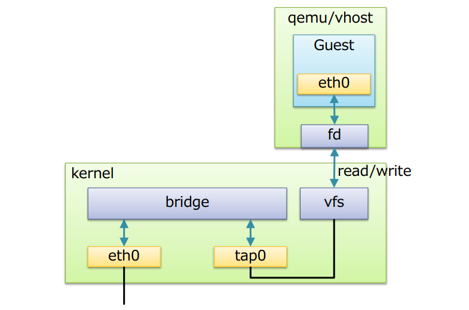

## Tìm hiểu về KVM

### Giới thiệu

KVM (Kernel-based Virtual Machine) là 1 module ảo hóa mã nguồn mở được tích hợp vào trong Linux. Cụ thể, nó cho phép bạn biến Linux thành 1 hypervisor cho phép máy chủ chạy nhiều môi trường ảo bị cô lập gọi là máy khách hoặc máy ảo (VM).

Avi Kivity bắt đầu phát triển KVM vào giữa năm 2006 tại Qumranet - 1 startup company về công nghệ, sau đó được Redhat mua lại vào ngày 4 tháng 9 năm 2008 với giá 107 triệu đô la và bắt đầu phát triển, phổ biến KVM Hypervisor. KVM nổi lên vào tháng 10 năm 2006 và được sáp nhập vào dòng chính của Linũ trong phiên bản kernel 2.6.20, được phát hành ngày 5 tháng 2 năm 2007.

KVM là giải pháp ảo hóa cho hệ thống Linux trên nền tảng phần cứng x86 có các module mở rộng hỗ trợ ảo hóa (Intel VT-x hoặc AMD-V), hỗ trợ cho rất nhiều hđh khách bao gồm Windows, Linux, BSD, Solaris, Haiku OS, ReactOS và hđh nghiên cứu AROS. Sử dụng kết hợp với QEMU, KVM có thể chạy Mac OS X.

### KVM hoạt động ntn?

Về bản chất, KVM không thực sự là 1 hypervisor có chức năng giả lập phần cứng để chạy các máy ảo. Chính xác hơn KVM chỉ là 1 module của nhân Linux hỗ trợ cơ chế ánh xạ các chỉ dẫn trên CPU ảo (của guest VM) sang chỉ dẫn trên CPU vật lý (của host chứa VM). Hoặc có thể hình dung KVM giống như 1 driver cho hypervisor để sử dụng được tính năng ảo hóa của các vi xử lý Intel như Intel VT-x hay như của AMD như AMD-V, với mục đích là tăng hiệu suất cho guest VM.

KVM chuyển đổi Linux thành hypervisor loại 1 (bare-metal). Tất cả hypervisor cần 1 số thành phần ở mức độ hđh như trình quản lý bộ nhớ, lập lịch cho các triến trình, input/output stack, driver thiết bị, trình quản lý bảo mật, ngăn xếp mạng ... để chạy các máy ảo. KVM có tất cả các thành phần đó vì nó là 1 phần của nhân Linux. Mọi máy ảo được triển khai như 1 tiến trình Linux thông thường, được lên lịch bởi bộ lập lịch Linux tiêu chuẩn, với phần cứng ảo chuyên dụng như card mạng, graphic adapter, CPU, bộ nhớ, ổ đĩa.

### Kiến trúc của KVM

Trong kiến trúc KVM, máy ảo được triển khai như 1 tiến trình Linux thông thường, được lên lịch bởi bộ lập lịch Linux tiêu chuẩn. Trong thực tế, mỗi CPU ảo xuất hiện như 1 tiến trình Linux thông thường. Điều này cho phép KVM được hưởng lợi từ tất cả các tính năng của nhân Linux.

Cấu trúc tổng quan:


Linux có tất cả các cơ chế của 1 VMM cần thiết để vận hành các máy ảo, vì vậy các nhà phát triển không xây dụng lại mà chỉ thêm vào đó 1 vài thành phần để hỗ trợ ảo hóa. KVM được triển khai như 1 module hạt nhân có thể được nạp vào để mở rộng Linux bởi những khả năng này.

Trong môi trường Linux thông thường, mỗi process chạy / sử dụng kernel-mode hoặc user-mode. KVM đưa ra 1 chế độ thứ 3, đó là guest-mode. Nó dựa trên CPU có khả năng ảo hóa với kiến trúc Intel VT hoặc AMD SVM. 1 process trong guest-mode bao gồm cả kernel-mode và user-mode.


Trong cấu trúc tổng quan của KVM bao gồm 3 thành phần chính:


- KVM kernel module:

	- là 1 phần trong dòng chính của Linux kernel
	
	- cung cấp giao diện chung cho Intel VMX và AMD SVM (thành phần hỗ trợ ảo hóa phần cứng)
	
	- chứa những mô phỏng cho các instructions và CPU modes không được hỗ trợ bởi Intel VMX và AMD SVM

- quemu - kvm: chương trình dòng lệnh để tạo các mây ảo, thường được vận chuyển dưới dạng các package "kvm" hoặc "quemu-kvm". Có 3 chức năng chính:

	- thiết lập VM các các thiết bị I/O
	
	- thực thi mã khách thông qua KVM kernel module
	
	- mô phỏng các thiết bị I/O và di chuyển các guest từ host này sang host khác

- libvirt management stack:

	- cung cấp API để quản lý các tool như virsh để có thể giao tiếp và quản lý các VM
	
	- cung cấp chế độ quản lý từ xa an toàn

### Các tính năng của KVM

- Bảo mật: KVM sử dụng kết hợp SE Linux và secure virtualization (sVirt) để tăng cường khả năg bảo mật và cô lập cho các máy ảo. SE Linux thiết lập ranh giới bảo mật xung quanh máy ảo. sVirt mở rộng khả năng của SE Linux, cho phép bảo mật Kiểm soát truy cập bắt buộc (MAC) được áp dụng cho các guest VM và ngăn ngừa lỗi ghi nhãn thủ công. sVirt đảm bảo máy ảo không thể bị truy cập bởi các tiến trình (hoặc máy ảo) khác, việc này có thể được mở rộng thêm bởi người quản trị hệ thống định nghãi ra các quyền hạn đặc biệt: như là nhóm các máy ảo chia sẻ chung nguồn tài nguyên.

- Lưu trữ: KVM có thể sử dụng bất kỳ bộ lưu trữ nào được Linux hỗ trợ, bao gồm ổ đĩa cục bộ hay hệ thống lưu trữ qua mạng (NAS). Multipath I/O có thể được sử dụng để cải thiện việc lưu trữ và cung cấp dự phòng. KVM cũng hỗ trọ việc chia sê file system nên có thể share image các máy ảo cho nhiều host khác nhau. Disk image trong KVM hỗ trợ thin provisioning, cho phép phân bổ lưu trữ thoe yêu cầu. Định dạng image của KVM là QCOW2, hỗ trợ việc sanpshot nhiều mức, nén và mã hóa dữ liệu.

- Hỗ trợ phần cứng: KVM có thể sử dụng nhiều nền tảng phần cứng được chứng nhận hỗ trợ Linux. Do các nhà cung cấp phần cứng thường xuyên đóng góp cho sự phát triển của kernel, nên các tính năng phần cứng mới cũng thường nhanh chóng được áp dụng.

- Quản lý bộ nhớ: KVM kế thừa các tính năng quản lý bộ nhớ của Linux, bao gồm cả non-uniform memory access cho phép tận dụng hiệu quả bộ nhớ cho các hệ thống đa xử lý và kernel same-page merging cho phép các máy ảo chia sẻ vùng nhớ, các yêu cầu bộ nhớ giống nhau trên các máy ảo có thể được xử lý chung để tiết kiệm bộ nhớ xử lý.

- Live migration: KVM hỗ trợ live migration, đoa là khả năng di chuyển 1 máy ảo đang chạy giữa các máy chủ vật lý mà không bị gián đoạn dịch vụ. Máy ảo vẫn được bật, các kết nối mạng vẫn được duy trì và các ứng dụng vẫn tiếp tục hoạt động trong khi máy ảo được di chuyển. KVM cũng lưu trặng thái hiện tại của máy ảo để có thể lưu trữ và chạy tiếp sau này.

- Hiệu suất và khả năng mở rộng: KVM kế thừa hiệu năng của Linux, mở rộng để phù hợp với yêu cầu tải nếu số lượng máy khách và các yêu cầu tăng lên. KVM cho phép khối lượng công việc ứng dụng đòi hỏi khắt khe nhất được ảo hóa và là cơ sở cho nhiều thiết lập ảo hóa doanh nghiệp, chẳng hạn như trung tâm dữ liệu và đám mây riêng (thông qua Openstack).


- Lập kế hoạch và kiểm soát tài nguyên: Trong mô hình KVM, VM là 1 tiến trình Linux, được lên lịch và quản lý bởi kernel. Bộ lập lịch Linux cho phép kiểm soát chi tiết các tài nguyên được phân bổ cho 1 tiến trình Linux và đảm bảo chất lượng cho 1 tiến trình cụ thể. Trong KVM, điều này bao gồm bộ lập lịch hoàn toàn công bằng, các nhóm kiểm soát, không gian tên mạng và tiện ích mở rộng thời gian thực.

- Độ trễ thấp và mức độ ưu tiên cao hơn: Nhân Linux có các phần mở rộng thời gian thực cho phép các ứng dụng dựa trên VM chạy ở độ trễ thấp hơn với mức độ ưu tiên tốt hơn (so với bare-metal). Kernel cũng phân chia các tiến trình đòi hỏi thời gian tính toán dài thành các thành phần nhỏ hơn, sau đó được lên lịch và xử lý tương ứng.

> 1 số lưu ý về KVM và QEMU:
Có thể hình dung KVM như là driver cho hypervisor để sử dụng được virtualization extension của CPU vật lý nhằm tăng hiệu năng cho guest VM.
QEMU là 1 emulator nên nó có bộ dịch của nó là Tiny Code Generator (TCG) để xử lý các yêu cầu trên CPU ảo và giả lập kiến trúc của máy ảo. Nên có thể coi QEMU là 1 hypervisor type 2. Lúc tạo VM bằng QEMU có VirtType là KVM thì khi đó các chỉ dẫn có nghĩa đối với CPU ảo sẽ được QEMU sử dụng KVM để ánh xạ thành các chỉ dẫn có nghĩa đối với CPU vật lý. Làm như vậy sẽ nhanh hơn là chỉ chạy độc lập QEMU, vì nếu không có KVM thì QEMU sẽ phải về sử dụng translator của riêng nó là TCG để chuyển dịch các chỉ dẫn của CPU ảo rồi đem thực thi trên CPU vật lý.
=> Khi QEMU/KVM kết hợp nhau thì tạo thành type-1 hypervisor.
QEMU cần KVM để tăng cường hiệu năng và ngược lại KVM cần QEMU (modified version) để cung cấp giải pháp full virtualization hoàn chỉnh.

### Các chế độ mạng trong KVM

KVM có 3 chế độ card mạng là NAT (Routing with iptables), Public Bridge và Private Virtual Bridge.

- NAT:

Đây là cấu hình mạng mặc định của KVM. Với phương pháp này, bạn có thể kết nối guest VM của bạn với một thiết bị "tap device" trong máy host của bạn. Sau đó, bạn có thể đặt quy tắc iptables trong máy host của mình để nó hoạt động như một bộ định tuyến và tường lửa cho các guest VM. Cơ chế NAT sẽ cấp cho mỗi VM một địa chỉ IP theo dải mặc định, đồng thời nó sẽ NAT từ dải mạng mà ta tạo ra địa chỉ của card mạng vật lý trên KVM host để đi ra ngoài internet. Việc định tuyến được thực hiện đơn giản bằng cách set default route trên guest VM thành địa chỉ IP của máy host, cho phép chuyển tiếp IP và set default route tới "tap device" của guest VM trên máy host. Khi một dải mạng tạo ra ta sẽ thấy trên KVM host xuất hiện một thêm một card mang, đóng vai trò là gateway cho dải mạng mà ta tạo ra.

KVM sẽ cấp DHCP cho các máy dùng chế độ NAT theo dải mặc định, có thể cấu hình trong file `/var/run/libvirt/network.xml`:

```
<networkstatus>
  <class_id bitmap='0-2'/>
  <floor sum='0'/>
  <network>
    <name>default</name>
    <uuid>b3b1652d-233b-4a7b-9fbb-0c604c94dac6</uuid>
    <forward mode='nat'>
      <nat>
        <port start='1024' end='65535'/>
      </nat>
    </forward>
    <bridge name='virbr0' stp='on' delay='0'/>
    <mac address='52:54:00:56:f3:ed'/>
    <ip address='192.168.122.1' netmask='255.255.255.0'>
      <dhcp>
        <range start='192.168.122.2' end='192.168.122.254'/>
      </dhcp>
    </ip>
  </network>
</networkstatus>
```

- Public Bridge:

Được sử dụng khi bạn muốn gán địa chỉ IP cho các máy ảo của mình và làm cho chúng có thể truy cập từ mạng local hoặc khi bạn muốn cải thiện hiệu suất mạng cho các máy ảo.

Chế độ này sẽ cho phép các máy ảo có cùng dải mạng vật lý với card mạng thật. Để có thể làm được điều này, bạn cần thiết lập 1 bridge và cho phép nó kết nối với cổng vật lí của thiết bị thật.

Để cấu hình public bridge:


sau đó restart lại network service.

Bridge br0 sẽ nhận được địa chỉ IP (tĩnh/dhcp) trong khi card mạng vật lý eth0 sẽ không có địa chỉ IP.

Cơ chế cấp DHCP cho các máy ảo sẽ do Router bên ngoài đảm nhận, nhờ vậy nên các VM mới có dải địa chỉ ip trùng với card vật lí bên ngoài.

Với mô hình này gói tin bên trong VM đi ra ngoài mạng sẽ đi từ VM đến thẳng card vật lý gắn với switch ảo và đi ra ngoài mạng.


- Private Virtual Bridge

Được sử dụng khi bạn muốn thiết lập một mạng riêng giữa 2 hoặc nhiều máy ảo. Mạng này sẽ không được nhìn thấy từ các máy ảo khác cũng như từ mạng thực.

Chế độ này sử dụng 1 bridge riêng biệt để các VM giao tiếp với nhau mà không ảnh hưởng tới địa chỉ của host.

Có thể tạo ra private bridge bằng cách chỉnh sửa file `/etc/network/interfaces`. Tại đây bạn không cần phải comment các cấu hình của card vật lý, đồng thời cũng không cần thêm tham số `bridge_ports` cho bridge.

Ngoài ra cũng có thể tạo private bridge bằng cách sử dụng công cụ GUI virt-manager.

Khi tạo máy ảo và kết nối tới private bridge, các máy ảo sẽ được cấp phát địa chi ip theo dải ip mà người dùng chọn. Chúng có thể giao tiếp với nhau nhung không thể kết nối ra internet.

### Cơ chế hoạt động của Linux bridge

Để các máy ảo giao tiếp được với nhau, KVM sử dụng Linux Bridge và OpenVSwitch, đây là 2 phần mềm cung cấp các giải pháp ảo hóa network.

Linux bridge là 1 phần mềm được tích hợp vào nhân Linux để giải quyết vấn đề ảo hóa phần network trong các máy vật lý. Về mặt logic, Linux bridge sẽ tạo ra 1 switch ảo để cho các VM kết nối vào và cũng có thể giao tiếp với nhau cũng như sử dụng để ra mạng ngoài.

Cấu trúc của Linux bridge khi kết hợp với KVM-QEMU:



trong đó:

- Bridge: tương đương với switch layer 2

- Port: tương đương với port của switch thật

- Tap (tap interfaces): có thể hiểu là giao diện mạng để các VM kết nối với bridge do Linux bridge tạo ra

- fd (forward data): chuyển tiếp dữ liệu từ máy ảo tới bridge

Các tính năng chính:

- STP (Spanning Trê Protocol): giao thức chống lặp gói tin trong mạng

- VLAN: chia switch (do Linux bridge tạo ra) thành các mạng LAN ảo, cô lập traffic giữa các VM trên các VLAN khác nhau trên cùng 1 switch

- FDB (forwarding database): chuyển tiếp các gói tin theo database để nâng cao hiệu năng switch. Database lưu các địa chỉ MAC mà nó biết, khi có gói tin đến, bridge sẽ tìm kiếm trong database có chứa địa chỉ MAC không, nếu không thì nó sẽ gửi gói tin đến tất cả các cổng.

### Dữ liệu trong KVM

- Các file cấu hình của KVM:

	- Các VM trong KVM mặc định được lưu trong thư mục `/var/lib/libvirt/imagaes/`
	
	- Thông tin cấu hình máy ảo nằm trong thư mục `/etc/libvirt/qemu/` dưới dạng các file xml. Có thể chỉnh sửa trực tiếp các file này hoặc dùng lệnh `virt edit <tên_máy_ảo>`
	
	- Các file log của KVM nằm trong thư mục `/var/log/libvirt/`
	
	- Log ghi lại hoạt động của từng máy ảo nằm trong thư mục `/var/log/libvirt/qemu/`

### File image trong KVM

File image (còn gọi là file ảnh) của đĩa CD/DVD chính là 1 dạng file có định dạng theo các chuẩn tạo file ảnh. File image là 1 file đóng gói hết tất cả nọi dung của 1 đĩa CD/DVD vào trong nó.

Trong KVM guest có 2 thành phần chính là VM definition được lưu dưới dạng file xml tại `/etc/libvirt/qemu` chứa các thông tin cảu máy ảo như tên, thông tin về tài nguyên (ram, cpu, ...) và file còn lại là storage thường được lưu dưới dạng file image tại thư mục `/var/lib/libvirt/images`

3 định dạng thông dụng nhất của file image sử dụng trong KVM đó là iso, raw và qcow2.

- ISO:

	- là file ảnh của 1 đĩa CD/DVD, nó chứa toàn bộ dữ liệu của đĩa cd/DVD đó. File ISO thường được sử dụng để cài đặt hđh của VM, người dùng có thể import trực tiếp hoặc tải từ trên internet về.
	
	- boot từ file ISO cũng là 1 trong số các tùy chọn mà người dùng có thể sử dụng khi tạo máy ảo.

- File raw:

	- là định dạng file image phi cấu trúc, không thể mở rộng
	
	- khi người dùng tạo mới 1  máy ảo có disk format là raw thì dung lượng của file disk sẽ bằng dung lượng của ổ đĩa máy ảo bạn đã tạo
	
	- định dạng raw là hình ảnh theo dạng nhị phân (bit by bit) của ổ đĩa
	
	- mặc định khi tạo máy ảo với virt-manager hoặc không khai báo khi tạo VM bằng virt-install thì định dạng ổ đĩa sẽ là raw, hay nói cách khác ră chính là định dạng mặc định của QEMU
	
	- file raw có lợi thế về hiệu suất so với qcow2 ở chỗ không áp dụng định dạng nào cho virtual machine disk images lưu trữ ở định dạng raw, tuy nhiên không hỗ trợ việc snapshot

- File qcow2:

	- qcow là 1 định dạng tập tin cho file image được sử dụng bởi QEMU, nó viết tắt của "QEMU Copy On Write" và sử dụng 1 chiến lược tối ưu hóa lưu trữ đĩa để trì hoãn phân bổ dung lượng lưu trữ cho đến khi nó thực sự cần thiết.
	
	- qcow2 là phiên bản cập nhật của định dạng qcow nhằm để thay thế nó. Khác biệt với bản gốc là qcow2 hỗ trợ nhiều snapshot thông qua 1 mô hình mới, linh hoạt để lưu trữ nhanh snapshot. Khi khởi tạo máy ảo mới sẽ dựa vào disk này rồi snapshot thành 1 máy mới
	
	- qcow2 hỗ trợ copy-on-write với những tính năng đặc biệt như snapshot, mã hóa, nén dữ liệu ...
	
	- qcow2 hỗ trợ việc tăng bộ nhớ bằng cơ chế thin provisioning (máy ảo dùng bao nhiêu file có dung lượng bấy nhiêu)
	
	- 1 bất lợi của image qcow là không thể mount trực tiếp như file image raw

- Chuyển đổi giữa raw và qcow2:

Để chuyển đổi từ định dạng raw sang qcow2, ta dùng câu lệnh:

`qemu-img convert -f raw -O qcow2 /var/lib/libvirt/images/VM.img /var/lib/libvirt/images/VM.qcow2`

Để chuyển đổi từ định dạng qcow2 sang raw, ta dùng câu lệnh:

`qemu-img convert -f qcow2 -O raw /var/lib/libvirt/images/VM.qcow2 /var/lib/libvirt/images/VM.raw`

Sau khi chuyển đổi, tiến hành shutdown máy ảo. Đồng thời, sửa file xml của VM bằng câu lệnh:

`virsh edit VMname`

Sau đó khởi động lại máy ảo.

>Lưu ý rằng file bạn muốn chuyển đổi sẽ không bị mất đi, bạn phải tiến hành xóa bỏ nó bằng tay.

### Thick and thin provisioning

- Thick provisioning: hay còn gọi là fat provisioning, đề cập đến dung lượng lưu trữ đĩa ảo sẽ được phân bổ trước trên không gian lưu trữ vật lý khi đĩa ảo được tạo. Một đĩa ảo sử dụng thick provisioning sẽ chiếm tất cả không gian được phân bổ cho kho dữ liệu ngay từ đầu mặc dù nó không sử dụng hết dung lượng đó, vì vậy, không gian này không có sẵn để sử dụng cho các máy ảo khác.

- Thin provisioning: đề cập đến việc phân bổ lưu trữ theo yêu cầu dựa trên lượng không gian yêu cầu tại bất kỳ thời điểm nào. Khi lưu trữ nhiều dữ liệu hơn, nó sẽ chiếm nhiều đĩa hơn, khi xóa dữ liệu, nó sẽ co lại.