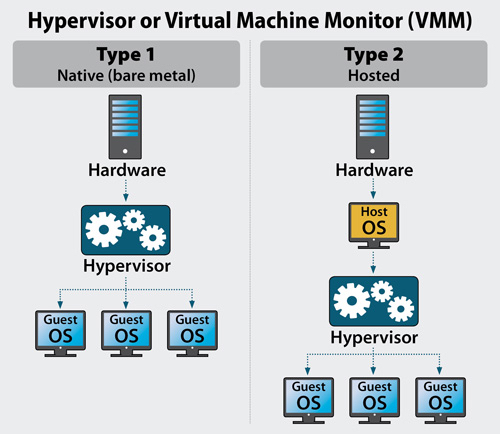

## Tìm hiểu về ảo hóa

### Ảo hóa là gì?

Trong máy tính, ảo hóa (virtualization) là một thuật ngữ dùng để chỉ một phương pháp cô lập tài nguyên để tạo một phiên bản ảo của tài nguyên nào đó, chẳng hạn như server, storage device, network hoặc thậm chí operating system nơi framework chia tài nguyên thành một hoặc nhiều môi trường thực thi. Ngay cả một việc đơn giản như phân vùng ổ đĩa cứng cũng được coi là ảo hóa bởi vì bạn chỉ có một ổ đĩa nhưng nó được phân vùng để tạo thành hai ổ đĩa cứng riêng biệt. Các thiết bị, ứng dụng và người dùng có thể tương tác với tài nguyên ảo như thể nó là một tài nguyên logic thực sự duy nhất (single logical resource). Thuật ngữ ảo hóa đã trở thành một phần của các công nghệ máy tính.

Công nghệ ảo hóa là một công nghệ được ra đời nhằm khai thác triệt để khả năng làm việc của các phần cứng trong một máy chủ vật lý. Nó hoạt động như một tầng trung gian giữa hệ thống phần cứng máy tính và phần mềm chạy trên nó.

### Chức năng và lợi ích của ảo hóa

#### Các chức năng chính của ảo hóa

- Phân chia: Với công nghệ ảo hóa, ta có thể chạy nhiều máy ảo trên 1 máy chủ vật lý với các hđh khác nhau, nhờ vậy mà ta có thể tách từng dịch vụ để cài trên các máy ảo.

- Cô lập: Khi mỗi dịch vụ quan trọng được cài trên các máy ảo khác nhau thì nếu có sự cố, các dịch cụ khác cũng không bị ảnh hưởng gì. Thêm vào đó, nó cũng giúp quản lý tốt hơn tài nguyên trên các máy ảo.

- Đóng gói: Với công nghệ ảo hóa, các máy ảo được đóng gói thành các file riêng biệt, nhờ vậy mà nó có thể dễ dàng được sao chép để backup và di chuyển sang các hệ thống khác.

#### Lợi ích của ảo hóa

- Tiết kiệm: Việc sử dụng ảo hóa giúp tiết kiệm chi phí, khai thác triệt để tài nguyên vật lý của máy chủ, tiết kiệm không gian, hạ tầng và tiết kiệm diện năng tiêu thụ.

- Dễ dàng bảo trì, nâng cấp, mở rộng hệ thống khi có nhu cầu, tận dụng tài nguyên hiện có: vì mỗi máy ảo đơn giản chỉ là một tập tin hoặc một thư mục, ta có thể tạo ra máy chủ ảo mới bằng cách sao chép từ một file của máy chủ ảo hiện tại và cấu hình lại, chọn máy chủ vật lý còn dư tài nguyên để đưa máy chủ ảo mới lên.

- Dễ dàng quản lý, vận hành với công cụ quản lý tập trung, ta sẽ theo dõi được máy chủ nào đang quá tải, từ đó sẽ áp dụng chính sách tăng tài nguyên về CPU, Ram, ổ cứng cho máy chủ ảo đó hoặc di chuyển máy ảo đang quá tải đó sang máy chủ vật lý có cấu hình mạnh hơn, có nhiều tài nguyên hơn để chạy.

- Cung cấp máy chủ nhanh chóng: Việc tạo máy ảo nhanh hơn nhiều so với việc mua, thiết lâp, chạy một máy chủ vật lý.

- Dễ dàng dịch chuyển và sao lưu: Ảo hóa hỗ trợ tính năng giúp tạo snapshot để lưu lại trạng thái máy ảo để có thể triển khai máy ảo về đúng trạng thái tạo snapshot. Nó cũng hỗ trợ tính năng migrate giúp di chuyển các máy ảo dễ dàng trong datacenter.

- Mang lại tính sẵn sàng cao (HA), giảm thời giam downtime của hệ thống

#### Các loại ảo hóa

Các công nghệ ảo hóa cơ bản:

- Ảo hóa phần cứng: hay ảo hóa nền tảng là việc tạo ra 1 máy ảo mà hoạt động như 1 máy thật với 1 hđh. Trong ảo hóa phần cứng, host machine là máy vật lý được sử dụng để ảo hóa và guest machine là máy ảo chạy trên host machine. Những loiạ ảo hóa phần cứng bao gồm:

	- Ảo hóa toàn phần: mô phỏng gần như hoàn chỉnh phần cứng thực tế để cho phép môi trường phần mềm bao gồm hđh khách và các ứng dụng của nó chạy mà không cần sửa đổi thêm.
	
	- Ảo hóa song song: các ứng dụng khách được chạy trên các miền riêng biệt như là đang chạy trên 1 hệ thống riêng, nhưng phần cứng không được ảo hóa. Phần mềm khách cần được chỉnh sủa để chạy trên loại ảo hóa này.

- Ảo hóa network: Ảo hóa mạng kết hợp thiết bị mạng vật lý và tài nguyên mạng phần mềm và chức năng mạng thành một tài nguyên. Nó chia băng thông thành nhiều kênh độc lập có thể được gán cho máy chủ và thiết bị. Có hai loại ảo hóa network:

	- Internal: Một hệ thống duy nhất được cung cấp chức năng giống như mạng cho các software containers
	
	- External: Nhiều mạng được kết hợp thành một đơn vị ảo

- Ảo hóa ứng dụng: là quá trình mà 1 chương trình máy tính được tách biệt hoàn toàn khỏi hệ điều hành bên dưới, tách rời mối liên kết giữa ứng dụng và hệ điều hành và cho phép phân phối lại ứng dụng để phù hợp với yêu cầu của user. Một ứng dụng được ảo hóa sẽ không được cài đặt lên máy tính một cách thông thường, mặc dù ở góc độ người sử dụng, ứng dụng vẫn hoạt động một cách bình thường. Hiện nay đã có khá nhiều chương trình ảo hóa ứng dụng như Citrix XenApp, Microsoft Application Virtualization, VMware ThinApp ... Có hai loại ảo hóa ứng dụng:

	- Remote application Virtualization: Các ứng dụng từ xa chạy trên một máy chủ. Thông qua giao thức điều khiển từ xa, người dùng cuối có thể xem và tương tác với các ứng dụng của họ trên mạng. Các chương trình từ xa có thể được tích hợp hoàn toàn với máy tính của người dùng để chúng hoạt động như các ứng dụng cục bộ, với sự hỗ trợ của công nghệ được gọi là "seamless windows".
	
	- Streaming application virtualization: Ứng dụng ảo hóa được thực thi trên máy tính cục bộ của người dùng cuối. Khi một ứng dụng được yêu cầu, các thành phần của nó được tải trực tiếp đến máy tính cục bộ theo yêu cầu. Một số phần của ứng dụng được yêu cầu để khởi chạy, phần còn lại có thể được tải xuống trong nền nếu cần. Khi quá trình tải xuống hoàn tất, một ứng dụng được truyền phát có thể hoạt động mà không cần kết nối mạng.

- Ảo hóa storage: còn được gọi là lưu trữ đám mây là quá trình kết hợp lưu trữ vật lý từ nhiều thiết bị lưu trữ để nó trông giống như một thiết bị lưu trữ duy nhất. Ảo hóa lưu trữ thường được sử dụng trong storage area networks. Có hai loại ảo hóa lưu trữ:

	- Block Level Storage: các raw volume được tạo và mỗi block có thể được sử dụng như 1 ổ cứng riêng lẻ. HĐH dựa trên máy chủ kiểm soát các block này và mỗi block có thể được định dạng bằng hệ thống tệp được yêu cầu.
	
	- File Level Storage: tạo thành một nhóm lưu trữ logic và cho phép người dùng sử dụng đường dẫn logic để truy cập tệp.

- Ảo hóa hđh: còn được gọi là container hóa, đề cập đến một tính năng hệ điều hành trong đó kernel cho phép tồn tại nhiều trường hợp không gian người dùng bị cô lập. Các trường hợp như vậy, được gọi là các container, phân vùng, môi trường ảo (VE) hoặc jail (FreeBSD jail hoặc chroot jail), có thể trông giống như các máy tính thực theo quan điểm của các chương trình đang chạy trong đó. Một chương trình máy tính chạy trên một hệ điều hành thông thường có thể thấy tất cả các tài nguyên (thiết bị, tệp và thư mục được kết nối, chia sẻ mạng, CPU, khả năng phần cứng định lượng) của máy tính đó. Tuy nhiên, các chương trình chạy bên trong một container chỉ có thể thấy nội dung và thiết bị của container được gán cho container. Containerization bắt đầu nổi bật vào năm 2014, với sự ra đời của Docker.

Phân loại theo mức độ ảo hóa có thể chia ảo hóa ra các loại:

- Full Virtualization (Ảo hóa toàn phần): là 1 loại ảo hóa phổ biến, về cwo bran là phương pháp tách biệt hoàn toàn phần cứng, hđh, dịch vụ của máy ảo với máy chủ. Trong ảo hóa hoàn toàn, máy ảo sẽ không khác nhiều so với 1 máy thật. 1 số công nghệ ảo hóa hoàn toàn phổ biến: KVM, VirtualBox, VMware ESXi, MS Hyper-V ...

- Paravirtualization ( Ảo hóa song song): là loại ảo hóa mà trong đó nó không ảo hóa phần cứng để chạy hđh ảo mà thay vào đó tạo ra 1 lớp giao diện phần mềm để các hđh ảo và hypervisor giao tiếp với nhau. 1 số công nghệ phổ biến: Xen server LPAR, Oracle VM for SPARC (LDOM), Oracle VM for x86 (OVM) ...

- Partial Virtualization (Ảo hóa một phần): chỉ tiến hành ảo hóa 1 số phần cứng nhất định của máy tính nên nó không đủ tài nguyên để vận hành 1 hđh ảo hoàn chỉnh, thay vào đó nó chỉ cho phép chạy 1 số phần mềm để tránh lãnh phí tài nguyên

- Operating System Virtualization (Ảo hóa hệ điều hành): là công nghệ ảo hóa mà máy ảo sử dụng 1 phần của hđh máy chủ để có thể sử dụng tất cả các tính năng như ảo hóa toàn phần. Tuy nhiên ở mức độ ảo hóa này, máy ảo phải chạy cùng hđh với máy chủ. Các máy ảo chạy độc lập với nhau trong hệ thống. 1 số công nghệ phổ biến: Docker, Linux LXC, AIX WPAR ...

Hypervisor: hay còn có tên khác là Virtual machine monitor (VMM) là từ dùng để chỉ các phần mềm , firmware hoặc thậm chí là một phần cứng chuyên dụng dùng để tạo, theo dõi và quản lý các máy ảo (virtual machine).

Có 2 dạng Hypervisor:

- Bare-Metal (type 1): Hypervisor tương tác trực tiếp với phần cứng của máy chủ để quản lý, phân phối và cấp phát tài nguyên.Loại ảo hóa này bao gồm các giải pháp như VMware ESXi, Microsoft Hyper-V, Xen Server, KVM.

- Hosted (type 2): Đây là loại ảo hóa Hypervisor giao tiếp với phần cứng thông qua hệ điều hành. Hypervisor lúc này được xem như một ứng dụng của hệ điều hành và các phương thức quản lý, cấp phát tài nguyên đều phải thông qua hệ điều hành. Loại ảo hóa này bao gồm các giải pháp như Vmware WorkStation, Oracle VirtualBox, Microsoft Virtual PC, …

Giữa type 1 và type 2 thì loại 1 tương tác trực tiếp với phần cứng nên việc quản lý và phân phối tài nguyên được tối ưu và hiệu quả hơn so với loại 2, vì vậy khi triển khai trong thực tế, ảo hóa Loại 1 (Bare-Metal Hypervisor) được sử dụng, loại 02 chỉ sử dụng trong các trường hợp thử nghiệm, hoặc mục đích học tập.

