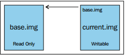

## Tổng quan về Template và Snapshot trong KVM

### 1. Template

- Template là 1 dạng file image pre-configured của hđh được dùng để tạo nhanh các máy ảo.

- 1 ví dụ được đặt ra là giả sử rằng bạn có 4 máy để làm web server. Thông thường , bạn sẽ phải cài 4 máy ảo rồi lần lượt cài đặt hđh cho từng máy, sau đó lại tiếp tục cài đặt các dịch vụ cũng như phần mềm. Điều này hiển nhiên là tốn rất nhiều thời gian và template sẽ giúp bạn giải quyết vấn đề này.

- Hình ảnh bên dưới đây mô tả các bước theo ví dụ trên nếu bạn cài bằng tay. Các bước từ 2-5 chỉ là những tasks lặp đi lặp lại và sẽ tiêu tốn rất nhiều thời gian không cần thiết.


- Với việc sử dụng template, số bước cần thực hiện sẽ được rút ngắn đi rất nhiều, chỉ cần thực hiện 1 lần các bước từ 1-5. Sau đó sử dụng template là đã có thể triển khai 4 web server còn lại 1 cách rất dễ dàng. Điều này giúp người dùng tiết kiệm rất nhiều thời gian.


- 2 khái niệm mà người dùng cần phân biệt đó là `clone` và `template`. Nếu `clone` đơn thuần chỉ là một bản sao của máy ảo thì `template` được coi là master copy của VM, nó có thể được dùng để tạo ra rất nhiều `clone` khác nữa. Template là bản sao chính của máy ảo thường bao gồm HĐH khách, bộ ứng dụng và cấu hình VM cụ thể. Các template được sử dụng khi cần triển khai nhiều máy ảo và đảm bảo rằng chúng phù hợp và được chuẩn hóa.

- Có 2 phương thức để triển khai máy ảo từ `template` đó là `Thin` và `Clone`

	- Thin: Máy ảo được tạo ra theo phương thức này sẽ sử dụng template như một base image, lúc này nó sẽ được chuyển sang trạng thái read only. Cùng với đó, sẽ có một ổ mới hỗ trợ "copy on write" được thêm vào để lưu dữ liệu mới. Phương thức này tốn ít dung lượng hơn tuy nhiên các VM được ra sẽ phụ thuộc vào base image, chúng sẽ không chạy được nếu không có base image.
	
	- Clone: Máy ảo được tạo ra là một bản sao hoàn chỉnh và hoàn toàn không phụ thuộc vào template cũng như máy ảo ban đầu. Tuy nhiên, nó sẽ chiếm dung lượng trên ổ đĩa giống như máy ảo ban đầu.

- Template thực chất là máy ảo được chuyển đổi sang. Quá trình này gồm 3 bước:

	- Bước 1: Cài đặt máy ảo với các phần mềm cần thiết để biến nó thành template.
	
	- Bước 2: Loại bỏ những cài đặt như password SSH, địa chỉ MAC,... để đảm bảo rằng nó sẽ không được áp dụng vào các máy ảo được tạo ra từ template này.
	
	- Bước 3: Đánh dấu máy ảo là template bằng việc đổi tên.

### 2. Các bước cụ thể tạo template và clone với máy ảo CentOS 7

- Để clone 1 máy ảo KVM, ta cần:

	- 1 file định nghĩa (cpu, ram, disk, etc ...)
	
	- 1 template disk image (đã được cài hđh)
	
	- Tệp định nghĩa chỉ là tệp xml libvirt. Template image chỉ là disk image máy ảo.

- Cài đặt Cent 7 trên KVM

- Shutdown máy ảo với câu lệnh `virsh shutdown VMname`

- Dump XML file của máy ảo `virsh dumpxml centos7 > /var/lib/libvirt/images/template_cent7.xml`

- Copy disk image máy ảo `cp /var/lib/libvirt/images/centos7.qcow2 /var/lib/libvirt/images/template_cent7.qcow2`

- Trong tệp template.xml trỏ đường dẫn source file tới file template_cent7.qcow2 vừa copy

```
<disk type='file' device='disk'>
  <driver name='qemu' type='qcow2'/>
  <source file='/var/lib/libvirt/images/template_cent7.qcow2'/>
  <target dev='vda' bus='virtio'/>
  <address type='pci' domain='0x0000' bus='0x00' slot='0x07' function='0x0'/>
</disk>
```

- Sử dụng công cụ `virt-sysprep` để "niêm phong" máy ảo:

    - Cần cài đặt gói `libguestfs-tools-c` để có thể sử dụng được công cụ này. Nó được sử dụng để loại bỏ những thông tin cụ thể của hệ thống đồng thời niêm phong và biến máy ảo trở thành template.

    - Ở đây ta có thể sử dụng 2 tùy chọn để dùng `virt-sysprep` đó là `-a` và `-d`. Tuỳ chọn `-d` được sử dụng với tên hoặc UUID của máy ảo, tuỳ chọn `-a` được sử dụng với đường dẫn tới ổ đĩa máy ảo.

`virt-sysprep -a /var/lib/libvirt/images/template_cent7.qcow2`

- Undefine máy ảo `virsh undefine centos7`

- Xóa disk images centos7 `rm -f /var/lib/libvirt/images/centos7.qcow2`

- Clone các máy ảo mới từ template_cent7.xml và template_cent7.qcow2

```
virt-clone --connect qemu:///system                    \
  --original-xml /var/lib/libvirt/images/template_cent7.xml  \
  --name newvm                                         \
  --file /var/lib/libvirt/images/newvm.qcow2
```

### 3. Snapshot

- Snapshotlà trạng thái của hệ thống ở 1 thời điểm nhất định, nó sẽ lưu lại cả những cài đặt và dữ liệu. Với snapshot, bạn có thể quay trở lại trạng thái của máy ảo ở 1 thời điểm nào đó rất dễ dàng.

- libvirt hỗ trợ việc tạo snapshot khi máy ảo đang chạy. Mặc dù vậy, tốt hơn hết là nên shutdown hoặc suspend trước khi tiến hành tạo snapshot.

- Có 2 loại snapshot chính được hỗ trợ bởi libvirt:

	- Internal: Trước và sau khi tạo snapshot, dữ liệu chỉ được lưu trên 1 ở đĩa duy nhất. Người dùng có thể tạo internal snapshot bằng công cụ virt-manager. Mặc dù vậy, nó vẫn có 1 vài hạn chế
	
		- chỉ hỗ trợ duy nhất định dạng qcow2
		
		- VM sẽ bị ngưng lại khi tiến hành snapshot
		
		- không hoạt động với LVM storage pools
	
	- External: Dựa theo cơ chế copy-on-write. Khi snapshot được tạo, ổ đĩa ban đầu sẽ có trạng thái "read-only" và có một ổ đĩa khác chồng lên để lưu dữ liệu mới:
	
		- Ổ đĩa được chồng lên được tạo ra có định dạng qcow2, hoàn toàn trống và nó có thể chứa lượng dữ diệu giống như ổ đĩa ban đầu. External snapshot có thể được tạo với bất kì định dạng ổ đĩa nào mà libvirt hỗ trợ. Tuy nhiên không có công cụ đồ họa nào hỗ trợ cho việc này.

	

### 4. Tạo và quản lý snapshot

- Internal Snapshot:

	- Để tạo mới 1 Internal Snapshot, câu lệnh thông dụng sẽ là `virsh snapshot-create-as VMname --name "Snapshot 1" --description "First Snapshot" --atomic`, trong đó các tùy chọn:
	
		- VMname: tên máy ảo muốn tạo snapshot
	
		- Snapshot 1: tên của snapshot
		
		- First Snapshot: mô tả cho snapshot
		
		- --atomic: bảo đảm cho việc toàn vẹn dữ liệu
		
	- Để quay trở lại trạng thái của 1 internal snapshot, dùng câu lệnh `virsh snapshot-revert VMname --snapshotname "Snapshot 1"`
	
	- Để xoá 1 internal snapshot sử dụng câu lệnh `virsh snapshot-delete VMname Snapshotname`

- External Snapshot:

	- Kiểm tra ổ đĩa mà máy ảo muốn tạo snapshot đang sử dụng bằng câu lệnh `virsh domblklist VMname --details`
	
	- Tạo snapshot bằng câu lệnh `virsh snapshot-create-as VMname snapshot1 "Description" --disk-only --atomic`, tùy chọn `--disk-only` dùng để tạo snapshot cho riêng ổ đĩa.
	
	- Revert lại trạng thái của external snapshot, ta phải cấu hình file XML bằng tay.
	
		- Lấy đường dẫn tới ổ đĩa được tạo ra khi snapshot `virsh snapshot-dumpxml VMname --snapshotname "tên snapshot" | grep "source file"`
		
		- Kiểm tra để đảm bảo nó còn nguyên vẹn và được kết nối với backing file bằng các câu lệnh `qemu-img check` và `qemu-img info`
		
		- Mở file xml và chỉnh sửa bằng tay, thay thế đường dẫn ỗ đĩa hiện tại bằng đường dẫn snapshot muốn revert
	
	- Để xóa external snapshot, trước tiên bạn phải tiến hành hợp nhất nó với ổ đĩa cũ. Có hai kiểu hợp nhất đó là:
	
		- blockcommit: hợp nhất dữ liệu với ổ đĩa cũ
		
		- blockpull: hợp nhất dữ liệu với ổ đĩa được tạo ra khi snapshot. Ổ đĩa sau khi hợp nhất sẽ luôn có định dạng qcow2.
		
	với blockcommit: `virsh blockcommit VMname vda --verbose --pivot --active`, xóa snapshot: `virsh snapshot-delete VMname snapshotname --children --metadata`
	
	với blockpull: `virsh blockpull VMname --path snap/shot/path --wait --verbose`, xoá bỏ base image và snapshot metadata bằng câu lệnh `virsh snapshot-delete VMname snapshotname --metadata`
	
> Lưu ý: Điều này chỉ khả dụng với các phiên bản: QEMU 2.1 (trở lên), libvirt-1.2.9 (trở lên).