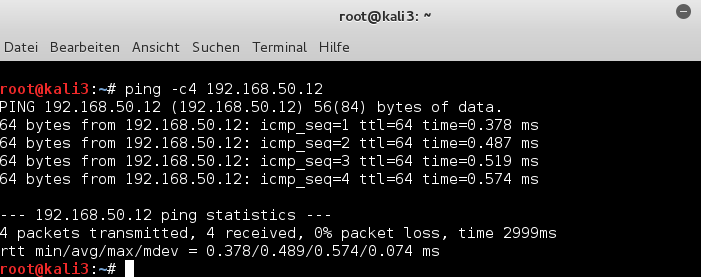

## veth device, Linux virrtual bridge, KVM, VMware - gắn với host và kết nối các bridge qua veth

Thông thường, các thiết bị Ethernet "veth" ảo được sử dụng để kết nối các virtual container (như LXC) với các virtual bridge như OpenVswitch. Nhưng, do tính chất cặp của chúng, "veth" cũng hứa hẹn tính linh hoạt trong các bối cảnh khác, đơn giản hơn nhiều về xây dựng mạng ảo. Do đó, mục tiêu của bài viết này là thử nghiệm với các thiết bị" veth "làm công cụ để tự gắn máy chủ ảo hóa hoặc các thiết bị (ảo) khác như Linux bridge thứ cấp hoặc VMware bridge tới Linux bridge tiêu chuẩn - và do đó cho phép giao tiếp với các hệ thống khách ảo hóa cũng như giao tiếp giữa chúng với nhau.

Động cơ của bài viết:

Tôi có hứng thứ với các "veth" khi cố gắng đạt được sự linh hoạt để nhanh chóng xây dựng và sắp xếp lại các cấu hình mạng ảo khác nhau trong các bài lab pen-test trên thiết bị laptop Linux, ví dụ như:

- Đôi khi, bạn muốn tránh việc cấp IP cho 1 Linux bridge. Việc gán IP cho Linux bridge thường cho phép liên lạc máy chủ với máy khách KVM được gắn vào thiết bị bridge. Tuy nhiên, trong quá trình mô phỏng việc tấn công qua bridge, host thường rất dễ bị lộ. Theo tôi, máy chủ có thể được bảo vệ tốt hơn và hiệu quả hơn bởi các bộ lọc gói nếu nó giao tiếp với guest bridge qua 1 cặp interface "veth" đặc biệt được gắn vào bridge. Trong các kịch bản thư nghiệm hoặc mô phỏng khác, người ta có thể kết nối máy chủ như 1 hệ thống vật lý bên ngoài với bridge -  tức là thông qua 1 uplink port.

- Có những kịch bản mà bạn muốn ghép 2 bridge, mỗi thiết bị gắn với 1 virtual guest, với nhau và làm cho tất cả các guest giao tiếp với nhau và với host. Hoặc thiết lập liên lạc từ 1 guest của 1 Linux bridge tới các thiết bị guest của VMware bridge gắn với 1 Linux bridge khác. Trong tất cả các tình huống này, tất cả các máy khách và kể cả host có thể cư trú trong cùng 1 logical IP network segment, nhưng trong các phần tách biệt. Trên thực tế, những người quản trị viên có thể đã sử dụng 1 sự tách biệt như vậy để cải thiện hiệu suất và tránh quá tải các switch.

- Ngoài ra, người ta có thể giải quyết 1 số vấn đề với các cặp "veth" nếu không sẽ trở nên phức tạp. 1 ví dụ là tránh việc gán đại chỉ IP cho thiết bị enslaved ethernet đặc biệt tương ứng với bridge cho hệ thống Linux. Cả virt-manager của libvirt và network editor của VMware đều tự động thực hiện việc gán IP khi tạo các mạng ảo host-only. Chúng ta sẽ quay trở lại với vấn đề này bên dưới.

Để chuẩn bị, trước tiên chúng ta hãy so sánh ngắn gọn "veth" với các "tap" device và tóm tắt 1 số khía cạnh cơ bản của các Linux bridge - tất cả theo sự hiểu biết còn hạn chế của tôi. Sau đó, chúng ta  sẽ thực hành 1 kịch bản network đơn giản cho mục đích training.

### vtap vs veth

Thiết bị ảo "tap" là 1 thiết bị point to point duy nhất có thể đuwọc sử dụng bởi 1 chương trình trong không gian người dùng hoặc máy ảo để gửi các gói tin ethernet trên lớp 2 1 cách trực tiếp đến kernel hoặc nhận các gói từ nó. 1 mô tả tập tin (fd) được đọc/ghi trong quá trình truyền như vậy. Ảo hóa KVM/qemu sử dụng các "tap" device để sử dụng cho các virtualized guest system với giao diện ethernet ảo và có thể định cấu hình - sau đó tương tác với fd. Mặt khác, 1 "tap" device có thể được gắn vào virtual Linux bridge, kernel xử lý việc chuyển gói như thể nó xảy ra trên 1 virtual bridge port.

Thay vào đó, các thiết bị "veth" được tạo thành các cặp giao diện Ethernet ảo được kết nối. Ta cso thể hình dung rằng 2 thiết bị này được kết nối bằng cáp mạng, mỗi "veth" device của 1 cặp có thể được gán vào các thực thể ảo khác như OpenVswitch bridge, XC containers hoặc Linux standard bridges. Cặp "veth" là lý tưởng để kết nối các thiệt bị ảo với nhau.

Mặc dù không hỗ trợ trực tiếp, 1 KVM guest có thể kết nối với "veth" device qua macVtap/macVlan (xem thêm ở [đây](https://seravo.fi/2012/virtualized-bridged-networking-with-macvtap))

Ngoài ra, các mạng ảo của VMware có thể được kết nối với một thiết bị "veth" - như tôi sẽ trình bày dưới đây.

### Các khía cạnh và tính chất của Linux bridge

Một số khía cạnh và hạn chế cơ bản của các Linux standard bridge rất đáng chú ý:

- 1 "tap" device đã được gắn vào 1 Linux bridge thì khôing thể gắn với một Linux bridge khác.

- Tất cả các thiết bị đính kèm được chuyển sang promiscuous mode.

- Bản thân bridge (không phải là "tap" device tại port!) có thể nhận địa chỉ IP và có thể hoạt động như một thiết bị Ethernet tiêu chuẩn. Host có thể liên lạc qua địa chỉ này với các guest gắn với bridge.

- Bạn có thể gắn một số thiết bị Ethernet vật lý (không có IP!) của host vào 1 bridge - mỗi thiết bị trong số chúng như một loại "uplink" đến các thiết bị switch / hub vật lý khác và các hệ thống được kết nối. Với giao thức spanning tree protocol, kích hoạt tất cả các hệ thống vật lý được gắn vào mạng phía sau mỗi giao diện vật lý có thể giao tiếp với các máy khách thực hoặc ảo được liên kết với bridge bằng các giao diện vật lý hoặc virtual port khác.

- Bridge được cấu hình đúng cách chuyển các gói trực tiếp giữa hai bridge port cụ thể liên quan đến luồng liên lạc của 2 guest được gắn vào - mà không để lộ thông tin liên lạc đến các cổng khác và các máy guest khác. Bridge có thể tìm và cập nhật sự liên kết các địa chỉ MAC có liên quan đến các bridge port.

- Bản thân virtual bridge - với vai trò là thiết bị Ethernet - không hoạt động ở promiscuous mode. Tuy nhiên, các gói đến qua một trong các cổng của nó cho (chưa) địa chỉ không xác định có thể bị ngập đến tất cả các cổng.

- Bạn không thể kết nối Linux bridge trực tiếp bằng hoặc với một cầu Linux khác (không có Linux bridge cascading). Bạn cũng không thể kết nối Linux bridge với 1 Linux bridge khác thông qua "tap" device.

Khi kết hợp với VMware (trên 1 máy chủ Linux) sẽ có 1 số khía cạnh rất thú vị được bổ sung:

- 1 virtual Linux bridge trong vai trò là 1 thiết bị Ethernet có thể được được bắc cầu bằng các non-native Linux bridge - ví dụ như các VMware bridge - và do đó được chuyển sang promiscuous mode. VMware bridge (master) sau đó sử dụng Linux bridge như 1 attach device (slave). Kiểu bridge này có thể có tác động bảo mật: các gói đến qua cổng vật lý tại Linux bridge và được định sẵn cho các VMware guest được kết nối với VMware master bridge của chúng có thể được nhìn thấy tại các Linux bridge port. Xem thêm ở [đây](https://linux-blog.anracom.com/2016/01/14/vmware-ws-bridging-of-linux-bridges-and-security-implications/)

- Có thể gắn thiết bị "vmnet" - Ethernet liên quan đến VMware bridge trên máy chủ Linux (không có địa chỉ IP) với Linux bridge, do đó cho phép giao tiếp giữa máy khách VMware gắn với VMware bridge và KVM guest được kết nối với Linux bridge. Tuy nhiên, vì đây là 1 uplink, chúng ta phải loại bỏ bất kỳ địa chỉ IP nào được gán cho thiết bị "vmnet" - Ethernet.

### Kịch bản thử nghiệm

Tôi muốn thực hiện kịch bản thử nghiệm sau đây với sự trọ giúp cảu các cặp veth:

Mạng ảo của chúng tôi sẽ chứa 2 Linux bridge được ghép nối, mỗi bridge có một KVM guest. Máy chủ "mytux" sẽ được gắn thông qua 1 bridge port thông thường đến một trong những bridge. Ngoài ra, tôi muốn kết nối 1 VMware bridge với 1 trong những Linux bridge. Tất cả các KVM / VMware guest phải thuộc cùng phân khúc mạng lớp 3 logic và có thể giao tiếp với nhau và máy chủ (cộng với các hệ thống bên ngoài thông qua định tuyến).

Các đầu nối giống như RJ45 trong hình trên đại diện cho các thiết bị "veth" - xuất hiện theo cặp. Thay vào đó, các hình chữ nhật nhỏ màu xanh trên Linux bridge đại diện cho các cổng được liên kết với các "tap" device ảo. Tôi thừa nhận: Kịch bản của một mạng ảo bên trong host là một chút học thuật. Nhưng nó cho phép tôi kiểm tra những gì có thể với các cặp "veth".

- Xây dựng các bridge:

Trên máy chủ Linux của tôi, tôi sử dụng `connection details` >> `virtual networks` của virt-manager để xác định 2 mạng ảo host-only với các bridge "virbr4" và "virbr6".

> Lưu ý: Tôi không cho phép "dịch vụ dhcp" cụ thể và không chỉ định địa chỉ mạng. Tôi sẽ cấu hình địa chỉ của máy guest một cách thủ công; bạn sẽ tìm thấy một số nhận xét về một dịch vụ DHCP trên toàn mạng cụ thể ở cuối bài viết.

Sau đó, chúng tôi triển khai và định cấu hình cho 2 KVM guest Linux (ở đây là các hệ thống Kali) - 1 hệ thống với giao diện Ethernet được gắn vào "virbr4"; cái còn lại sẽ được kết nối với "virbr6". Hình ảnh tiếp theo hiển thị các cài đặt mạng cho máy khách "kali3" được gắn vào "virbr6".

Tôi kích hoạt các mạng và khởi động các máy khách. Sau đó, trên máy khách (kích hoạt giao diện phù hợp và hủy kích hoạt các giao diện khác, nếu cần), tôi cần đặt địa chỉ IP: Các giao diện trên kali2, kali3 phải được cấu hình thủ công - vì tôi chưa kích hoạt DHCP. kali2 lấy địa chỉ "192.168.50.12", kali3 địa chỉ "192.168.50.13".

Nếu tôi đã xác định 1 số tap interface trên hệ thống kali3, tôi có thể gặp sự cố khi xác định đúng giao diện được liên kết với bridge. Tuy nhiên, nó có thể được xác định bởi MAC của nó và so sánh với MAC của các thiết bị "vnet" trong đầu ra của các lệnh `ip link show` và `brctl show virbr6`.

Bây giờ chúng ta hãy xem những thông tin chúng ta nhận được về các bridge trên máy chủ:

Lưu ý rằng tôi không thấy bất kỳ thông tin IPv4 nào trên các "tap" device vnet5 và vnet2 tại đây. Nhưng cũng lưu ý rằng không có địa chỉ IP nào được host gán cho các bridge.

Ok, chúng tôi có bridge virbr4 với guest "kali2" và bridge virbr6 riêng với guest KVM "kali3". Máy host không có vai trò gì. Tôi sẽ thay đổi điều này trong bước tiếp theo.

Lưu ý rằng virt-manager tự động bắt đầu các bridge khi tôi bắt đầu các KVM guest. Ngoài ra, tôi có thể thiết lập thủ công

### Gắn host vào 1 bridge thông qua veth

Theo ví dụ của tôi, tôi sẽ đính kèm máy chủ bằng cách sử dụng cặp veth với virbr4. Tôi tạo một cặp như vậy và kết nối một trong các giao diện Ethernet của nó với "virbr4":

Bây giờ, chúng tôi gán một địa chỉ IP cho giao diện vmh2 - vốn không lệ thuộc bởi bất kỳ bridge nào:

Sau đó tôi kích hoạt vmh1 và vmh2. Tiếp theo, tôi cần định tuyến trên máy host đến bridge (và các máy khách tại các cổng của nó) thông qua vmh2:

Bây giờ tôi thử xem có thể tiếp cận máy khách "kali2" từ máy chủ không và ngược lại:

Vì vậy, tôi đã biết được rằng máy chủ có thể dễ dàng kết nối với Linux bridge thông qua cặp veth - và tôi không cần gán địa chỉ IP cho chính bridge. Về kết nối liên kết, tình huống kết quả rất giống với các bridge trong đó bạn sử dụng một NIC "eth0" vật lý như một đường dẫn đến các hệ thống bên ngoài của mạng vật lý.

Và trong tất cả tôi thích tình huống này hơn nhiều so với việc có 1 bridge được gán IP. Trong các thử nghiệm thâm nhập quan trọng, bây giờ chúng ta có thể bỏ vmh1 ra khỏi bridge. Và liên quan đến các bộ lọc gói: Chúng ta không cần thiết lập các quy tắc tường lửa trên chính bridge - vốn có ý nghĩa bảo mật nếu chỉ được thực hiện ở cấp 3 - nhưng trên thiết bị Ethernet "bên ngoài". Cũng lưu ý rằng giao diện "vmh2" có thể được cầu nối trực tiếp bởi VMware (nếu bạn tin tưởng hơn vào VMware bridge) mà không tạo ra các vấn đề cách ly khách như được mô tả trong bài viết trước (trích dẫn ở trên).

### Liên kết 2 Linux bridge với nhau

Bây giờ, tôi cố gắng tạo một liên kết giữa 2 Linux bridge. Vì việc Linux bridge cascading bị cấm, thật thú vị khi tìm hiểu xem ít nhất có cho phép liên kết các bridge hay không. Tôi sử dụng một cặp veth bổ sung cho mục đích này:

Lưu ý rằng giao thức STP được kích hoạt trên cả 2 bridge! (Nếu bạn thấy điều gì đó khác biệt, bạn có thể kích hoạt STP theo cách thủ công thông qua các tùy chọn của lệnh brctl).

Bây giờ, hãy kiểm tra xem chúng ta có thể giao tiếp từ "kali3" tại "virbr6" qua cặp veth và "virbr4" với máy host không?

và

Vâng, rõ ràng là chúng ta có thể - và cả máy host có thể giao tiếp được với máy ảo "kali3".

và tất nhiên trên cả máy ảo "kali2":

Đây chỉ là một ví dụ khác về cách chúng ta có thể sử dụng cặp veth. Chúng ta có thể liên kết các Linux bridge với nhau - và tất cả máy khách ở cả 2 bridge đều có thể liên lạc với nhau và với máy host.

### Kết nối virtual VMware bridge với Linux bridge thông qua cặp veth

Thử nghiệm cuối cùng cảu tôi liên quan đến VMware WS bridge. Ta có thể sử dụng VMware Network Editor để xác định 1 "VMware Host Only Network" thông thường. Tuy nhiên, khi ta sử dụng chế độ bridge cho 1 mạng như vậy thì VMware sẽ tự động gán địa chỉ. Không có cách nào để tránh điều này, tôi cần phải xóa địa chỉ này theo cách thủ công sau đó

Vì vây, hãy thử 1 cáh tiếp cận khác

Đầu tiên, tôi tạo 1 cặp veth - và sau đó là bridge

>Lưu ý: nếu lệnh `brctl link` không chạy thì có thể thử `brctl addif`

Để tạo VMware bridge cần thiết cho vmw2, tôi sử dụng VMware Virtual Network Editor:

Lưu ý rằng bằng cách tạo 1 bridge cụ thể đến một trong các thiết bị veth, tôi đã tránh được việc gán địa chỉ IP tự động cho thiết bị Ethernet thường được tạo bởi VMware cùng với host only bridge. Do đó, tôi tránh mọi xung đột với việc gán địa chỉ đã được thực hiện cho "vmh2" (xem bên trên).

Trong máy khách VMware (hệ thống Win), tôi định cấu hình thiết bị mạng - ví dụ: với địa chỉ 192.168.50.21 - và sau đó:

Tuyệt vời! Hơn cả những gì mà tôi mong đợi! Tất nhiên các KVM guest khác của tôi và máy host cũng có thể gửi các gói đến máy khách VMware.

### Tóm lược

Cặp veth dễ dàng để tạo và sử dụng. Chúng là những công cụ lý tưởng để kết nối máy host và các Linux bridge hoặc VMware bridge khác với 1 Linux bridge theo cách được xác định rõ.

### Một nhận xét về DHCP

Việc gán địa chỉ hợp lý và được xác định chính xác cho các bridge và hoặc các giao diện ảo có thể trở thành vấn đề với VMware cũng như với KVM / virt-manager hoặc virsh. Đặc biệt, khi bạn muốn tránh việc gán địa chỉ cho các bridge. Thông thường, khi bạn xác định mạng ảo trong môi trường ảo hóa của mình, 1 bridge được tạo cùng với giao diện Ethernet đính kèm cho máy host - thứ mà bạn có thể không thực sự cần. Ngoài ra, nếu bạn bật chức năng DHCP cho bridge / mạng, thì chính bridge này (hoặc thiết bị có liên quan) chắc chắn sẽ (!) tự động nhận địa chỉ như 192.168.50.1. Hơn nữa các tuyến máy chủ liên quan được tự động thiết lập. Điều này có thể dẫn đến xung đột với những gì bạn thực sự muốn đạt được.

Do đó: Nếu bạn muốn làm việc với DHCP, tôi khuyên bạn nên làm điều này với dịch vụ DHCP trung tâm trên máy chủ Linux và không sử dụng các dịch vụ DHCP của các môi trường ảo hóa khác nhau. Nếu bạn muốn tránh việc gán địa chỉ IP cho các bridge, bạn có thể cần phải làm việc với các DHCP pool và group. Điều này nằm ngoài phạm vi của bài viết này - mặc dù bản thân nó rất thú vị. Tất nhiên, 1 giải pháp thay thế sẽ là thiết lập toàn bộ mạng ảo với sự trợ giúp của tập lệnh, có thể (với một công việc cấu hình nhỏ) được bao gồm như 1 unit bên trong systemd.

### Cấu hình veth liên tục

Ở đây tôi có một chút vấn đề với Opensuse 13.2 / Leap 42.1! Lý do là systemd trong Leap và OS 13.2 là phiên bản 210 và chưa có dịch vụ "systemd-networkd.service" - thứ cần thiết để hỗ trợ việc tạo ra các thiết bị ảo như "veth" trong quá trình khởi động hệ thống. Theo hiểu biết của tôi, cả dịch vụ "wicked" được sử dụng bởi Opensuse cũng như các tệp "ifcfg -..." đều không cho phép định nghĩa các cặp veth. Tuy nhiên, việc tạo các bridge và gán địa chỉ cho các thiết bị ethernet hiện tại được hỗ trợ.

Tất nhiên, bạn có thể viết một tập lệnh tạo và cấu hình tất cả các cặp veth cần thiết của bạn. Tập lệnh này có thể được tích hợp trong quá trình khởi động dưới dạng dịch vụ systemd để được khởi động trước "wicked.service". Ngoài ra, bạn có thể định cấu hình các thiết bị Ethernet hiện có sau đó với các tệp "ifcfg -..." -. Các tệp như vậy cũng có thể được sử dụng để đảm bảo thiết lập tự động các Linux bridge và sự lệ thuộc của chúng đối với các thiết bị Ethernet được xác định.

Một tùy chọn khác là - nếu bạn dám chấp nhận một số rủi ro - tìm nạp phiên bản 224 của systemd từ kho lưu trữ Tumbleweed của Opensuse. Sau đó, bạn có thể tạo 1 thư mục "/etc/systemd/network" và định cấu hình việc tạo các cặp veth thông qua các tệp ".... netdev" tương ứng trong thư mục. Ví dụ:

Tôi đã thử và nó hoạt động. Tuy nhiên, phiên bản systemd 224 gặp rắc rối với việc sắp xếp lại khởi động apparmor của Leap. Tôi chưa xem xét chi tiết này.

Tuy nhiên, hãy vui vẻ với các thiết bị veth trong mạng ảo của bạn!

> Tham khảo: https://linux-blog.anracom.com/2016/02/02/fun-with-veth-devices-linux-virtual-bridges-kvm-vmware-attach-the-host-and-connect-bridges-via-veth/