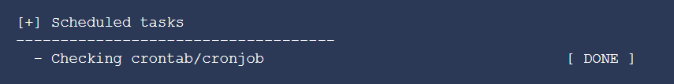
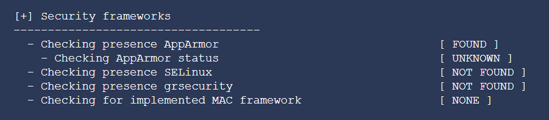

## Tìm hiểu về Lynis

Lynis là 1 công cụ kiểm tra bảo mật mã nguồn mở cho các hệ thống Unix/Linux. Phần mềm này rất linh hoạt, nó có thể chạy trên hầu hết các hệ thống Linux, macOS, BSD và các biến thể Unix khác. Lynis cung cấp các hướng dẫn để "làm cứng" hệ thống, phát hiện các lỗ hổng như các vấn đề về cấu hình và có thể được sử dụng để kiểm tra tuân thủ bảo mật.

### Lịch sử phát triển

Lynis được tạo ra vào năm 2007 bởi Michael Boelen, 1 chuyên gia bảo mật người Hà Lan quan tấm đến bảo mật Linux và Unix.

Lynis là dự án nguồn mở thứ 2 của anh ấy và có thể được xem như đứa con tinh thần dựa trên Rootkit Hunter (rkhunter). Rootkit Hunter có trọng tâm chính là việc phát hiện các thành phần độc hại trên hệ thống, còn Lynis là 1 cung cụ chung hơn để đánh giá tính năng bảo mật của hệ thống và báo cáo về nó.

Sự phát triển trong những ngày đầu chủ yếu được thực hiện bởi chính Michael. Các đóng góp sau đó thường được gửi qua email và được hợp nhất vào mã nguồn sau khi đã được xem xét. Các bản phát hành đã được cung cấp trên tên miền [rootkit.nl](http://rootkit.nl/) cũng là homepage của dự án rhunter.

Năm 2013, sự phát triển được chuyển sang CISOfy. Công ty được thành lập bới Michael, với việc anh ấy chuyển sang phát triển toàn thời gian. Nó đảm bảo cập nhật thường xuyên hơn và cung cấp bản thương mại có tên Lynis Enterprise. Giải pháp này sẽ sử dụng công cụ Lynis độc lập trong lõi của nó, đồng thời cung cấp giao diện web với các tính năng bổ sung như báo cáo, bẳng điều khiển, hướng dẫn "làm cứng" và kiểm tra tuân thủ sâu rộng hơn.

Là 1 phần của việc tăng cường phất triển dự án, cuối năm 2013 và đầu năm 2014, nó đã được cơ cấu lại mã nguồn và tối ưu hóa hơn nữa. Dự án được đưa lên Github vào năm 2014, nơi mọi người tìm thấy sự phát triển và đóng góp khác nhau. Phiên bản 1.6.1 là bản phát hành đầu tiên có sẵn thông qua cả trang web và trên Github.

Năm 2018, dự án trên Github có hơn 100 người đóng góp công khai bên cạnh vô số đóng góp thông qua các kênh khác. Trong cùng năm đó, nó cũng đạt được cột mốc 5000 sao.

### Các phiên bản Lynis

Lynis hiện cung cấp 2 phiên bản là Lynis free và Lynis Enterprise, trong đó bản Enterprise có 2 version là Basic và Premium. Mỗi phiên bản sẽ cung cấp những tính năng khác nhau:


Lý do nên nâng cấp:

Công cụ kiểm toán miễn phí Lynis rất mạnh mẽ và dễ sử dụng. Bằng cách nâng cấp lên Lynis Enterprise, bạn sẽ nhận được các lợi ích bổ sung:

- Nhanh chóng kiểm tra trạng thái tuân thủ của bạn

- Hiển thị bằng chứng cho người quản lý hoặc kiểm toán viên của bạn

- Hiểu biết tốt hơn: bằng cách sử dụng những plugin bổ sung

- Tiết kiệm thời gian: với các đoạn "làm cứng" sẵn sàng để sử dụng

- Tích hợp: hệ thống liên kết với API của nhà phát triển

- Hỗ trợ và hướng dẫn

### Cách hoạt động của Lynis

Lynis sẽ thực hiện hàng trăm quá trính kiểm tra độc lập để xác định tình trạng bảo mật của hệ thống. Tất cả các bài test này đều dựa trên các nguyên tắc và tiêu chuẩn an ninh chung. Ví dụ như tìm kiếm các phần mềm đã cài đặt và xác định lỗi cấu hình cụ thể. Lynis đi sâu hơn nữa, kiểm tra các thành phần trong phần mềm, kiểm tra liên quan các file cấu hình và đánh giá hiệu năng. Sau tất cả các bài test, 1 báo cáo sẽ hiển thị với đầy đủ kết quả.

Lynis sẽ thực hiện các bài kiểm tra cá nhân dựa trên danh sách CSDL hành vi thực hiện thao tác theo các bước sau:

- Xác định hđh

- Tìm kiếm các công cụ và tiện ích đang có để thực hiện kiểm tra

- Kiểm tra update Lynis

- Chạy kiểm tra với các plugin được kích hoạt nếu có

- Chạy kiểm tra bảo mật quy trình với từng nhóm phân loại

- Báo cáo trạng thái quét bảo mật

Bên cạnh các dữ liệu được hiển thị trên màn hình, tất cả các chi tiết kỹ thuật về quét được lưu trữ trong một tệp nhật ký. Bất kỳ phát hiện nào (cảnh báo, đề xuất, thu thập dữ liệu) đều được lưu trữ trong một tệp báo cáo.

Các case điển hình sử dụng Lynis:

- Kiểm tra bảo mật

- Kiểm tra tuân thủ (ví dụ: PCI, HIPPA, SOx)

- Phát hiện và quét lỗ hổng bảo mật

- Làm hệ thống trở nên bảo mật hơn

Các nhóm phân loại bảo mật của Lynis:

- System tools: system binaries

- Boot anđ services: boot loaders, startup services

- Kernel: run level, loaded module, kernel configuration, core dumps

- Memory and processes: zombie processes, IO waiting processes

- User, groups and authentication: group IDS, sudoers, PAM configuration, password aging, default mask

- Shells

- file systems: mount points, /tmp files, root file system

- Storage: usb-storage, firewire ohci

- NFS

- Software: name services: DNS search domain, BIND

- Ports and packages: vulnerable/upgradable packages, security repository

- Networking: nameservers, promiscuous interfaces, connections

- Printers and spools: cups configuration

- Software: email and messaging

- Software: fỉewalls: iptables, pf

- Software: webserver: apache, nginx

- SSH support: SSH configuration

- SNMP support

- Databases: MySQL root password

- LDAP services

- Software: php: php options

- Squid support

- Logging and files: syslog daemon, log directories

- Insecure services: inetd

- Banners and identification

- Scheduled tasks: crontab/cronjob, atd

- Accounting: sysstat data, audit

- Time and synchronization: ntp daemon

- Cryptography: SSL certificate expiration

- Virtualization

- Security framework: AppArmor, SELinux, grsecurity status

- Software: file itegrity

- Software: malware scanners

- Home directories: hell history file

Tài nguyên được sử dụng để kiểm tra:

Nhiều công cụ khác sử dụng cùng 1 tệp dữ liệu để thực hiện kiểm tra. vì Lynis không bị giới hạn trong 1 vài bản phân phối Linux phổ biến, nó sử dụng các bài kiểm tra  từ các tiêu chuẩn và tùy chỉnh không tìm thấy trong bất kỳ công cụ nào khác

- Thực hành tốt nhất

- CIS

- NIST

- NSA

- Dữ liệu OpenSCAP

- Hướng dẫn và khuyến nghị của nhà cung cấp (ví dụ Debian, Gentoo, RedHat ...)

### Cài đặt và sử dụng

#### Cài đặt

Để tải xuống Lynis, có 1 số tùy chọn sau:

- Tải xuống package ở định dạng deb hoặc rpm

- Clone từ Github

- Tải xuống trực tiếp

- Homebrew (macOS)

1. Cài đặt qua package

- RedHat: `yum install lynis`

- Debian: `apt-get install lynis`

- openSUSE: `zypper install lynis`

2. Clone từ Github

Chọn 1 thư mục chứa, ví dụ: `cd /usr/local`

Clone từ Github: `git clone https://github.com/CISOfy/lynis`

3. Tải xuống trực tiếp

Tạo thư mục chứa: `mkdir -p /usr/local/lynis`

Di chuyển vào thư mục và download:

```
cd /usr/local
wget https://cisofy.com/files/lynis-<version>.tar.gz
```

Giải nén tập tin vừa tải xuống: `tar xfvz lynis-<version>.tar.gz`

4. Cài đặt qua Homebrew

`brew install lynis`

#### First run

Nếu Lynis được cài đặt qua package hoặc Homebrew, bạn có thể chạy Lynis từ bất kỳ thư mục nào.

Đối với các phương thức khác, đảm bảo rằng bạn đang ở đúng thư mục và thêm `./` vào trước lệnh, như sau: `./lynis`

Chạy basic scan: `lynis audit system`

Command:

- Audit: thực hiện kiểm tra

target:

	- system: audit host system
	
	- dockerfile: audit dockerfile

- Show: hiển thị các thông tin, hướng dẫn, trợ giúp

ví dụ:

	- help: hiển thị trợ giúp và mẹo
	
	- commands: hiển thị các lệnh Lynis có sẵn
	
	- profiles: hiển thị các audit profile được phát hiện
	
	- settings: hiển thị các cài đặt hoạt động
	
	- version: hiển thị phiên bản Lynis

- Options:

Trong bảng dưới đây, các tham số được sử dụng phổ biến nhất được liệt kê.

| Option | Viết tắt | Mô tả |
| --- | --- | --- |
| --auditor "Name" | | Thêm tên người thực hiện kiểm tra (report) |
| --checkall | -c| Start the check |
| --check-update | | Kiểm tra xem Lynis có được cập nhật không |
| --cronjob | | Chạy Lynis dưới dạng cronjob (bao gồm -c -Q) |
| --debug | | Hiển thị thông tin debug, hữu ích khi troubleshooting và development |
| --help | -h | Hiển thị các tham số hợp lệ |
| --man-page | | View man page |
| --no-colors | | Do not use any colors |
| --pentest | | | Thực hiện quét kiểm tra thâm nhập (non-privileged) |
| --quick | -Q | Không đợi input từ user, ngoại trừ lỗi |
| --quiet | -q | Chỉ hiện các cảnh báo (bao gồm cả --quick, nhưng không đợi) |
| --reverse-colors | | Sử dụng bảng màu khác cho nền sáng hơn |
| --verbose | | Hiển thị output ra màn hình nhiều hơn |
| --version | -V | Kiểm tra phiên bản chương trình (và thoát) |

#### Báo cáo và ghi nhật ký

Lynis thực hiện kiểm tra chuyên sâu và báo cáo kết quả ra các output:

- Màn hình

- Logging

- Report

1. Screen output

Lynis quét hệ thống và thực hiện hàng trăm bài kiểm tra. Đối với hầu hết các thử nghiệm này, một kết quả sẽ được hiển thị trên màn hình.

Kết quả cảu các bài test có thể bao gồm:

- OK hoặc Warning

- Found hoặc Not found

- A value

2. Log file

Các kết quả được hiển thị trên màn hình trong quá trình quét hệ thống. Các chi tiết bổ sung được ghi vào một tệp riêng (mặc định: `/var/log/lynis.log`). Thông tin này hữu ích cho advanced testers, để xem chương trình đã làm gì trong nền hoặc nơi bất thường xuất hiện.

Thông tin trong tệp nhật ký:

- Thời gian của một hành động/sự kiện

- Lý do tại sao một bài kiểm tra thất bại hoặc bị bỏ qua

- Output của các bài test (nội bộ)

- Gợi ý về các tùy chọn cấu hình hoặc cách khắc phục / cải thiện mọi thứ

- Các mối đe dọa/tác động

Ghi chú: tệp nhật ký được xóa mỗi lần quét. Nếu bạn cần debug hoặc ghi thông tin cho các lần quét trước, hãy lập lịch quay vòng nhật ký hoặc tạo bản sao lưu trước khi chạy lại Lynis.

3. Report files

Trong quá trình kiểm toán, Lynis sẽ thu thập các phát hiện và các điểm dữ liệu khác. Thông tin này được lưu trữ trong tệp báo cáo, theo mặc định `/var/log/lynis-report.dat`.

Lynis hỗ trợ một định dạng báo cáo, có thể được sử dụng để thu thập kết quả và hiển thị chúng trong bản trình bày tùy chỉnh hoặc (thêm). Tệp báo cáo cũng có thể được sử dụng để so sánh kết quả quét từ quá khứ với quá trình quét hiện tại. Lynis Enterprise có nhiều khả năng hơn để hiển thị dữ liệu, bao gồm các báo cáo mở rộng ở một số định dạng.

Nội dung của tập tin báo cáo:

- Nhận xét = #<remark>
- Mục = [<section name>]
- Tùy chọn/giá trị = <option name>=<option value>

Khi một tùy chọn có thể có nhiều giá trị (ví dụ như các gói đã cài đặt), dấu ngoặc `[]` sẽ được thêm vào. Ví dụ: installed_package[]=Package-1.0.0

Các lưu ý khác:

Tìm các thông tin cảnh báo "WARNING" về khả năng lỗ hổng được tìm thấy từ file report: `grep "Warning" /var/log/lynis.log`

Tìm các thông tin "SUGGESTIONS" nhằm cải thiện tính năng bảo mật hệ thống: `grep "Suggestion" /var/log/lynis.log`

### 1 số ảnh của quá trình scan

- System Tools: Scan system tools & system binaries có sẵn. Kiểm tra tệp nhị phân trong thư mục `/bin`, tương tự, nó sẽ quét mã nhị phân khác như `/sbin`, `/usr/bin`, `/usr/sbin` & `/usr/local/bin`, vv, .


- Plugins (phase 1): Quét thử nghiệm plugin giai đoạn 1 dựa trên các plugin đã cài đặt. Nếu bạn muốn cài đặt plugin cho lynis, hãy thêm nó vào thư mục `/etc/lynis/plugins`.


- Boot loader & startup services: Quét các boot loader file (UEFI, GRUB2), dịch vụ đang chạy (audd, kdump, sshd, sysstat, v.v.) và các dịch vụ khởi động.


- Kernel: Quét run level, CPU support, kernel version, kernel type, `/etc/inittab` & loaded kernel modules.


- Memory and Processes: Quét thông tin bộ nhớ từ `/proc/meminfo`, dead processes & IO processes.


- Users, Groups and Authentication: Quét tài khoản quản trị viên, UID, GID, `/etc/passwd`, sudoers & PAM file, password aging, chế độ người dùng đơn, đăng nhập thất bại & umask.


- Shells: Quét các shell có sẵn và kiểm tra xem nó có dễ bị tấn công không.


- File systems: Quét các mount point có sẵn và kiểm tra xem nó được gắn riêng hay gắn trên hệ thống tệp. Cũng kiểm tra các mount point flag và thêm đúng cách. tập tin fstab, phân vùng swap, `/proc`, `/tmp` và `/tmp stick bit`.


- Storage: Quét bộ nhớ lưu trữ, nếu bộ nhớ USB bị tắt, hãy kiểm tra ủy quyền thiết bị USB. Ngoài ra kiểm tra nếu lưu trữ firewire bị vô hiệu hóa.


- NFS: Quét thông tin NFS như các chương trình đã đăng ký rpcinfo, phiên bản đã đăng ký NFS, giao thức đã đăng ký NFS và trình nền NFS đang chạy.


- Name Services: Quét tệp `/etc/resolve.conf` để biết thông tin name services, lệnh dnsdomainname, trạng thái nscd, trạng thái được đặt tên (BIND), trạng thái daemon không liên kết và xác minh `/etc/hosts` có mục nhập tên máy chủ.


- Ports and packages: quản lý gói quét đầu tiên, nếu tìm thấy trình quản lý gói (rpm, deb, v.v.) thì nó sẽ truy vấn danh sách các gói đã cài đặt và kiểm tra lỗ hổng gói, cập nhật gói. Cuối cùng kiểm tra chữ ký GPG để bảo mật gói.


- Networking: Quét IPv6 có bật hay không, kiểm tra cấu hình name server, tìm kiếm giao diện mạng khả dụng, địa chỉ MAC, địa chỉ IP mạng, trạng thái DHCP.


- Printers and Spools: Kiểm tra trạng thái cupsd và các tệp cấu hình liên quan. trạng thái lpd, trạng thái bộ đệm máy in qdaemon & old print job.


- Software: e-mail and messaging: Quét trạng thái máy chủ thư có sẵn và các tệp cấu hình liên quan.


- Software: firewalls: Kiểm tra mô-đun hạt nhân iptables, các chính sách được sử dụng của iptables chains. Đồng thời xác minh tường lửa phần mềm như CSF, UCF, v.v.


- Software: webserver: Quét các máy chủ web đã cài đặt (apache hoặc enginx), virtual host, loaded module, mod_evasive, mod_qos & ModSecurity.


- SSH Support: Quét trạng thái SSH daemon và các chỉnh sửa khác của SSH trên `/etc/ssh/sshd_config` để đăng nhập an toàn.


- SNMP Support: Kiểm tra SNMP daemon đang chạy, vị trí tệp daemon, liên lạc SNMP.


- Databases: Kiểm tra các cơ sở dữ liệu đã cài đặt như MySQL, PostgreSQL, Oracle, DB2 & Redis và các tiến trình, tệp cấu hình liên quan.


- LDAP Services: Kiểm tra phiên bản OpenLDAP có chạy hay không và tệp cấu hình của nó.


- PHP: Kiểm tra xem PHP đã cài đặt hay chưa, tệp php.ini và các tệp liên quan đến php khác. Chức năng bị vô hiệu hóa PHP, tùy chọn register_globals của PHP, tùy chọn enable_dl của PHP, tùy chọn allow_url_fopen của PHP.


- Squid Support: Quét trạng thái squid daemon, phiên bản squid, vị trí tệp squid daemon, phương thức xác thực, squid acl & cổng an toàn.


- Logging and files: Quét xem syslog daemon có chạy hay không và các tệp cấu hình của nó.


- Insecure services: Quét trạng thái trình nền inet và kiểm tra tệp cấu hình khi bị tắt.


- Banners and identification: Quét các tệp biểu ngữ bản quyền, kiểm tra tệp & nội dung biểu ngữ & kiểm tra tệp `issue.net` và nội dung của nó.


- Scheduled tasks: Quét các số liệu thống kê cron daemon sau đó nó sẽ kiểm tra danh sách cronjob / crontab.



- Accounting: Quét thông tin phần mềm kiểm toán và các tệp cấu hình của nó.


- Time and Synchronization: Quét daemon NTP hoặc trạng thái máy khách và kiểm tra trạng thái đồng bộ hóa thời gian NTP.


- Cryptography: Kiểm tra ngày hết hạn của chứng chỉ SSL.


- Virtualization: Kiểm tra công nghệ ảo hóa.


- Containers: Kiểm tra trạng thái và thông tin Docker, kiểm tra thông tin docker xem có cảnh báo nào không và kiểm tra không có container docker.


- Security frameworks: Quét AppArmor, SELinux, grsecurity được bật. nếu có, nó sẽ kiểm tra trạng thái & sự hiện diện của daemon.



- File integrity: Kiểm tra tính toàn vẹn của tệp đối với tất cả các tệp.


- System tooling: Kiểm tra các công cụ tự động hóa hệ thống, fail2ban, IDS / IPS, v.v.


- Malware: Quét các công cụ liên quan đến phần mềm độc hại như chkrootkit, Rootkit Hunter, LMD & clamscan.


- File Permissions: Quét tất cả các loại quyền.


- Home directories: Kiểm tra tập tin thư mục home & thông tin thư mục.


- Kernel Hardening: Quét các cặp khóa sysctl với hồ sơ để xác minh các tham số cứng kernel.


- Hardening: Kiểm tra các thông số làm cứng hạt nhân, nếu nó yếu thì đưa ra lời khuyên cho việc "làm cứng". Trình biên dịch hạt nhân được quét cài đặt đúng cách, kiểm tra quyền biên dịch, quét phần mềm độc hại và kiểm tra tùy chỉnh.


- Custom Tests: Thực hiện một số kiểm tra tùy chỉnh để kiểm tra bảo mật hệ thống.


- Plugins (phase 2): Quét thử nghiệm plugin giai đoạn 2


- Lynis results Warnings: Sau khi quét thành công, nó sẽ hiển thị chi tiết Cảnh báo & Đề xuất.


- Lynis results Suggestions: Gợi ý chi tiết.


- Lynis security scan details: Trong khi quét, bạn sẽ thấy trong mỗi thông số đầu ra OK hoặc WARNING, trong đó OK được coi là kết quả mong đợi (tốt) và WARNING là bất ngờ. Tuy nhiên, hãy nhớ rằng một kết quả cho biết OK KHÔNG luôn luôn có nghĩa là mục tiêu được quét được định cấu hình chính xác, an toàn (bảo mật thông minh) hoặc thực tiễn tốt nhất. Ngược lại, mọi WARNING không phải là 'xấu'. Vì vậy, hãy chú ý WARNING để tránh thiệt hại tiềm tàng trên máy chủ.


### Tự động chạy Lynis với cronjob

Lời khuyên được đua ra là chạy một lần trong một tháng. Tạo 1 script và thêm nội dung bên dưới để chạy kiểm tra lynis một lần trong một tháng. Tạo các đường dẫn liên quan trong tập lệnh (`/usr/local/lynis` và `/var/log/lynis`).

`sudo nano /etc/cron.monthly/lynis`

```
#!/bin/sh
AUDITOR="automated"
DATE=$(date +%Y%m%d)
HOST=$(hostname)
LOG_DIR="/var/log/lynis"
REPORT="$LOG_DIR/report-${HOST}.${DATE}"
DATA="$LOG_DIR/report-data-${HOST}.${DATE}.txt"

# Run Lynis
lynis audit system --auditor "${AUDITOR}" --cronjob > ${REPORT}

# Optional step: Move report file if it exists
if [ -f /var/log/lynis-report.dat ]; then
    mv /var/log/lynis-report.dat ${DATA}
fi
```