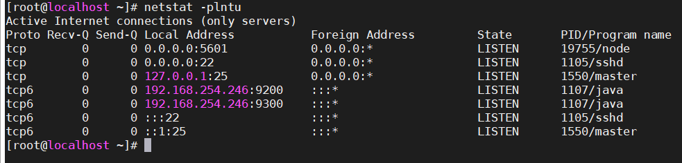
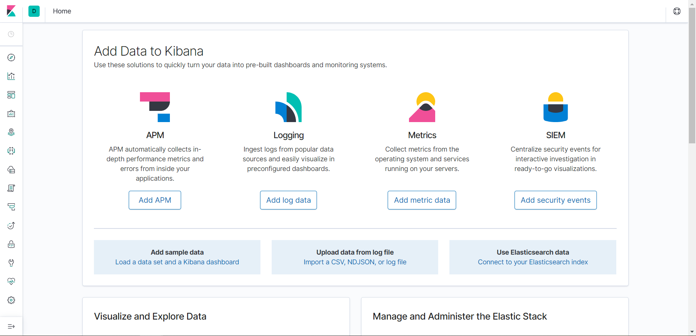

## Cài đặt ELK Stack

- Cập nhật server và cài một số gói cần thiết:

`yum update -y && yum install -y wget curl`

1. Disable SE Linux

Kiểm tra trạng thái SE Linux:

`sestatus`

Nếu SE Linux đang enable thì tắt như sau:

`sed -i 's/^SELINUX=.*/\SELINUX=disabled/' /etc/selinux/config`

Sau đó reboot server.

2. Cài đặt java

Logstash và Elasticsearch yêu cầu Java nên cần có một Java Virtual Machine để hoạt động. Vì vậy trước tiên bạn cần cài đặt Java, nếu đã cài đặt Java thì có thể bỏ qua bước này.

`yum -y install java-openjdk java-1.8.0-openjdk-devel`

3. Cài đặt Elasticsearch

- Download public key Elasticsearch:

`rpm --import http://packages.elastic.co/GPG-KEY-elasticsearch`

- Thêm repo Elasticsearch version 7 để cài đặt:

```
cat << EOF > /etc/yum.repos.d/elasticsearch.repo
elasticsearch-7.x
name=Elasticsearch repository for 7.x packages
baseurl=https://artifacts.elastic.co/packages/7.x/yum
gpgcheck=1
gpgkey=https://artifacts.elastic.co/GPG-KEY-elasticsearch
enabled=1
autorefresh=1
type=rpm-md
EOF
```

- Cài đặt Elasticsearch bằng lệnh sau:

`yum -y install elasticsearch`

- Sau khi cài đặt xong, kiểm tra version bằng lệnh:

`rpm -qi elasticsearch`

- Thiết lập dung lượng RAM để chạy Elasticsearch:

`vi /etc/elasticsearch/jvm.options`

- Cấu hình lại 2 tham số sau:

```
-Xms256M
-Xmx512M
```

Với máy ảo hiện tại có 1GB Ram nên set 2 thông số trên, nếu server có nhiều ram hơn thì có thể tăng lên để chạy mượt mà hơn. Với môi trường test thì như vậy là ổn rồi.

- Sửa phần `network.host` trong file `/etc/elasticsearch/elasticsearch.yml` bằng ip của server

- Thêm dòng sau vào trường Discovery nếu cài Elasticsearch 1 node:

`discovery.type: single-node`

- Bắt đầu chạy Elasticsearch và cho phép khởi động cùng hệ thống:

```
systemctl enable elasticsearch.service
systemctl start elasticsearch
```

- Mở cổng 9200 firewall:

```
firewall-cmd --add-port=9200/tcp --permanent
firewall-cmd --reload
```

- Kiểm tra Elasticsearch có phản hồi hay không bằng lệnh:

`curl -X GET http://your_server_ip:9200`

nếu Elasticsearch hoạt động đúng, ta sẽ nhận được kết quả như sau:


4. Cài đặt Logstash

- Thêm repo Logstash version 7 để cài đặt:

```
cat << EOF > /etc/yum.repos.d/logstash.repo
[logstash-7.x]
name=Elastic repository for 7.x packages
baseurl=https://artifacts.elastic.co/packages/7.x/yum
gpgcheck=1
gpgkey=https://artifacts.elastic.co/GPG-KEY-elasticsearch
enabled=1
autorefresh=1
type=rpm-md
EOF
```

- Cài đặt Logstash với câu lệnh:

`yum install -y logstash`

- Start và enable logstash:

```
systemctl daemon-reload
systemctl enable logstash
systemctl start logstash
```

- Kiểm tra trạng thái của Logstash:

`systemctl status logstash`

- Mở port 5044 để cho phép Logstash tiếp nhận log từ client đẩy về:

```
firewall-cmd --add-port=5044/tcp --permanent
firewall-cmd --reload
```

5. Cài đặt Kibana

- Thêm repo Kibana version 7 để cài đặt:

```
cat << EOF > /etc/yum.repos.d/kibana.repo
[kibana-7.x]
name=Kibana repository for 7.x packages
baseurl=https://artifacts.elastic.co/packages/7.x/yum
gpgcheck=1
gpgkey=https://artifacts.elastic.co/GPG-KEY-elasticsearch
enabled=1
autorefresh=1
type=rpm-md
EOF
```

- Cài đặt kibana với câu lệnh:

`yum install -y kibana`

- Cấu hình Kibana trong file /etc/kibana/kibana.yml để có thể truy cập:

```
tìm đến dòng #server.host: "localhost" vừa sửa thành server.host: "0.0.0.0"
dòng #elasticsearch.hosts: ["http://localhost:9200"] sủa lại thành elasticsearch.hosts: ["http://your_server_ip:9200"]
```

lưu file lại.

- Enable và start dịch vụ Kibana:

```
systemctl daemon-reload
systemctl enable kibana.service
systemctl start kibana
```
Kiểm tra port 5601 nếu có tức là Kibana đang chạy:

`netstat -plntu`



Mở port 5601 trên firewall để có thể vào giao diện web Kibana:

```
firewall-cmd --add-port=5601/tcp --permanent
firewall-cmd --reload
```

- Mở trình duyệt web và nhập địa chỉ `http://your_server_ip:5601`

giao diện web Kibana sẽ như sau:

