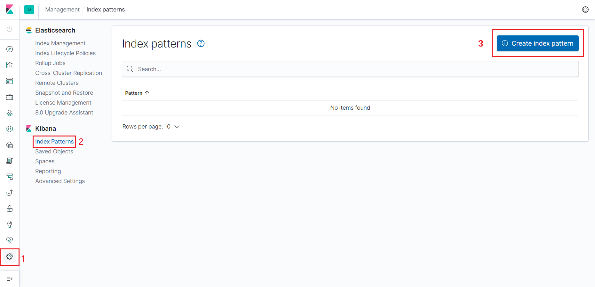
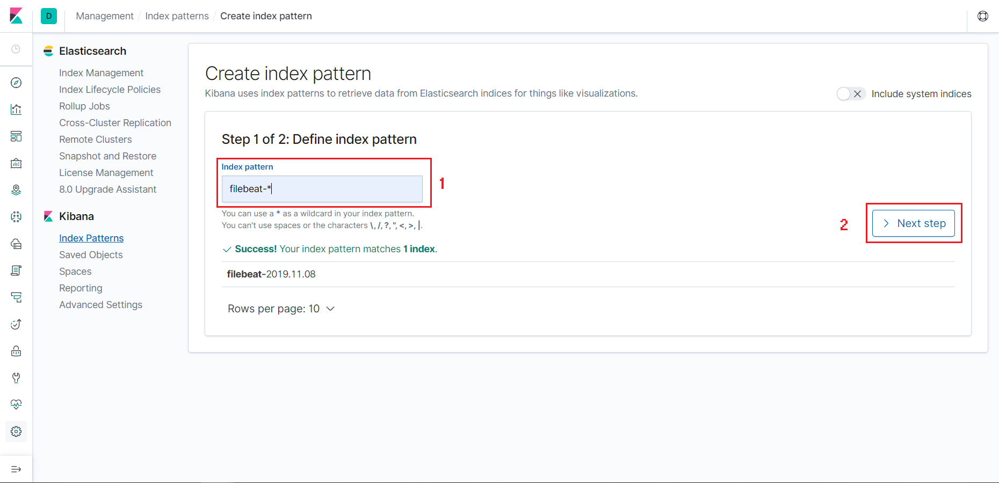

## Cài đặt Filebeat

- Trên máy chủ muốn đẩy log về chúng ta cần phải cài đặt filebeat, cài đặt GPG keys từ Elastic và thêm Elastic repo:

```
rpm --import https://packages.elastic.co/GPG-KEY-elasticsearch

cat << EOF > /etc/yum.repos.d/elastic.repo 
[elasticsearch-7.x]
name=Elasticsearch repository for 7.x packages
baseurl=https://artifacts.elastic.co/packages/7.x/yum
gpgcheck=1
gpgkey=https://artifacts.elastic.co/GPG-KEY-elasticsearch
enabled=1
autorefresh=1
type=rpm-md
EOF
```

- Cài đặt filebeat với câu lệnh:

`yum install -y filebeat`

- Start và enable filebeat:

```
systemctl enable filebeat.service
systemctl start filebeat
```

- Tạo thư mục lưu trữ debug từ filebeat:

`mkdir /var/log/filebeat`

- Sao chép file cấu hình filebeat.yml để backup:

`cp /etc/filebeat/filebeat.yml /etc/filebeat/filebeat.yml.1`

- Cấu hình các mục trong file /etc/filebeat/filebeat.yml như sau:

```
filebeat.inputs:
- type: log
  enable: true

  paths:
    - /var/log/*.log
    - /var/log/messages
	- /var/log/secure
    - /var/log/maillog
	- /var/log/yum.log
    - /var/log/httpd/*.log

  fields:
    level: debug
```

```
filebeat.config.modules:

  path: ${path.config}/modules.d/*.yml
  
  reload.enabled: true

setup.template.settings:
  index.number_of_shards: 1
```

```
output.logstash:

  host: ["your_ELK_server_ip:5044"]
```

```
processors:
  - add_host_metadata: ~
  - add_cloud_metadata: ~
```

```
logging.level: info

logging.selectors: ["*"]
```

- Tạo file config logstash trên ELK server

`vi /etc/logstash/conf.d/02-logstash.conf`

- Thêm nội dung sau vào file:

```
input {
beats {
    port => 5044
    ssl => false
}
}

output {
    elasticsearch {
    hosts => ["your_ELK_server_ip:9200"]
    sniffing => true
    index => "%{[@metadata][beat]}-%{+YYYY.MM.dd}"
    }
}
```

- Restart lại dịch vụ logstash trên ELK server:

`systemctl restart logstash`

- Trên máy client đẩy log, khởi động lại filebeat:

`systemctl restart filebeat`

- Kiểm tra trên Kibana:

Trên trình duyệt nhập địa chỉ ip ELK server:

`http://your_ELK_server_ip:5601`

Vào mục `Management` và chọn `Create Index`:



Tại mục `Index pattern` ở bước 1 nhập `filebeat-*` rồi nhấn `Next step`



Mục `Time Filter field name` ở bước 2 chọn `@timestamp` rồi bấm `Create index pattern`


Kiểm tra lại thông tin log được đẩy về ở phần `Discover`:

