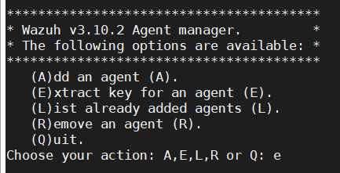

## Cài đặt Wazuh

### Cập nhật server và cài một số gói cần thiết:

`yum update -y && yum install -y wget curl openssl-devel`

### Cài đặt java

Logstash và Elasticsearch yêu cầu Java nên cần có một Java Virtual Machine để hoạt động. Vì vậy trước tiên bạn cần cài đặt Java, nếu đã cài đặt Java thì có thể bỏ qua bước này.

`yum -y install java-openjdk java-1.8.0-openjdk-devel`

### Cài đặt Wazuh server

> Tất cả các lệnh được mô tả dưới đây cần phải được thực thi với quyền người dùng root.

1. Add Wazuh repository

- Bước đầu tiên để thiết lập Wazuh là thêm kho lưu trữ Wazuh vào máy chủ của bạn.

```
rpm --import https://packages.wazuh.com/key/GPG-KEY-WAZUH
cat > /etc/yum.repos.d/wazuh.repo <<\EOF
[wazuh_repo]
gpgcheck=1
gpgkey=https://packages.wazuh.com/key/GPG-KEY-WAZUH
enabled=1
name=Wazuh repository
baseurl=https://packages.wazuh.com/3.x/yum/
protect=1
EOF
```

2. Cài đặt Wazuh manager

- Bước tiếp theo là cài đặt trình quản lý Wazuh trên hệ thống của bạn:

`yum install -y wazuh-manager`

- Khi quá trình hoàn tất, bạn có thể kiểm tra trạng thái dịch vụ với:

	- Đối với Systemd:
	
	`systemctl status wazuh-manager`
	
	- Đối với SysV Init:
	
	`service wazuh-manager status`


3. Cài đặt Wazuh API

- NodeJS >= 4.6.1 là yêu cầu bắt buộc để chạy Wazuh API. Nếu bạn chưa cài đặt NodeJS hoặc phiên bản của bạn cũ hơn 4.6.1, bạn nên thêm kho lưu trữ NodeJS chính thức như sau:

`curl --silent --location https://rpm.nodesource.com/setup_8.x | bash -`

và sau đó, cài đặt NodeJS:

`yum install -y nodejs`

- Cài đặt API Wazuh. Nó sẽ cập nhật NodeJS nếu được yêu cầu:

`yum install -y wazuh-api`

- Khi quá trình hoàn tất, bạn có thể kiểm tra trạng thái dịch vụ với:

	- Đối với Systemd:
	
	`systemctl status wazuh-api`
	
	- Đối với SysV Init:
	
	`service wazuh-api status`


- Vô hiệu hóa Wazuh repo (tùy chọn):

Khuyến cáo rằng kho lưu trữ Wazuh nên bị vô hiệu hóa để ngăn chặn các nâng cấp ngẫu nhiên. Để làm điều này, sử dụng lệnh sau:

`sed -i "s/^enabled=1/enabled=0/" /etc/yum.repos.d/wazuh.repo`

- Mở các port cần thiết:

```
firewall-cmd --add-port=514/tcp --permanent
firewall-cmd --add-port=514/udp --permanent
firewall-cmd --add-port=1514/udp --permanent
firewall-cmd --add-port=1514/tcp --permanent
firewall-cmd --add-port=1515/tcp --permanent
firewall-cmd --add-port=55000/tcp --permanent
firewall-cmd --reload
```

4. Cài đặt Filebeat

Filebeat là công cụ trên máy chủ Wazuh giúp chuyển tiếp các cảnh báo và các archived event một cách an toàn tới Logstash service trên Elasticsearch server.

> Chú ý : Với mô hình all-in-one, có thể bỏ qua việc cài Filebeat vì Logstash có thể đọc event/alert trực tiếp từ local filesystem.

- Thêm Elastic repository và GPG key:

```
rpm --import https://packages.elastic.co/GPG-KEY-elasticsearch
cat > /etc/yum.repos.d/elastic.repo << EOF
[elasticsearch-7.x]
name=Elasticsearch repository for 7.x packages
baseurl=https://artifacts.elastic.co/packages/7.x/yum
gpgcheck=1
gpgkey=https://artifacts.elastic.co/GPG-KEY-elasticsearch
enabled=1
autorefresh=1
type=rpm-md
EOF
```

- Cài đặt Filebeat:

`yum install -y filebeat-7.4.2`

- Tải xuống tệp cấu hình Filebeat từ kho lưu trữ Wazuh. Đây là cấu hình được thiết lập sẵn để chuyển tiếp cảnh báo Wazuh tới Elasticsearch:

```
curl -so /etc/filebeat/filebeat.yml https://raw.githubusercontent.com/wazuh/wazuh/v3.10.2/extensions/filebeat/7.x/filebeat.yml
chmod go+r /etc/filebeat/filebeat.yml
```
- Tải xuống mẫu cảnh báo cho Elasticsearch:

```
curl -so /etc/filebeat/wazuh-template.json https://raw.githubusercontent.com/wazuh/wazuh/v3.10.2/extensions/elasticsearch/7.x/wazuh-template.json
chmod go+r /etc/filebeat/wazuh-template.json
```

- Tải xuống mô-đun Wazuh cho Filebeat:

`curl -s https://packages.wazuh.com/3.x/filebeat/wazuh-filebeat-0.1.tar.gz | sudo tar -xvz -C /usr/share/filebeat/module`

- Chỉnh sửa tệp `/etc/filebeat/filebeat.yml` và thay thế `YOUR_ELASTIC_SERVER_IP` bằng địa chỉ IP hoặc tên máy chủ của máy chủ Elasticsearch. Ví dụ:

`output.elasticsearch.hosts: ['http://YOUR_ELASTIC_SERVER_IP:9200']`

- Kích hoạt và bắt đầu dịch vụ Filebeat:

	- Đối với Systemd:
	
	```
	systemctl daemon-reload
	systemctl enable filebeat.service
	systemctl start filebeat.service
	```
	
	- Đối với SysV Init:
	
	```
	chkconfig --add filebeat
	service filebeat start
	```
- Vô hiệu Elastic repository (tùy chọn):

Khuyến cáo rằng Elastic repository nên bị vô hiệu hóa để ngăn chặn các nâng cấp ngẫu nhiên. Để làm điều này, sử dụng lệnh sau:

`sed -i "s/^enabled=1/enabled=0/" /etc/yum.repos.d/elastic.repo`

### Cài đặt Elastic Stack

> Tất cả các lệnh được mô tả dưới đây cần phải được thực thi với quyền người dùng root.

1. Chuẩn bị

- Thêm Elastic repository và GPG key:

```
rpm --import https://packages.elastic.co/GPG-KEY-elasticsearch
cat > /etc/yum.repos.d/elastic.repo << EOF
[elasticsearch-7.x]
name=Elasticsearch repository for 7.x packages
baseurl=https://artifacts.elastic.co/packages/7.x/yum
gpgcheck=1
gpgkey=https://artifacts.elastic.co/GPG-KEY-elasticsearch
enabled=1
autorefresh=1
type=rpm-md
EOF
```

2. Cài đặt Elasticsearch

- Cài đặt gói Elasticsearch:

`yum install -y elasticsearch-7.4.2`

- Elasticsearch sẽ chỉ nghe trên giao diện loopback (localhost) theo mặc định. Định cấu hình Elasticsearch để nghe địa chỉ khác bằng cách chỉnh sửa tệp `/etc/elasticsearch/elasticsearch.yml` và bỏ ghi chú cài đặt `network.host`. Thay đổi giá trị thành IP mà bạn muốn:

`network.host: <elasticsearch_ip>`

- Cấu hình sau có thể sẽ là cần thiết sau khi thay đổi tùy chọn `network.host` với cluster gồm nhiều node (chú ý tên các node không được trùng nhau). Thêm hoặc chỉnh sửa (nếu nó được comment) các dòng sau trong tệp `/etc/elasticsearch/elasticsearch.yml`:

```
node.name: <node_name>
cluster.initial_master_nodes: ["<node_name>"]
```

- Kích hoạt và bắt đầu dịch vụ Elasticsearch:

	- Đối với Systemd:
	
	```
	systemctl daemon-reload
	systemctl enable elasticsearch.service
	systemctl start elasticsearch.service
	```
	
	- Đối với SysV Init:
	
	```
	chkconfig --add elasticsearch
	service elasticsearch start
	```

- Sau khi Elasticsearch hoạt động và chạy, bạn nên tải mẫu Filebeat. Chạy lệnh sau nơi Filebeat đã được cài đặt:

> Lệnh này phải được chạy trên Wazuh server.

`filebeat setup --index-management -E setup.template.json.enabled=false`

- Add port trên firewall:

```
firewall-cmd --add-port=9200/tcp --permanent
firewall-cmd --reload
```

- Kiểm tra dịch vụ Elasticsearch:

`curl http://<elasticsearch_ip>:9200`


### Cài đặt Logstash

- Cài đặt Elastic repository và GPG key:

```
rpm --import https://packages.elastic.co/GPG-KEY-elasticsearch
cat > /etc/yum.repos.d/elastic.repo << EOF
[elasticsearch-7.x]
name=Elasticsearch repository for 7.x packages
baseurl=https://artifacts.elastic.co/packages/7.x/yum
gpgcheck=1
gpgkey=https://artifacts.elastic.co/GPG-KEY-elasticsearch
enabled=1
autorefresh=1
type=rpm-md
EOF
```

- Cài đặt Logstash:

`yum install -y logstash-7.4.2`

- Start và enable Logstash service:

```
systemctl daemon-reload
systemctl enable logstash
systemctl start logstash
```

- Tải xuống tệp cấu hình Wazuh cho Logstash (nếu triển khai trên multi-node sử dụng filebeat):

`curl -so /etc/logstash/conf.d/01-wazuh.conf https://raw.githubusercontent.com/wazuh/wazuh/v3.10.2/extensions/logstash/7.x/01-wazuh-remote.conf`

còn nếu chạy single-node thì có thể không cần filebeat

- Thêm usermode:

`usermod -a -G ossec logstash`

- Khởi động lại Logstash:

`systemctl restart logstash`

- Định cấu hình đối tượng Filebeat, thay đổi đích sự kiện từ đối tượng Elasticsearch thành đối tượng Logstash:

	- Vô hiệu hóa đầu ra Elasticsearch trong file `/etc/filebeat/filebeat.yml`:
	
	```
	#output.elasticsearch:
	#    hosts: ['http://YOUR_ELASTIC_SERVER_IP:9200']
	```
	
	- Thêm đầu ra Logstash trong file `/etc/filebeat/filebeat.yml`:
	
	`output.logstash.hosts: ["YOUR_LOGSTASH_SERVER_IP:5000"]`

- Khởi động lại Filebeat:

`systemctl restart filebeat`

- Kiểm tra xem Logstash có thể truy cập được từ Filebeat không:

`filebeat test output`


### Cài đặt Kibana

- Cài đặt gói Kibana:

`yum install -y kibana-7.4.2`

- Cài đặt plugin ứng dụng Wazuh cho Kibana:

	- Cài đặt từ URL:
	
	`sudo -u kibana /usr/share/kibana/bin/kibana-plugin install https://packages.wazuh.com/wazuhapp/wazuhapp-3.10.2_7.4.2.zip`
	
	- Cài đặt từ gói:
	
	`sudo -u kibana /usr/share/kibana/bin/kibana-plugin install file:///path/wazuhapp-3.10.2_7.4.2.zip`
	
	> Path phải có quyền read cho other. Vd: Thư mục /tmp/

- Kibana sẽ chỉ nghe trên giao diện loopback (localhost) theo mặc định, điều đó có nghĩa là nó chỉ có thể được truy cập từ cùng một máy. Để truy cập Kibana từ bên ngoài, hãy thêm IP của nó bằng cách chỉnh sửa tệp `/etc/kibana/kibana.yml`, bỏ ghi chú cài đặt `server.host` và thay đổi giá trị thành:

`server.host: "<kibana_ip>"`

- Định cấu hình URL của các phiên bản Elasticsearch để sử dụng cho tất cả các truy vấn của bạn bằng cách chỉnh sửa tập tin `/etc/kibana/kibana.yml`:

`elasticsearch.hosts: ["http://<elasticsearch_ip>:9200"]`

- Kích hoạt và bắt đầu dịch vụ Kibana:

	- Đối với Systemd:
	
	```
	systemctl daemon-reload
	systemctl enable kibana.service
	systemctl start kibana.service
	```
	
	- Đối với SysV Init:
	
	```
	chkconfig --add kibana
	service kibana start
	```

- Vô hiệu hóa Elasticsearch repo (tùy chọn):

`sed -i "s/^enabled=1/enabled=0/" /etc/yum.repos.d/elastic.repo`

- Add port firewall:

```
firewall-cmd --add-port=5601/tcp --permanent
firewall-cmd --reload
```

- Disable SE Linux:

Kiểm tra trạng thái SE Linux:

`sestatus`

Nếu SE Linux đang enable thì tắt như sau:

`sed -i 's/^SELINUX=.*/\SELINUX=disabled/' /etc/selinux/config`

Sau đó reboot server.

### Kết nối Wazuh App với API

Chúng ta sẽ register Wazuh API (đã được install trên Wazuh server) tới Wazuh App trên Kibana :

- Kích hoạt tùy chọn HTTPS:

Để bật HTTPS, bạn có thể tự tạo chứng chỉ của riêng mình hoặc tự động tạo chứng chỉ bằng cách sử dụng tập lệnh:

`/var/ossec/api/scripts/configure_api.sh`

- Trên Wazuh server chạy các lệnh sau với quyền root để set thông tin bảo mật cho Wazuh API:

```
cd /var/ossec/api/configuration/auth
node htpasswd -Bc -C 10 user yourUserName
```

- Sau đó, bạn sẽ cần phải khởi động lại `wazuh-api` và `wazuh-manager` để các thay đổi có hiệu lực:

```
systemctl restart wazuh-api
systemctl restart wazuh-manager
```

- Mở Web browser và tới Elastic Stack server IP trên port 5601. Tới Wazuh App


- Tại phần Wazuh API configuration điền các thông tin đã đăng ký vào:


Nếu bạn sử dụng Wazuh Documentation cho Nginx, URL phải là https://localhost

### Cài đặt Wazuh agent

> Wazuh agent sẽ được cài đặt trên những host cần giám sát.

- Thêm Wazuh repository:

```
rpm --import http://packages.wazuh.com/key/GPG-KEY-WAZUH
cat > /etc/yum.repos.d/wazuh.repo <<\EOF
[wazuh_repo]
gpgcheck=1
gpgkey=https://packages.wazuh.com/key/GPG-KEY-WAZUH
enabled=1
name=Wazuh repository
baseurl=https://packages.wazuh.com/3.x/yum/
protect=1
EOF
```

- Cài đặt Wazuh agent với câu lệnh:

`yum install -y wazuh-agent`

hoặc truy cập địa chỉ Elastic Stack server IP trên port 5601, tới Wazuh APP, chọn mục Agent, tại đây chọn `Add new agent`


tại đây, chọn hđh và điền ip Wazuh server vào và chạy câu lệnh bên dưới với quyền root trên host cân giám sát.


- Start wazuh-agent:

`systemctl start wazuh-agent`

- Register cho các Agent:

	- Trên server:
	
		- Chạy câu lệnh:
		
		`/var/ossec/bin/manage_agents`
		
		
		
		- Chọn `a` để thêm 1 agent. Điền tên và ip cho agent
		
		- Sau đó chọn `e` để tạo 1 pre-shared key để liên lạc giữa server và agent.
		
		
	
	- Trên agent:
	
		- Chạy câu lệnh:
		
		`/var/ossec/bin/manage_agents`
		
		
		
		- Chọn `i` để import key đã tạo từ phía server.
		
		- Chỉnh sửa ip của server trong file `/var/ossec/etc/ossec.conf`, thay `MANAGE_IP` bằng ip của server:
		
		```
		<client>
			<server-ip>MANAGE_IP</server-ip>
		</client>
		```

> Chú ý : Register đè một agent
VD : Một agent tên là Server với IP 10.0.0.10 đã được install và có ID là 005. Giả sử agent được reinstall, chúng ta cần phải reinstall agent mới và kết nối lại với Manager. Sử dụng câu lệnh sau trên Manager :
`/var/ossec/bin/manage_agents -n Agent_name -a 10.10.10.10 -F 0`

- Truy cập vào Wazuh APP trên kibana để kiểm tra agent vừa thêm vào:

