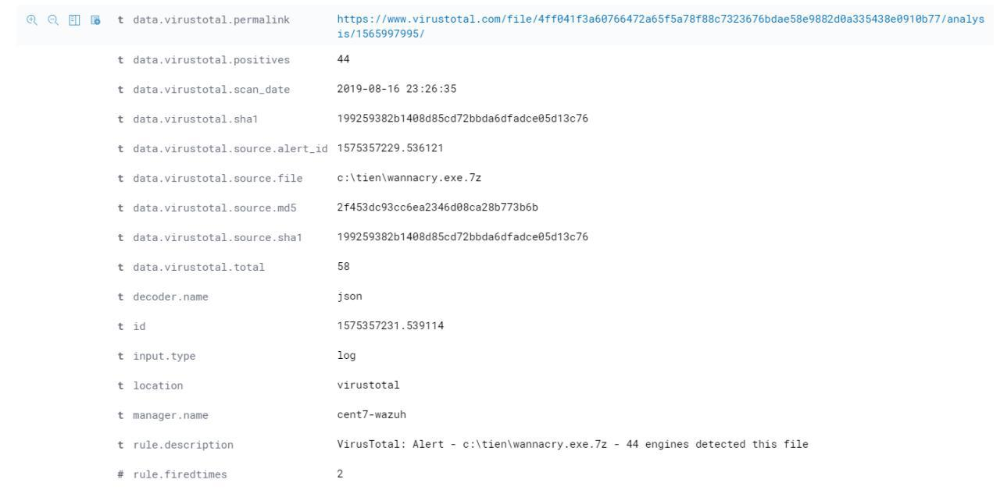

## Cấu hình giám sát thời gian thực và tích hợp virustotal

### Giám sát thời gian thực

Giám sát thời gian thực được cấu hình với tùy chọn `realtime`. Tùy chọn này chỉ hoạt động với các thư mục chứ không phải với các tệp riêng lẻ. Phát hiện thay đổi thời gian thực bị tạm dừng trong quá trình quét `syscheck` định kỳ và kích hoạt lại ngay khi những lần quét này hoàn tất.

Ví dụ:

```
<syscheck>
  <directories check_all="yes" realtime="yes">/home/wibu</directories>
</syscheck>
```

Kể từ phiên bản 3.4.0, Wazuh được bổ sung tùy chọn `whodata`. Tùy chọn này được thay thế cho tùy chọn `realtime`, có nghĩa là `whodata` ngụ ý theo dõi thời gian thực nhưng thêm thông tin who-data. Chức năng này sử dụng hệ thống con Linux Audit và Microsoft Windows SACL, do đó có thể cần cấu hình bổ sung.

```
<syscheck>
  <directories check_all="yes" whodata="yes">/home/wibu</directories>
</syscheck>
```

ngoài ra, ta có thể bổ sung thêm tùy chọn `report_changes` để theo dõi những thay đổi cụ thể trong tệp văn bản trong thư mục được giám sát

```
<syscheck>
  <directories check_all="yes" whodata="yes" report_changes="yes">/home/wibu</directories>
</syscheck>
```

### Tích hợp Virustotal

Việc tích hợp này sử dụng API VirusTotal để phát hiện nội dung độc hại trong các tệp được theo dõi bởi File Integrity Monitoring. Chức năng tích hợp này như được mô tả dưới đây:

- FIM tìm kiếm mọi bổ sung, thay đổi hoặc xóa tập tin trên các thư mục được theo dõi. Mô-đun này lưu trữ hàm băm của tệp này và kích hoạt cảnh báo khi có bất kỳ thay đổi nào được thực hiện.

- Khi tích hợp VirusTotal được bật, nó được kích hoạt khi có cảnh báo FIM xảy ra. Từ cảnh báo này, mô-đun trích xuất trường băm của tệp.

- Sau đó, mô-đun tạo một yêu cầu POST HTTP đến cơ sở dữ liệu VirusTotal bằng API VirusTotal để so sánh giữa hàm băm được trích xuất và thông tin có trong cơ sở dữ liệu.

- Sau đó, một phản hồi JSON là kết quả của tìm kiếm này sẽ kích hoạt một trong các cảnh báo sau:

	- Error: Public API request rate limit reached.

	- Error: Check credentials.

	- Alert: No records in VirusTotal database.

	- Alert: No positives found.

	- Alert: X engines detected this file.

Cảnh báo được kích hoạt được ghi vào tệp `integration.log` và được lưu trong tệp `alerts.log` cùng với tất cả các cảnh báo khác.

#### Cấu hình

- Các tích hợp được cấu hình trên `ossec.conf` nằm trong thư mục cài đặt Wazuh (/var/ossec/etc/). Để định cấu hình tích hợp, hãy thêm cấu hình sau vào phần `<ossec_config>`:

```
<integration>
  <name>virustotal</name>
  <api_key>API_KEY</api_key> <!-- Replace with your VirusTotal API key -->
  <group>syscheck</group>
  <alert_format>json</alert_format>
</integration>
```

> Để có được API_KEY của virustotal, bận cần phải đăng ký tài khoản tại [đây](https://www.virustotal.com/gui/join-us)

- Trên Agent:

Sử dụng FIM để giám sát 1 thư mục:

Thêm phần cấu hình sau vào mục `<syscheck>` của tệp cấu hình:

```
<syscheck>
...
  <directories check_all="yes" whodata="yes">C:\wibu</directories>
...
</syscheck>
```

- Sau khi áp dụng cấu hình, bạn phải khởi động lại Wazuh-agent và Wazuh-manager:

Đối với Systemd:

`systemctl restart wazuh-agent`

`systemctl restart wazuh-manager`

Đối với SysV Init:

`service wazuh-agent restart`

`service wazuh-manager restart`

Bên dưới là cảnh báo trên Kibana khi phát hiện file trong thư mục giám sát trùng với mẫu trên database của virustotal:

