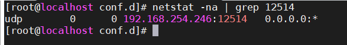
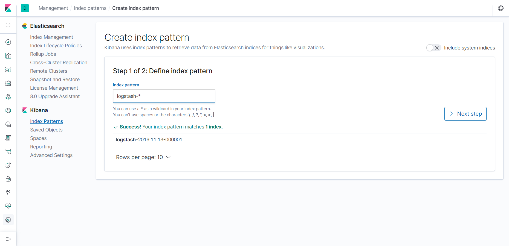
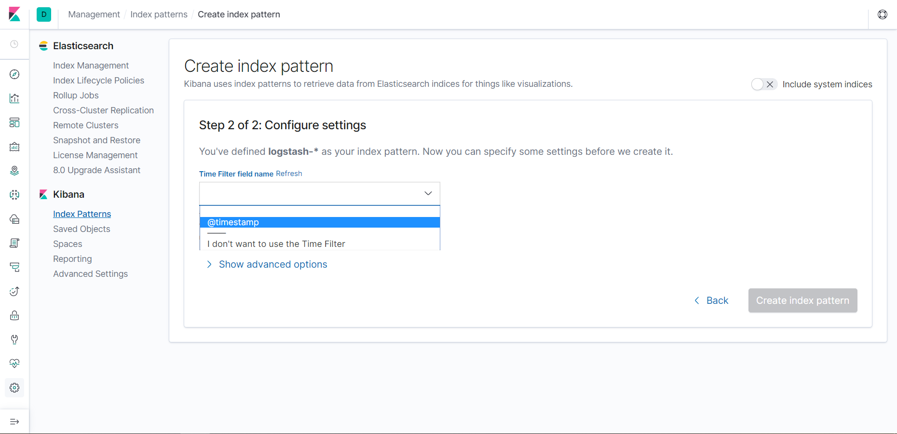
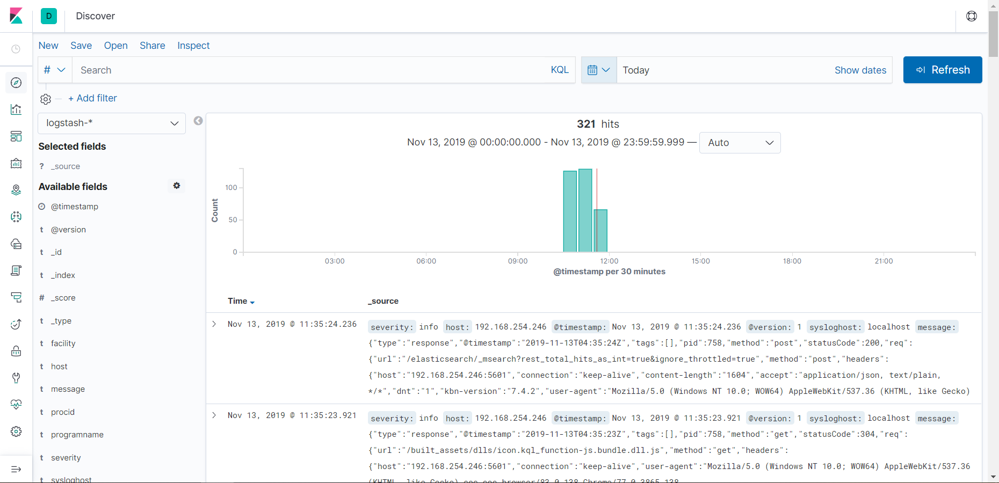

## Đẩy log về Logstash bằng rsyslog

### Mô hình:

- Server:

	- Cent 7
	
	- Đã cài đặt ELK Stack

- Client:

	- Cent 7

### Cấu hình

- Cấu hình rsyslog trên client để gửi log đến server

Mở file /etc/rsyslog.conf và thêm dòng sau:

`*.*	@IP_ELK_server:514`

@ là sử dụng UDP, @@ để sử dụng TCP

- Cấu hình rsyslog trên server để nhận log từ client

Truy cập file /etc/rsyslog.conf, bỏ comment ở các dòng sau:

```
$ModLoad imudp
$UDPServerRun 514

$ModLoad imtcp
$InputTCPServerRun 514
```

Các dòng đầu tiên của mỗi phần ( $ModLoad imudp và $ModLoad imtcp) tương ứng với các module imudp và imtcp. Chữ imudp viết tắt của **i**nput **m**odule **udp**, và imtcp viết tắt của **i**nput **m**odule **tcp**. Các mô-đun này lắng nghe dữ liệu đến từ các máy chủ syslog khác.

Các dòng thứ hai của mỗi phần ( $UDPSerververRun 514 và $TCPServerRun 514) chỉ ra rằng rsyslog sẽ khởi động các máy chủ UDP và TCP tương ứng cho các giao thức này nghe trên cổng 514 (là cổng mặc định syslog).

Lưu và đóng tệp cấu hình rsyslog.

Khởi động lại rsyslog bằng cách chạy:

`systemctl restart rsyslog`

- Cấu hình rsyslog gửi log đến Logstash

Tạo file /etc/rsyslog.d/70-output.conf và thêm vào nội dung sau:

```
# This line sends all lines to defined IP address at port 12514
# using the json-template format.

*.* @IP_ELK_server:12514;json-template
```

Nếu muốn sử dụng 1 port khác, hãy thay đổi ở đây.

- Định dạng log về JSON

Tạo file /etc/rsyslog.d/01-json-template.conf và thêm vào nội dung:

```
template(name="json-template"
  type="list") {
    constant(value="{")
      constant(value="\"@timestamp\":\"")     property(name="timereported" dateFormat="rfc3339")
      constant(value="\",\"@version\":\"1")
      constant(value="\",\"message\":\"")     property(name="msg" format="json")
      constant(value="\",\"sysloghost\":\"")  property(name="hostname")
      constant(value="\",\"severity\":\"")    property(name="syslogseverity-text")
      constant(value="\",\"facility\":\"")    property(name="syslogfacility-text")
      constant(value="\",\"programname\":\"") property(name="programname")
      constant(value="\",\"procid\":\"")      property(name="procid")
    constant(value="\"}\n")
}
```

Như bạn có thể thấy, với mỗi tin nhắn đến, rsyslog sẽ chỉnh sửa các thuộc tính nhật ký thành một tin nhắn được định dạng JSON và chuyển tiếp nó tới Logstash, đang nghe trên cổng 12514.

- Cấu hình Logstash nhận JSON message

Tạo file /etc/logstash/conf.d/rsyslog.conf và thêm nội dung sau:

```
# This input block will listen on port 10514 for logs to come in.
# host should be an IP on the Logstash server.
# codec => "json" indicates that we expect the lines we're receiving to be in JSON format
# type => "rsyslog" is an optional identifier to help identify messaging streams in the pipeline.

input {
  udp {
    host => "IP_ELK_server"
    port => 12514
    codec => "json"
    type => "rsyslog"
  }
}

# The Filter pipeline stays empty here, no formatting is done.

filter { }                                                                                             

# Every single log will be forwarded to ElasticSearch. If you are using another port, you should specify it here.
output {
  if [type] == "rsyslog" {
    elasticsearch {
      hosts => [ "IP_ELK_server:9200" ]
    }
  }
}
```

> Lưu ý : đối với cấu hình này, tôi sử dụng input UDP cho Logstash, nhưng nếu bạn đang tìm kiếm một cách đáng tin cậy hơn để chuyển nhật ký của mình, có lẽ bạn nên sử dụng input TCP. Định dạng khá giống nhau, chỉ cần thay đổi dòng UDP thành TCP.

Sau đó khởi động lại dịch vụ Logstash và rsyslog:

`systemctl restart logstash rsyslog`

- Để xác minh rằng mọi thứ đang chạy chính xác, hãy đưa ra lệnh sau:

`netstat -na | grep 12514`



> Lưu ý : nhật ký sẽ được chuyển tiếp trong một chỉ mục gọi là logstash- *.

`curl -XGET 'http://IP_ELK_server:9200/logstash-*/_search?q=*&pretty'`

- Tạo chỉ mục trên Kibana

Truy cập địa chỉ ELK server:

`http://IP_ELK_server:5601`

Vào mục Management chọn Index Patterns rồi chọn Create index pattern:


Điền tên cho chỉ mục vào mục Index pattern trong phần Define index pattern rồi ấn Next step



Tại phần Configure settings chọn @timestamp trong mục Time Filter field name rồi ấn Create index pattern



Sau đó kiểm tra log được đẩy về ở phần Discover

