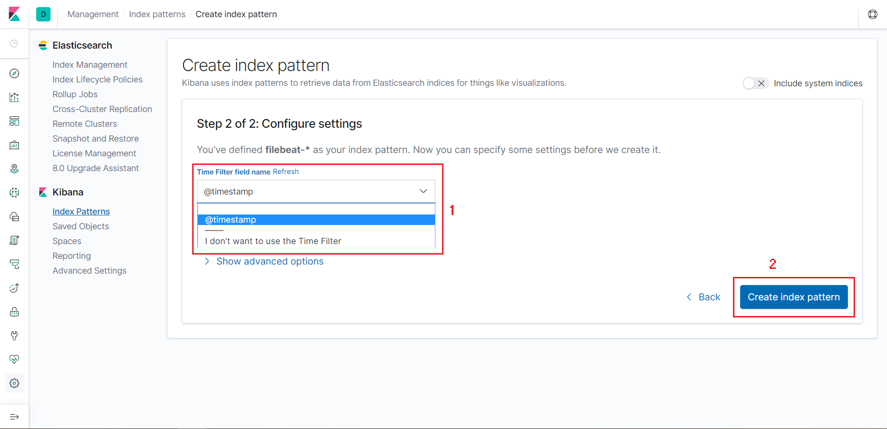
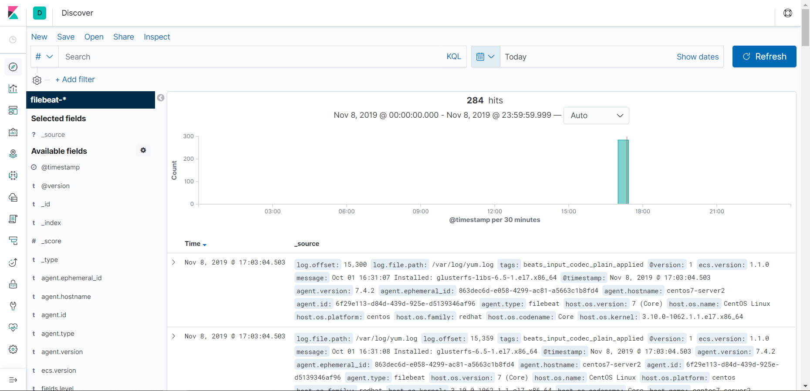

## Filter log Grok

### Chuẩn bị

- 1 server đã cài đặt ELK Stack

- 1 client muốn đẩy log về để filter

### Thực hành

- Cài đặt ELK Stack trên server

- Cài đặt Filebeat agent trên client để đẩy log về

- Thêm file log trên client muốn đẩy về:

Thêm phần sau vào mục `filebeat.inputs:` trong file /etc/filebeat/filebeat.yml (nhớ cần phải chú ý cấu trúc file cấu hình yml):

```
- type: log
  paths:
    - /var/log/messages
```

Khởi động lại filebeat:

`systemctl restart filebeat`

- Chỉnh sửa các file cấu hình trên server

Truy cập /etc/logstash/conf.d và tạo các file 01-input.conf, 20-filter.conf và 90-ouput.conf

Chỉnh sửa các file:

```
input {
  beats {
    port => 5044
    ssl => false
  }
}
```

```
filter {
   grok {
      match => { "message" => "%{SYSLOGTIMESTAMP:time} %{HOSTNAME:hostname} %{SYSLOGPROG}: %{GREEDYDATA:message}" }
      overwrite => "message"
  }
}
```

```
output {
  elasticsearch {
    hosts => [ "192.168.254.246:9200" ]
    sniffing => true
    index => "%{[@metadata][beat]}-%{+YYYY.MM.dd}"
  } 
}
```

Khởi động lại dịch vụ Logstash

`systemctl restart logstash`

- Create index pattern và add field trên Kibana:

Trên trình duyệt nhập địa chỉ ip ELK server:

`http://your_ELK_server_ip:5601`

Vào mục `Management` và chọn `Create Index`:


Tại mục `Index pattern` ở bước 1 nhập `filebeat-*` rồi nhấn `Next step`


Mục `Time Filter field name` ở bước 2 chọn `@timestamp` rồi bấm `Create index pattern`



Kiểm tra lại thông tin log được đẩy về ở phần `Discover`:



add thêm filed vừa định nghĩa trong filter.conf