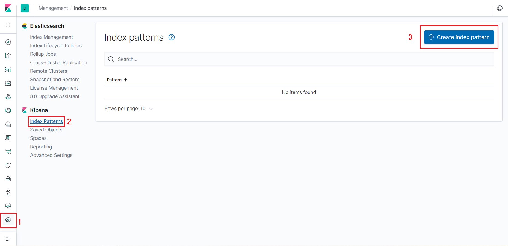
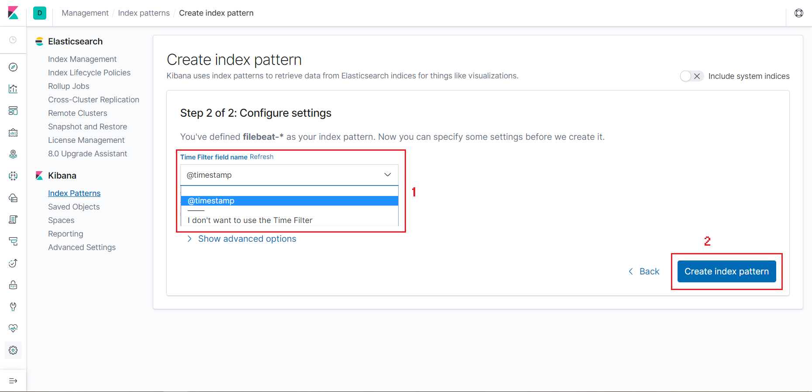

## Filter log ssh

Mục đích: Tách các trường trong bản tin log nhận được. việc này nhằm phục vụ cho việc query và vẽ các biểu đồ được chính xác nhất.

Lấy ví dụ cụ thể: Đây là bản tin log của ssh (/var/log/secure) mà server nhận được:

`Nov 14 09:45:09 zabbix-server sshd[634]: Failed password for root from 192.168.100.203 port 51061 ssh2`

- Thêm log ssh (trong bài dùng filebeats, các bạn có thể dùng những công cụ khác)

Trước đó ta phải cài đặt filebeat agent trên những client cần thu thập log, sau đó cấu hình đẩy log về server

Thêm phần sau vào mục `filebeat.inputs:` trong file /etc/filebeat/filebeat.yml (nhớ cần phải chú ý cấu trúc file cấu hình yml):

```
- type: log
  paths:
    - /var/log/secure
  tags: ssh
```

Khởi động lại filebeat:

`systemctl restart filebeat`

- Thêm custom pattern cho log ssh trên server ELK:

Tạo 1 file có tên `ssh` trong thư mục /etc/logstash/patterns và thêm nội dung sau:

```
SSHFAILED Failed %{WORD:auth_method} for %{USER:username} from %{IP:src_ip} port %{INT:src_port} ssh2
SSHACC Accepted %{WORD:auth_method} for %{USER:username} from %{IP:src_ip} port %{INT:src_port} ssh2
SSHFAILEDUSER Failed %{WORD:auth_method} for invalid user %{USER:username} from %{IP:src_ip} port %{INT:src_port} ssh2
```

- Tạo file cấu hình input filebeat trên ELK server:

Tạo 1 file có tên `input.conf` trong thư mục /etc/logstash/conf.d và thêm nội dung sau:

```
input {
  beats {
    port => 5044
    ssl => false
  }
}
```

- Tạo file cấu hình Logstash cho ssh:

Tạo 1 file có tên `ssh.conf` trong cùng thư mục trên và thêm vào nội dung sau:

```
filter {
  if "ssh" in [tags] {
    grok {
	  match => { "message" => "%{SYSLOGTIMESTAMP:time} %{HOSTNAME:hostname} %{SYSLOGPROG}: %{GREEDYDATA:message}" }
	  overwrite => "message"
    }
  }
}

filter {
  if "ssh" in [tags] {
    grok {
      patterns_dir => "/usr/share/logstash/patterns"
      match => { "message" => "%{SSHFAILED}" }
      match => { "message" => "%{SSHACC}" }
      match => { "message" => "%{SSHFAILEDUSER}" }
    }
  }
}
```

Tạo file `output.conf` cũng ở cùng thư mục:

```
output {
  if "ssh" in [tags] {
    elasticsearch {
      hosts => ["your_IP_ELK_server:9200"]
      sniffing => false
      index => "ssh-%{+YYYY.MM.dd}"
    }
  }
}
```

- Khởi động lại dịch vụ Logstash:

`systemctl restart logstash`

- Truy cập Kibana và tạo index:

Truy câp theo đường dẫn:

`http://your_IP_ELK_server:5601`

Vào mục `Management` và chọn `Create Index`



Tại mục `Index pattern` ở bước 1 nhập `ssh-*` rồi nhấn `Next step`

Mục `Time Filter field name` ở bước 2 chọn `@timestamp` rồi bấm `Create index pattern`



Kiểm tra lại thông tin log được đẩy về ở phần `Discover`