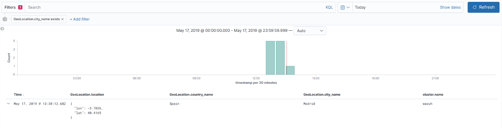
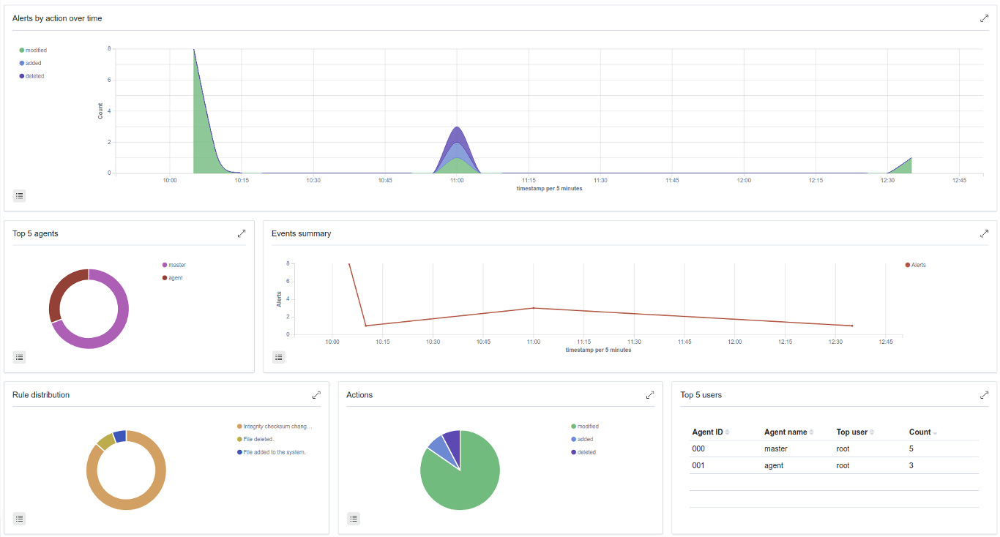
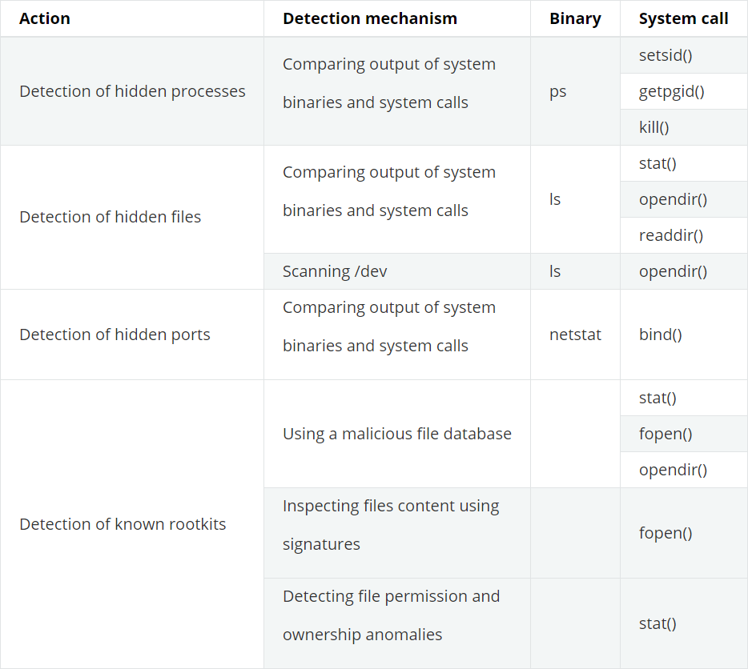
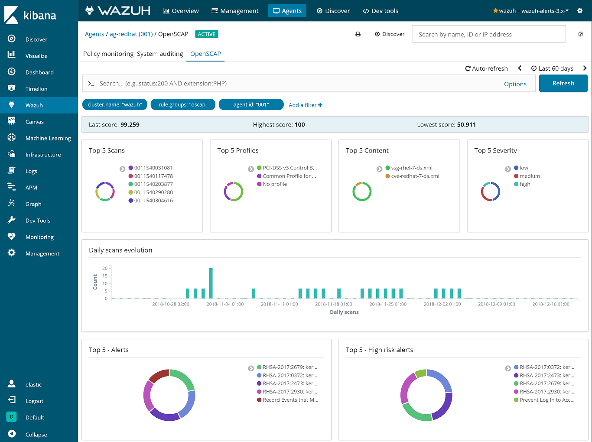

## Một số use case trong Wazuh

Wazuh thường được sử dụng để đáp ứng các yêu cầu tuân thủ (như PCI DSS hoặc HIPAA) và các tiêu chuẩn cấu hình (CIS hardening guides). Nó cũng phổ biến đối với người dùng IaaS (ví dụ: Amazon AWS, Azure hoặc Google cloud) khi triển khai host-based IDS trong các trường hợp đang chạy có thể được kết hợp với phân tích các sự kiện cơ sở hạ tầng (được lấy trực tiếp từ API của nhà cung cấp đám mây).

Dưới đây là danh sách các trường hợp sử dụng phổ biến:

- Signature-based log analysis

- File integrity monitoring

- Rootkits detection

- Security policy monitoring

1. Signature-based log analysis

Việc quản lý và phân tích log được tự động hóa để giúp việc phát hiện các mối đe dọa nhanh hơn. Có nhiều trường hợp bằng chứng về một cuộc tấn công có thể được tìm thấy trong nhật ký của thiết bị, hệ thống và ứng dụng của bạn. Wazuh có thể được sử dụng để tự động tổng hợp và phân tích dữ liệu nhật ký.

Wazuh agent chạy trên các host được giám sát thường chịu trách nhiệm đọc các thông điệp nhật ký ứng dụng và hệ điều hành, chuyển tiếp chúng đến Wazuh server, nơi diễn ra việc phân tích. Khi không có agent nào được triển khai, server cũng có thể nhận dữ liệu qua syslog từ các network device hoặc ứng dụng.

Wazuh sử dụng bộ giải mã để xác định ứng dụng nguồn của thông điệp log và sau đó phân tích dữ liệu bằng các quy tắc cụ thể của ứng dụng. Dưới đây là ví dụ về quy tắc được sử dụng để phát hiện các sự kiện lỗi xác thực SSH:

```
<rule id="5716" level="5">
  <if_sid>5700</if_sid>
  <match>^Failed|^error: PAM: Authentication</match>
  <description>SSHD authentication failed.</description>
  <group>authentication_failed,pci_dss_10.2.4,pci_dss_10.2.5,</group>
</rule>
```

Các quy tắc bao gồm một trường `match`, được sử dụng để xác định pattern mà quy tắc sẽ tìm kiếm. Nó cũng có một trường `level` chỉ định mức độ ưu tiên kết quả cảnh báo.

Manager sẽ tạo cảnh báo mỗi khi một sự kiện được thu thập bởi một trong các agent hoặc thông qua syslog khớp với quy tắc có mức cao hơn 0.

Đây là một ví dụ trong `/var/ossec/logs/alerts/alerts.json`:

```
{
  "agent": {
      "id": "1041",
      "ip": "10.0.0.125",
      "name": "vpc-agent-centos-public"
  },
  "decoder": {
      "name": "sshd",
      "parent": "sshd"
  },
  "dstuser": "root",
  "full_log": "Mar  5 18:26:34 vpc-agent-centos-public sshd[9549]: Failed password for root from 58.218.199.116 port 13982 ssh2",
  "location": "/var/log/secure",
  "manager": {
      "name": "vpc-ossec-manager"
  },
  "program_name": "sshd",
  "rule": {
      "description": "Multiple authentication failures.",
      "firedtimes": 349,
      "frequency": 10,
      "groups": [
          "syslog",
          "attacks",
          "authentication_failures"
      ],
      "id": "40111",
      "level": 10,
      "pci_dss": [
          "10.2.4",
          "10.2.5"
      ]
  },
  "srcip": "58.218.199.116",
  "srcport": "13982",
  "timestamp": "2017-03-05T10:26:59-0800"
}
```

Sau khi các cảnh báo được tạo bởi manager, nó sẽ được gửi đến Elastic Stack, nơi chúng được bổ sung với thông tin như Định vị địa lý, được lưu trữ và lập chỉ mục. Kibana sau đó có thể được sử dụng để tìm kiếm, phân tích và trực quan hóa dữ liệu. Bên dưới là một cảnh báo được hiển thị trong giao diện:



Wazuh cung cấp một bộ quy tắc mặc định, được cập nhật định kỳ, với hơn 1600 quy tắc cho các ứng dụng khác nhau.

2. File integrity monitoring

File integrity monitoring (FIM) - Giám sát sự toàn vẹn của file, phát hiện và cảnh báo khi các tệp ứng dụng và hệ điều hành được sửa đổi. Khả năng này thường được sử dụng để phát hiện truy cập hoặc thay đổi dữ liệu nhạy cảm. Thực tế, nếu server của bạn trong phạm vi với PCI DSS, yêu cầu 11.5 state, bạn phải cài đặt 1 giải pháp FIM thì mới pass qua sự kiểm tra.

Dưới đây là 1 ví dụ về cảnh báo được tạo khi file được giám sát bị thay đổi. Metadata bao gồm  MD5 và SHA1 checksum, file size (trước và sau khi thay đổi), file permisssion, file owner, nội dung thay đổi và người dùng đã thực hiện các thay đổi này (who-data).

```
{
    "timestamp":"2018-07-10T14:05:28.452-0800",
    "rule":{
        "level":7,
        "description":"Integrity checksum changed.",
        "id":"550",
        "firedtimes":10,
        "mail":false,
        "groups":[
            "ossec",
            "syscheck"
        ],
        "pci_dss":[
            "11.5"
        ],
        "gpg13":[
            "4.11"
        ],
        "gdpr":[
            "II_5.1.f"
        ]
    },
    "agent":{
        "id":"058",
        "ip": "10.0.0.121",
        "name":"vpc-agent-debian"
    },
    "manager":{
        "name":"vpc-ossec-manager"
    },
    "id":"1531224328.283446",
    "syscheck":{
        "path":"/etc/hosts.allow",
        "size_before":"421",
        "size_after":"433",
        "perm_after":"100644",
        "uid_after":"0",
        "gid_after":"0",
        "md5_before":"4b8ee210c257bc59f2b1d4fa0cbbc3da",
        "md5_after":"acb2289fba96e77cee0a2c3889b49643",
        "sha1_before":"d3452e66d5cfd3bcb5fc79fbcf583e8dec736cfd",
        "sha1_after":"b87a0e558ca67073573861b26e3265fa0ab35d20",
        "sha256_before":"6504e867b41a6d1b87e225cfafaef3779a3ee9558b2aeae6baa610ec884e2a81",
        "sha256_after":"bfa1c0ec3ebfaac71378cb62101135577521eb200c64d6ee8650efe75160978c",
        "uname_after":"root",
        "gname_after":"root",
        "mtime_before":"2018-07-10T14:04:25",
        "mtime_after":"2018-07-10T14:05:28",
        "inode_after":268234,
        "diff":"10a11,12\n> 10.0.12.34\n",
        "event":"modified",
        "audit":{
            "user":{
                "id":"0",
                "name":"root"
            },
            "group":{
                "id":"0",
                "name":"root"
            },
            "process":{
                "id":"82845",
                "name":"/bin/nano",
                "ppid":"3195"
            },
            "login_user":{
                "id":"1000",
                "name":"smith"
            },
            "effective_user":{
                "id":"0",
                "name":"root"
            }
        }
    },
    "decoder":{
        "name":"syscheck_integrity_changed"
    },
    "location":"syscheck"
}
```

Một bản tóm tắt tốt về các thay đổi tệp có thể được tìm thấy trong bảng điều khiển FIM cung cấp các khả năng truy sâu để xem tất cả các chi tiết của các cảnh báo được kích hoạt.



3. Rootkits detection

Wazuh agent quét định kỳ hệ thống được giám sát để phát hiện rootkit cả ở kernel và user level. Loại phần mềm độc hại này thường thay thế hoặc thay đổi các thành phần hệ điều hành hiện có để thay đổi hành vi của hệ thống. Rootkit có thể ẩn các tiến trình, tệp hoặc kết nối mạng khác như chính nó.

Wazuh sử dụng các cơ chế phát hiện khác nhau để tìm kiếm sự bất thường của hệ thống hoặc các xâm nhập phổ biến. Điều này được thực hiện định kỳ bởi thành phần `Rootcheck`:



Dưới đây là một ví dụ về cảnh báo được tạo khi tìm thấy một tiến trình ẩn. Trong trường hợp này, hệ thống bị ảnh hưởng đang chạy rootkit kernel-level (có tên Diamorphine):

```
{
  "agent": {
      "id": "1030",
      "ip": "10.0.0.59",
      "name": "diamorphine-POC"
  },
  "decoder": {
      "name": "rootcheck"
  },
  "full_log": "Process '562' hidden from /proc. Possible kernel level rootkit.",
  "location": "rootcheck",
  "manager": {
      "name": "vpc-ossec-manager"
  },
  "rule": {
      "description": "Host-based anomaly detection event (rootcheck).",
      "firedtimes": 4,
      "groups": [
          "ossec",
          "rootcheck"
      ],
      "id": "510",
      "level": 7
  },
  "timestamp": "2017-03-05T15:13:04-0800",
  "title": "Process '562' hidden from /proc."
}
```

4. Security policy monitoring

SCAP là 1 giải pháp kiểm tra tuân thủ tiêu chuẩn cho cơ sở hạ tầng cấp doanh nghiệp. Nó là một dòng các thông số kỹ thuật được duy trì bởi Viện Tiêu chuẩn và Công nghệ Quốc gia (NIST) với mục đích duy trì bảo mật hệ thống doanh nghiệp.

OpenSCAP là 1 công cụ kiểm tra sử dụng Extensible Configuration Checklist Description Format (XCCDF). XCCDF là 1 cách tiêu chuẩn để thể hiện nội dung danh sách kiểm tra và xác định danh sách kiểm tra bảo mật. Nó cũng kết hợp với các thông số kỹ thuật khác như CPE, CVE, CCE và OVAL để tạo danh sách kiểm tra biểu thị SCAP có thể được xử lý bởi các sản phẩm được xác thực SCAP.

Wazuh agent sử dụng OpenSCAP trong nội bộ để xác minh rằng các hệ thống tuân thủ các tiêu chuẩn cứng hóa CIS. Dưới đây là một ví dụ về quy tắc SCAP được sử dụng để kiểm tra xem SSH daemon có được cấu hình để cho phép mật khẩu trống hay không:

```
<ns10:Rule id="xccdf_org.ssgproject.content_rule_sshd_disable_empty_passwords" selected="false" severity="high">
  <ns10:title xml:lang="en-US">Disable SSH Access via Empty Passwords</ns10:title>
  <ns10:description xml:lang="en-US">To explicitly disallow remote login from accounts with empty passwords, add or correct the following line in <html:code>/etc/ssh/sshd_config</html:code>: <html:pre>PermitEmptyPasswords no</html:pre> Any accounts with empty passwords should be disabled immediately, and PAM configuration should prevent users from being able to assign themselves empty passwords.
  </ns10:description>
  <ns10:reference href="http://nvlpubs.nist.gov/nistpubs/SpecialPublications/NIST.SP.800-53r4.pdf">AC-3</ns10:reference>
  <ns10:reference href="http://iase.disa.mil/stigs/cci/Pages/index.aspx">765</ns10:reference>
  <ns10:reference href="http://iase.disa.mil/stigs/cci/Pages/index.aspx">766</ns10:reference>
  <ns10:rationale xml:lang="en-US">Configuring this setting for the SSH daemon provides additional assurance that remote login via SSH will require a password, even in the event of misconfiguration elsewhere.</ns10:rationale>
  <ns10:fix complexity="low" disruption="low" id="sshd_disable_empty_passwords" reboot="false" strategy="enable" system="urn:xccdf:fix:script:sh">grep -q ^PermitEmptyPasswords /etc/ssh/sshd_config &amp;&amp; \ sed -i "s/PermitEmptyPasswords.*/PermitEmptyPasswords no/g" /etc/ssh/sshd_config; if ! [ $? -eq 0 ]; then; echo "PermitEmptyPasswords no" &gt;&gt; /etc/ssh/sshd_config; fi
  </ns10:fix>
  <ns10:check system="http://oval.mitre.org/XMLSchema/oval-definitions-5">
    <ns10:check-content-ref href="ssg-rhel6-oval.xml" name="oval:ssg-sshd_disable_empty_passwords:def:1" />
  </ns10:check>
  <ns10:check system="http://scap.nist.gov/schema/ocil/2">
    <ns10:check-content-ref href="ssg-rhel6-ocil.xml" name="ocil:ssg-sshd_disable_empty_passwords_ocil:questionnaire:1" />
  </ns10:check>
</ns10:Rule>
```

SCAP check được chạy định kỳ (mặc định là một lần một ngày) và kết quả được trỏ tới Wazuh server nơi chúng được xử lý thông qua các bộ giải mã và quy tắc OpenSCAP. Dưới đây là một ví dụ về cảnh báo được tạo khi Linux audit policy (auditd) không được định cấu hình để giám sát user action:

```
{
  "agent": {
      "id": "1040",
      "ip": "10.0.0.76",
      "name": "ip-10-0-0-76"
  },
  "decoder": {
      "name": "oscap",
      "parent": "oscap"
  },
  "full_log": "oscap: msg: \"xccdf-result\", scan-id: \"10401488754797\", content: \"ssg-centos-7-ds.xml\", title: \"Ensure auditd Collects System Administrator Actions\", id: \"xccdf_org.ssgproject.content_rule_audit_rules_sysadmin_actions\", result: \"fail\", severity: \"low\", description: \"At a minimum the audit system should collect administrator actions for all users and root. If the auditd daemon is configured to use the augenrules program to read audit rules during daemon startup (the default), add the following line to a file with suffix .rules in the directory /etc/audit/rules.d: -w /etc/sudoers -p wa -k actions If the auditd daemon is configured to use the auditctl utility to read audit rules during daemon startup, add the following line to /etc/audit/audit.rules file: -w /etc/sudoers -p wa -k actions\", rationale: \"The actions taken by system administrators should be audited to keep a record of what was executed on the system, as well as, for accountability purposes.\" references: \"AC-2(7)(b) (http://nvlpubs.nist.gov/nistpubs/SpecialPublications/NIST.SP.800-53r4.pdf), AC-17(7) (http://nvlpubs.nist.gov/nistpubs/SpecialPublications/NIST.SP.800-53r4.pdf), AU-1(b) (http://nvlpubs.nist.gov/nistpubs/SpecialPublications/NIST.SP.800-53r4.pdf), AU-2(a) (http://nvlpubs.nist.gov/nistpubs/SpecialPublications/NIST.SP.800-53r4.pdf), AU-2(c) (http://nvlpubs.nist.gov/nistpubs/SpecialPublications/NIST.SP.800-53r4.pdf), AU-2(d) (http://nvlpubs.nist.gov/nistpubs/SpecialPublications/NIST.SP.800-53r4.pdf), AU-12(a) (http://nvlpubs.nist.gov/nistpubs/SpecialPublications/NIST.SP.800-53r4.pdf), AU-12(c) (http://nvlpubs.nist.gov/nistpubs/SpecialPublications/NIST.SP.800-53r4.pdf), IR-5 (http://nvlpubs.nist.gov/nistpubs/SpecialPublications/NIST.SP.800-53r4.pdf), 126 (http://iase.disa.mil/stigs/cci/Pages/index.aspx), Test attestation on 20121024 by DS (https://github.com/OpenSCAP/scap-security-guide/wiki/Contributors)\", identifiers: \"CCE-RHEL7-CCE-TBD (http://cce.mitre.org)\", oval-id: \"oval:ssg:def:370\", benchmark-id: \"xccdf_org.ssgproject.content_benchmark_RHEL-7\", profile-id: \"xccdf_org.ssgproject.content_profile_common\", profile-title: \"Common Profile for General-Purpose Systems\".",
  "location": "wodle_open-scap",
  "manager": {
      "name": "vpc-ossec-manager"
  },
  "oscap": {
      "check": {
          "description": "At a minimum the audit system should collect administrator actions for all users and root. If the auditd daemon is configured to use the augenrules program to read audit rules during daemon startup (the default), add the following line to a file with suffix .rules in the directory /etc/audit/rules.d: -w /etc/sudoers -p wa -k actions If the auditd daemon is configured to use the auditctl utility to read audit rules during daemon startup, add the following line to /etc/audit/audit.rules file: -w /etc/sudoers -p wa -k actions",
          "id": "xccdf_org.ssgproject.content_rule_audit_rules_sysadmin_actions",
          "identifiers": "CCE-RHEL7-CCE-TBD (http://cce.mitre.org)",
          "oval": {
              "id": "oval:ssg:def:370"
          },
          "rationale": "The actions taken by system administrators should be audited to keep a record of what was executed on the system, as well as, for accountability purposes.",
          "references": "AC-2(7)(b) (http://nvlpubs.nist.gov/nistpubs/SpecialPublications/NIST.SP.800-53r4.pdf), AC-17(7) (http://nvlpubs.nist.gov/nistpubs/SpecialPublications/NIST.SP.800-53r4.pdf), AU-1(b) (http://nvlpubs.nist.gov/nistpubs/SpecialPublications/NIST.SP.800-53r4.pdf), AU-2(a) (http://nvlpubs.nist.gov/nistpubs/SpecialPublications/NIST.SP.800-53r4.pdf), AU-2(c) (http://nvlpubs.nist.gov/nistpubs/SpecialPublications/NIST.SP.800-53r4.pdf), AU-2(d) (http://nvlpubs.nist.gov/nistpubs/SpecialPublications/NIST.SP.800-53r4.pdf), AU-12(a) (http://nvlpubs.nist.gov/nistpubs/SpecialPublications/NIST.SP.800-53r4.pdf), AU-12(c) (http://nvlpubs.nist.gov/nistpubs/SpecialPublications/NIST.SP.800-53r4.pdf), IR-5 (http://nvlpubs.nist.gov/nistpubs/SpecialPublications/NIST.SP.800-53r4.pdf), 126 (http://iase.disa.mil/stigs/cci/Pages/index.aspx), Test attestation on 20121024 by DS (https://github.com/OpenSCAP/scap-security-guide/wiki/Contributors)",
          "result": "fail",
          "severity": "low",
          "title": "Ensure auditd Collects System Administrator Actions"
      },
      "scan": {
          "benchmark": {
              "id": "xccdf_org.ssgproject.content_benchmark_RHEL-7"
          },
          "content": "ssg-centos-7-ds.xml",
          "id": "10401488754797",
          "profile": {
              "id": "xccdf_org.ssgproject.content_profile_common",
              "title": "Common Profile for General-Purpose Systems"
          }
      }
  },
  "rule": {
      "description": "OpenSCAP: Ensure auditd Collects System Administrator Actions (not passed)",
      "firedtimes": 3,
      "groups": [
          "oscap",
          "oscap-result"
      ],
      "id": "81529",
      "level": 5,
      "pci_dss": [
          "2.2"
      ]
  },
  "timestamp": "2017-03-05T15:00:03-0800"
}
```

Ngoài ra, Wazuh WUI có thể được sử dụng để trực quan hóa và phân tích kết quả scan việc giám sát các policy. Ví dụ: dưới đây là 1 ảnh chụp màn hình dữ liệu được thu thập từ hệ thống CentOS khi quét nó bằng cách sử dụng `Server baseline` và cấu hình được xác định trước `PCI DSS v3`

