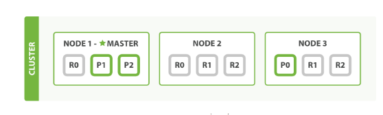

## Tìm hiểu về Elasticsearch

Elasticsearch là 1 công cụ tìm kiếm dựa trên nền tảng Apache Lucene. Nó cung cấp 1 bộ máy tìm kiếm dạng phân tán, có đầy đủ công cụ với 1 giao diện web HTTP có hỗ trợ dữ liệu json. Elasticsearch được phát triển bằng java và được phát hành dạng nguồn mở theo giấy phép Apache.

Nó cho phép lưu trữ, tìm kiếm và phân tích khói lượng lớn dữ liệu nhanh chóng và tương đối gần với thời gian thực. Nó thường được sử dụng như 1 engine hay công nghệ phía bên dưới tạo ra sức mạnh cho các ứng dụng bên trên có các tính năng và yêu cầu tìm kiếm phức tạp.

Elasticsearch thực chất hoặt động như 1 web server, có khả năng tìm kiếm nhanh chóng (near realtime) thông qua giao thức RESTful. Elasticsearch chạy trên server riêng và đồng thời giao tiếp thông qua RESTful do vậy nên nó không phụ thuộc vào client viết bằng gì hay hệ thống hiện tại của bạn viết bằng gì. Nên việc tích hợp nó vào hệ thống bạn là dễ dàng, bạn chỉ cần gửi request http lên là nó trả về kết quả.

Elasticsearch có khả năng mở rộng tuyệt vời (horizontal scalability). Lắp thêm node cho nó là nó tự động auto mở rộng cho bạn.

### Một số khái niệm cơ bản của Elasticsearch

1. Document

Là đơn vị nhỏ nhất để lưu trữ dữ liệu trong Elasticsearch. Đây là một đơn vị lưu trữ thông tin cơ bản trong Elasticsearch, là một JSON object đối với một số dữ liệu.

Ví dụ : Tìm hiểu về Elasticsearch.

2. Index

Trong Elasticsearch có một cấu trúc tìm kiếm gọi là inverted index, nó được thiết kế để cho phép tìm kiếm full-text search. Cách thức khá đơn giản, các văn bản được tách ra thành từng từ có nghĩa sau đó sẽ được map xem thuộc văn bản nào và khi search sẽ ra kết quả cụ thể. Có 2 kiểu đánh index và forward index và inverted index. Bản chất của inverted index là đánh theo keyword: words -> pages còn forward đánh theo nội dung page -> words.

3. Shard

- Shard là một đối tượng của Lucence, là tập hợp con của một Index. Một index có thể được lưu trên nhiều shard.

- 1 node bao gồm nhiều shard, shard chính là đối tượng nhỏ nhất hoạt động ở mức thấp nhất, đóng vai trò lưu trữ dữ liệu.

- Chúng ta sẽ không bao giờ làm việc với các shard vì Elasticsearch sẽ hỗ trợ chúng ta toàn bộ việc giao tiếp cũng như tự động thay đổi các shard khi cần thiết.

- Elasticsearch cung cấp 2 cơ chế của shard đó là primary shard và replica shard.

- Primary shard sẽ lưu trữ dữ liệu và đánh Index, sau khi đánh dữ liệu xong sẽ được vận chuyển đến các replica shard, mặc định của Elasticsearch mỗi index sẽ có 5 Primary shard thì sẽ đi kèm với 1 Replica shard.

- Replica shard là nơi lưu trữ dữ liệu copy của Elasticsearch, đóng vai trò đảm bảo tính toàn vẹn dữ liệu khi Primary shard xảy ra vấn đề, ngoài ra nó còn giúp tăng tốc độ tìm kiếm vì chúng ta có thể cấu hình lượng Replica shard nhiều hơn cấu hình mặc định của Elasticsearch.

4. Node

- Là trung tâm hoạt động của Elasticsearch, là nơi lưu trữ dữ liệu, tham gia thực hiện đánh index của cluster cũng như thực hiện các thao tác tìm kiếm.

- Mỗi node được xác định bằng một tên riêng và không được phép trùng lặp.

5. Cluster

- Tập hợp các node hoạt động cùng với nhau, chia sẻ với nhau cùng một thuộc tính cluster name. Chính vì thế cluster sẽ được xác định bằng một tên riêng và không được phép trùng lặp. Việc tên của các cluster elasticsearch mà trùng nhau sẽ gây ra lỗi cho các node vì vậy khi cấu hình chúng ta cần phải chú ý.

- Mỗi cluster có một node chính gọi là master, node master được lựa chọn một cách tự động và có thể thay đổi nếu như có sự cố xảy ra. Một cluster có thể bao gồm nhiều nodes. Các nodes có thể hoạt động trên cùng một server. Tuy nhiên trên thực tế, một cluster sẽ gồm nhiều nodes hoạt động trên các server khác nhau để đảm bảo nếu một server gặp sự cố thì các node trên các server khác có thể hoạt động đầy đủ chức năng. Các node có thể tìm thấy nhau để hoạt động trên cùng 1 cluster thông qua giao thức Unicast.

- Chức năng chính của Cluster là quyết định xem shard nào được phân bổ cho node nào và khi nào thì di chuyển các Cluster để cần bằng lại Cluster.

### Cơ chế làm việc với Elasticsearch

Bạn có thể gửi dữ liệu dưới dạng tài liệu JSON lên Elasticsearch bằng cách sử dụng API hoặc công cụ thu thập như Logstash và Amazon Kinesis Firehose. Elasticsearch tự động lưu trữ văn bản gốc và thêm tham chiếu có thể tìm kiếm vào văn bản ở phần chỉ mục của cụm. Khi đó bạn có thể tìm và truy xuất văn bản bằng cách sử dụng Elasticsearch API. Bạn cũng có thể sử dụng Kibana, một công cụ trực quan hóa mã nguồn mở, cùng Elasticsearch để trực quan hóa dữ liệu và xây dựng bảng thông tin tương tác. Khi người dùng tìm kiếm thì sẽ tìm kiếm trên Elasticsearch, tốc độ vừa nhanh, vừa giảm tải cho database.

### Ưu điểm của Elasticsearch

- Có khả năng tìm kiếm và phân tích dữ liệu.

- Có khả năng mở rộng theo chiều ngang.

- Hỗ trợ tìm kiếm khi từ khóa tìm kiếm có thể bị lỗi.

- Hỗ trợ các Elasticsearch client như Java, Php, JS, Ruby,….

### Nhược điểm của Elasticsearch

- Elasticsearch được thiết kế cho mục đích search cho nên khi sử dụng thì chúng ta nên sử dụng kèm theo một DB khac như MongoDB hay Mysql.

- Trong Elasticsearch không đảm bảo được toàn vẹn dữ liệu của các hoạt động như Insert, Update hay Delete.

- Không thích hợp với những hệ thống thường xuyên cập nhật dữ liệu. Sẽ rất tốn kém cho việc đánh index dữ liệu.