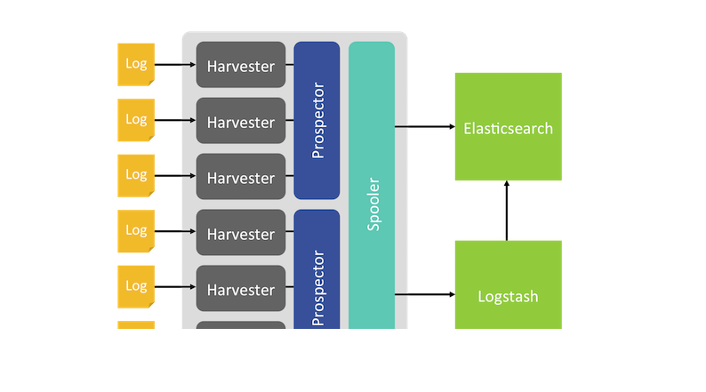

## Tìm hiểu về Filebeat

Beats là 1 tập hợp các công cụ thu thập thông tin chuyên dụng, được biết đến như là các shipper (người vận chuyển), được cài đặt như các agent trên các server, giúp thu thập và gửi các dữ liệu từ  những server đó tới máy chủ ELK. Ngoài ra, các beats này còn có thể gửi thẳng trực tiếp lên Elasticsearch hay Logstash do bản thân các công cụ đã được chuẩn hóa sẵn, việc kết nối các beats đến Logstash thường mang ý nghĩa bảo mật đối với các hệ thống tầm lớn khi họ muốn bảo vệ dịch vụ Elasticsearch.

Trong Beats có rất nhiều các Beat "con", cụ thể:

- Filebeat: đây là công cụ chuyên dùng để thu thập log và gửi log về cho hệ thống ELK. Filebeat có một điểm mạnh mà cách thu thập thông thường không thể có được, chính là khả năng theo dõi tình trạng của ELK và điều chỉnh lượng log đẩy về. Nếu hệ thống ELK đang gặp tình trạng quá tải về khối lượng cần xử lý, Filebeat sẽ quan sát và giảm lượng log đổ về bằng cách sử dụng hàng chờ.

- Metricbeat: đây là công cụ chuyên dùng để thu thập hiệu năng của máy chủ. Ngoài hiệu năng phần cứng máy chủ, Metricbeat có thể khai thác thông tin các dịch vụ web (Apache, Nginx) hay của database (MySQL, MongoDB).

- Packetbeat: công cụ này sử dụng để giám sát lưu lượng và băng thông trên các máy chủ. Packetbeat sẽ thu thập thông tin về lưu lượng gói tin vào và ra của máy chủ, từ đó tổng kết và gửi về cho hệ thống ELK.

- Winlogbeat: khác với các hệ điều hành mã nguồn mở Linux, Windows có một cấu trúc hoàn toàn khác, và khó can thiệp vào sâu trong hệ thống để thu thập thông tin. Winlogbeat ra đời nhằm thu thập những sự kiện xảy ra bên trong hệ điều hành Windows.

- Auditbeat: Winlogbeat dành cho hệ điều hành Windows, thì Auditbeat được dành riêng cho hệ điều hành linux. Auditbeat giúp quản lý các folder, các tập tin hệ thống trong hệ điều hành Linux. 

- Heartbeat: công vụ Heartbeat được sử dụng nhằm giúp cho hệ thống giám sát có thể biết được trạng thái dịch vụ đó có còn hoạt động hay không.

Các beat index pattern cần được cài đặt trên cả ELK server và các client. Trên ELK server, các beat sẽ kết hợp với các thành phần để lọc dữ liệu, đánh chỉ mục, hiển thị.

Mô hình beats platform:

Trong các beats pattern được kể ở trên thì filebeat thường được ưu tiên sử dụng tuy nhiên filebeat vẫn còn một số hạn chế cần lưu ý khi sử dụng như:

Khó khăn đối với người mới sử dụng cú pháp YAML.

Nếu cấu hình quá nhiều file log cần đẩy về thì File filebeat registry sẽ phình to rất nhanh do cần dung lượng để lưu trữ từng trạng thái của từng dòng log(dòng log đã được gửi đi hay chưa).

Không nên cấu hình filebeat quét các filelog nhỏ hơn 1s bởi vì điều này sẽ khiến cho filebeat chiếm CPU một lượng đáng kể.

Cách Filebeat làm việc: 

- Khi khởi động filebeat, nó sẽ khởi chạy một hay nhiều prospector, sẽ tìm kiếm các đường dẫn của tập tin tin mà ta đã khai báo. Với mỗi môt tập tin log mà prospector tìm thấy được, Filebeat sẽ khởi chạy một harvester. Mỗi một harvester đọc một tập tin log, và gửi các bản tin log này khi có dữ liệu mới tới spooler. Spooler là nơi tổng hợp các sự kiện và gửi dữ liệu đã tổng hợp được tới output mà ta đã cấu hình trên Filebeat.

- Cấu trúc bên trong filebeat:

