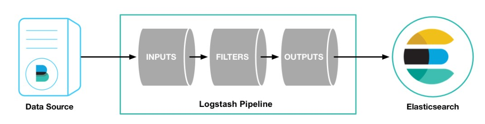
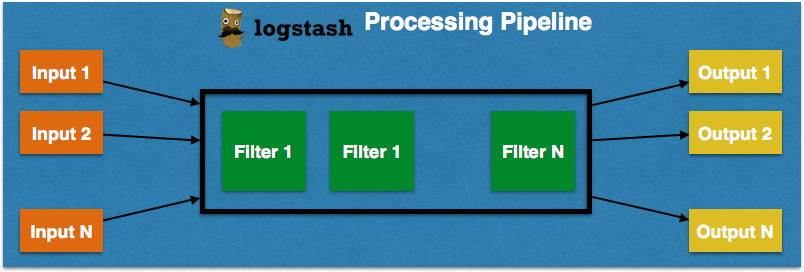
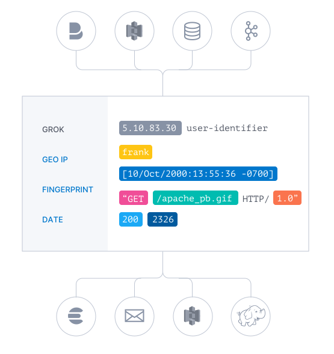
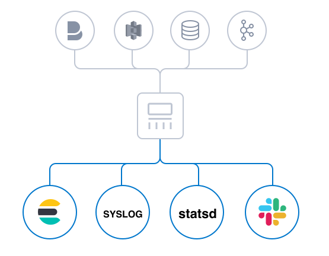

## Tìm hiểu về Logstash

Trang chủ: https://www.elastic.co/products/logstash

Logstash là 1 phần mềm mã nguồn mở nằm trong hệ sinh thái bộ sản phẩm ELK Stack. Nó có nhiệm vụ tiếp nhận log từ các nguồn khác nhau sau đó xử lý và đẩy vào Elasticsearch, bao gồm 3 giai đoạn trong chuỗi xử lý sự kiện log (pipeline) tương ứng 3 module:

- INPUT: tiếp nhận dữ liệu log sự kiện log ở dạng thô từ nhiều nguồn khác nhau như file, redis, rabbitmq, beats, syslog, ...

- FILTER: sau khi tiếp nhận log sẽ có 1 số lượng lớn các bộ lọc cho phép ta tiến hành thao tác dữ liệu sự kiện log (thêm, sửa, xóa ... nội dung log) theo cấu hình của người quản trị để xây dựng lại cấu trúc dữ liệu log event theo mong muốn

- OUTPUT: cuối cùng sẽ thực hiện chuyển tiếp dữ liệu sự kiện log đến các dịch vụ khác như Elasticsearch tiếp nhận lưu trữ log hoặc hiện thị log; ngoài ra Logstash còn hỗ trợ nhiều kết quả đầu ra khác như lưu vào file, email, lưu vào database, xuất đến zabbix, ...

### Luồng hoạt động





Luồng dữ liệu đi qua Logstash sẽ được xử lý theo cơ chế pipeline. Để tăng performance, pipeline sẽ được phân bổ trên nhiều worker. Mỗi worker sẽ chạy bên trong thread riêng của mình.

Luồng xử lý sự kiện của Logstash có 3 giai đoạn: input -> filter -> output. INPUT tạo sự kiện, FILTER sửa đổi chúng và OUTPUT gửi chúng đến nơi khác.

Ở bước INPUT, Logstash sẽ được cấu hình lựa chọn hình thức tiếp nhận log event hoặc đi lấy dữ liệu log ở dịch vụ remote theo nhu cầu. Dữ liệu từ các nguồn sẽ được Logstash chuyển thành các event. Mỗi 1 input stage sẽ chạy bên trọng thread riêng của mình và ghi các event vào trong 1 queue trung tâm nằm trong bộ nhớ (mặc định) hoặc trong ổ cứng. Trong queue này, các event sẽ được đóng gói thành các batch.

Trong bước FILTER, các worker thread sẽ lấy các batch ra khỏi queue, sau đó tùy theo filter mà chỉnh sửa nội dung của các event.

Cuối cùng OUTPUT, các worker thread sẽ chuyển các event tới đích.

INPUT và OUTPUT hỗ trợ các codec cho phép bạn mã hóa hoặc giải mã dữ liệu khi nó đi vào hoặc đi ra pipeline mà không cần phải sử dụng bộ lọc riêng. Trong 1 pipeline, chúng ta có thể sử dụng một hoặc kết hợp nhiều input/filter/output/codec.

Ví dụ: Trong một hệ thống Microservice, chúng ta sẽ sử dụng Logstash để thu thập log từ các service (input), sau đó thống nhất thành 1 chuẩn (filter) và chuyển cho Elasticsearch để tập trung và phân tích log (output).

Có một lưu ý là, nếu các event được lưu bên trong bộ nhớ thì khi Logstash bị dừng một cách đột ngột, các event sẽ biến mất. Để tránh gặp phải tình trạng này, chúng ta có thể chuyển sang lưu event trong ổ cứng.

### INPUT


Bạn sử dụng input để nhận dữ liệu vào Logstash. Phần cấu hình block "INPUT" quy định cơ chế nhận log vào Logstash. Dữ liệu thường được phân tán hoặc lưu trữ trên nhiều hệ thống ở nhiều định dạng. Logstash hỗ trợ nhiều loại đầu vào, 1 số INPUT plugin phổ biến thường được sử dụng như:

- file: đọc dữ liệu từ file trên filesystem, giống như lệnh `tail -f` trên UNIX/Linux

- syslog: chương trình Logstash sẽ lắng nghe trên port 514 để tiếp nhận dữ liệu syslog theo định dạng RFC 3164

- redis: đọc dữ liệu từ redis server, sử dụng cả redis channel và redis list. Redis thường được sử dụng như 1 "nhà môi giới" trong bản cài đặt Logstash tập trung, xếp hàng các sự kiện Logstash từ các remote Logstash "shipper"

- beats: xử lý các sự kiện được gửi bởi Beats (1 san phẩm nổi tiếng khác trong hệ thống ELK)

Logstash có hỗ trợ khá nhiều loại plugin input khác nhau giúp bạn linh động trong việc nhận nguồn dữ liệu log, có thể xem thêm tại [đây](https://www.elastic.co/guide/en/logstash/master/input-plugins.html)

### FILTER



Khi dữ liệu truyền từ nguồn đến, bộ lọc Logstash phân tích từng sự kiện, xác định các trường được đặt tên để xây dụng cấu trúc và chuyển đổi chúng thành 1 định dạng chung để dễ dàng phân tích. Bạn có thể kết hợp filter với các điều kiện so sánh nhằm thực hiện 1 tác vụ hành động (action) khi 1 event thảo mãn khớp với các tiêu chí do bạn đặt ra. 1 số filter plugin hữu ích như:

- grok: phân tích cú pháp và cấu trúc văn bản tùy ý. Grok hiện là cách tốt nhất trong Logstash để phân tích dữ liệu nhật ký phi cấu trúc thành một cái gì đó có cấu trúc và có thể truy vấn được.

- mutate: thực hiện sự thay đổi thông tin sự kiện log như: đổi tên, xóa, thay thế, chỉnh sửa các trường thông tin của log event

- drop: drop các log event hoàn toàn, ví dụ như: debug events

- clone: tạo 1 bản copy của sự kiện, có thể thêm hoặc xóa các trường

- geoip: thêm thông tin về vịa trí địa lý cảu đại chỉ ip (biểu thị biểu đồ trên kibana)

Để biết thêm thông tin về các bộ lọc có sẵn, hãy xem thêm ở [đây](https://www.elastic.co/guide/en/logstash/current/filter-plugins.html)

### OUTPUT



Output là bước cuối cùng trong chuỗi các bước xử lý của Logstash. Một sự kiện có thể đưa qua nhiều output khác nhau. Mặc dù Elaticsearch thường là output dễ bắt gặp nhất, mở ra 1 thế giới khả năng tìm kiếm và phân tích, nhưng nó không phải là thứ duy nhất có sẵn. Logstash có nhiều kết quả đầu ra cho phép bạn gửi dữ liệu đến nơi bạn muốn, 1 số output plugin hay được sử dụng là:

- elaticsearch : gửi dữ liệu sự kiện đến Elaticsearch.

- file: ghi dữ liệu sự kiện vào một file trên ổ đĩa.

- graphite: gửi dữ liệu tới graphite, 1 trong những tool mã nguồn mở hỗ trợ việc lưu trữ và tạo biểu đồ metric

- statsd: gửi dữ liệu tới dịch vụ "statsd

Để biết thêm thông tin về các output sẵn có, xem thêm tại [đây](https://www.elastic.co/guide/en/logstash/current/output-plugins.html)

### Cấu trúc thư mục của Logstash

| Loại | Miêu tả | Đường dẫn folder | Thông số |
| --- | --- | --- | --- |
| home | | `/usr/share/logstash` | |
| bin | | `/usr/share/logstash/bin` | |
| settings | | `/etc/logstash` | |
| conf | | `/etc/logstash/conf.d/*.conf` | |
| logs | file log của chương trình logstash | `/var/log/logstash/` | path.logs |
| plugins | | `/usr/share/logstash/plugins` | path.plugins |
| data | | `/var/lib/logstash` | |

### File cấu hình logstash

Logstash có 2 loại file cấu hình: pipeline config file dùng để định nghĩa quá trình xử lý log pipeline; setting file dùng để cấu hình các thông số liên quan đến hoạt động và khởi động của logstash

- Pipeline configuration file: thư mục chứa cấu hình xử lý pipeline bởi logstash nằm ở thư mục /etc/logstash/conf.d/, mặc định logstash sẽ chỉ load cấu hình của các file có đuôi là ".conf"

Cấu trúc cơ bản của 1 pipeline logstash xử lý:

```
input{
	stdin {}
	file {}
	...
}
```

```
filter{
	grok {}
	date {}
	geoip {}
	...
}
```

```
output{
	elaticsearch {}
	email {}
	...
}
```

- File tinh chỉnh dịch vụ logstash: các file cấu hình của dịch vụ logstash nằm ở thư mục /etc/logstash/, 1 số file cở bản quan trọng khi cấu hình chạy Logstash như:

	- logstash.yml: file này chứa các cấu hình chung dành cho dịch vụ Logstash
	
	- pipeline.yml: file này cấu hình thư mục chạy pipeline, số lượng pipeline hcạy đồng thời, hình thức chạy pipeline, ...
	
	- jvm.options: chứa cấu hình Java Virtual Machine (JVM). Sử dụng file này để thay đổi các thông số liên quan đến heap space, thuwòng quan trọng trong việc tối ưu hóa dịch vụ logstash

### Log của Logstash

Nếu bạn cài Logstash theo ".rpm" hoặc ".deb" đã được đóng gói thì file log của dịch vụ Logstash nằm ở /var/log/logstash/

Nếu bạn chỉ download logstash source và chạy thì log nằm ở thư mục tương ứng biến môi trường: $LS_HOME/logs/

Logstash sử dụng framework "Log4j 2" để định dạng cấu trúc log và sử lý log của riêng dịch vụ Logstash. Logstash hỗ trợ 1 số tính năng liên quan log như: Log-API, slơ-log-config, log4j 2 config, ...