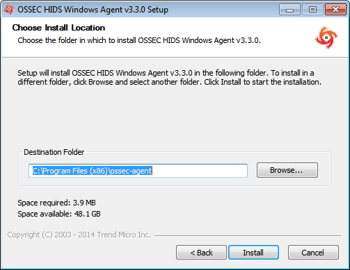
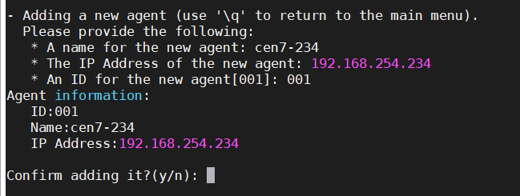

## Tìm hiểu về OSSEC

### Tổng quan về OSSEC

OSSEC là hệ thống phát hiện xâm nhập dựa trên host (HIDS) dựa trên log mã nguồn mở, miễn phí, đa nền tảng có thể mở rộng và có nhiều cơ chế bảo mật khác nhau. OSSEC có thể phát hiện xâm nhập bằng cả chữ ký hoặc dấu hiệu bất thường. Các dấu hiệu bình thường và bất thường được mô tả trong bộ luật của OSSEC. OSSEC có một công cụ phân tích và tương quan mạnh mẽ, tích hợp giám sát và phân tích log, kiểm tra tính toàn vẹn của file, kiểm tra registry của Windows, thực thi chính sách tập trung, giám sát chính sách, phát hiện rootkit, cảnh báo thời gian thực và phản ứng một cách chủ động cuộc tấn công đang diễn ra. Các hành động này cũng có thể được định nghĩa trước bằng luật trong OSSEC để OSSEC hoạt động theo ý muốn của người quản trị. Ngoài việc được triển khai như một HIDS, nó thường được sử dụng như một công cụ phân tích log, theo dõi và phân tích các bản ghi lại, IDS, các máy chủ Web và các bản ghi xác thực. OSSEC chạy trên hầu hết các hệ điều hành, bao gồm Linux, OpenBSD, FreeBSD, Mac OS X, Sun Solaris và Microsoft Windows. OSSEC còn có thể được tích hợp trong trong các hệ thống bảo mật lớn hơn là SIEM (Security information and event management). OSSEC chỉ có thể cài đặt trên Windows với tư cách là một agent.

Các tính năng nổi bật của OSSEC là:

- Theo dõi và phân tích các log: OSSEC thu thập log theo thời gian thực từ nhiều nguồn khác nhau để phân tích (giải mã, lọc và phân loại) và đưa ra cảnh báo dựa trên bộ luật được xây dụng trước. OSSEC phát hiện các cuộc tấn công trên mạng, hệ thống hoặc ứng dụng cụ thể bằng cách sử dụng log làm nguồn thông tin chính. Log cũng rất hữu ích để phát hiện việc khai thác lỗ hổng phần mềm, vi phạm chính sách và các hình thức hoạt động không phù hợp khác. Một số loại log mà OSSEC có thể phân tích là log proxy, log web, log ghi lại xác thực, system log

- Kiểm tra tính toàn vẹn của file: Sử dụng hàm băm mật mã, có thể tính toán giá trị băm của mỗi file trong hđh dựa trên tên file, nội dung file và giá trị băm này là duy nhất. OSSEC có thể giám sát các ổ đĩa để phát hiện các thay đổi của giá trị băm này khi có ai đó, hoặc điều gì đó sửa đổi nội dung file hoặc thay thế phiên bản file này bằng 1 phiên bản file khác

- Giám sát registry: Hệ thống registry là danh sách thư mục tất cả các cài đặt phần cứng và phần mềm, các cấu hình hđh, người dùng, nhóm người dùng và các preference trên 1 hệ thống Windows. Các thay đổi được thực hiện bởi người dùng và quản trị viên đối với hệ thống được ghi lại trong các kháo registry để các thay đổi được lưu khi người dùng đăng xuất hoặc hệ thống được khởi động lại. Registry cũng cho thấy kernel của hđh tương tác với phần cứng và phần mềm như thế nào. HIDS có thể giám sát những thay đổi này đối với các khóa registry quan trọng để đảm bảo rằng người dùng hoặc ứng dụng không cài đặt 1 chuwong trình mới hoặc sửa đổi chương trình hiện có với mục đích xấu

- Phát hiện rootkit: OSSEC phát hiện rootkit dựa trên chữ ký, rootkit là công cụ cho phép kẻ xấu đột nhập trở lại vào hệ thống bị cài đặt phần mềm rootkit. Kẻ xâm nhập có thể sử dụng rootkit để ăn cắp thông tin và tài nguyên từ máy tính nạn nhân. OSSEC có khả năng phát hiện rootkit bằng cách đọc file cở sở dữ liệu về rootkit và tiến hành quét hệ thống định kỳ, thực hiện các system call để phát hiện các file không bình thường, các tiến trình ẩn, các dấu hiệu vượt quyền, các cổng ẩn và so sánh chúng với cơ sở dữ liệu để phát hiện rootkit

- Phản ứng chủ động: Phản ứng chủ động cho phép các IDS nói chung và OSSEC nói riêng tự động thực thi các lệnh hoặc phản ứng khi 1 sự kiện hoặc tập hợp sự kiện cụ thể được kích hoạt. Phản ứng chủ động có thể được xác định bằng luật. Các lợi ích của phản ứng chủ động là rất lớn, nhưng cũng rất nguy hiểm, có thể ngăn chặn kết nối hợp pháp hoặc là lỗ hổng để kẻ tấn công khai thác. Ví dụ: quản trị viên hợp pháp có thể tạo ra báo động sai và chặn người dùng / máy chủ hợp pháp truy cập nếu các luật được thiết kế kém

### Kiến trúc và quy trình hoạt động của OSSEC

1. Kiến trúc

OSSEC được thiết kế theo mô hình client - server, gồm 2 thành phần chính là OSSEC server và OSSEC agent

- OSSEC Server

Là phần trung tâm và quan trọng nhất của OSSEC. Server là nơi lưu trữ dữ liệu. Tất cả các luật, bộ giải mã (decoder) cũng được lưu trữ trên server

Server còn đảm nhận nhiệm vụ quản lý các agent. Các agent kết nối đến máy chủ trên công 1514 hoặc 514, giao thức UDP. Kết nối với cổng này phải được cho phép để các agent kết nối với manager

Nhiệm vụ quan trọng nhất của server là phân tích các log nhận được từ các agent hay agentless (gọi chung là client) và xuất ra các cảnh báo. Các cảnh báo này có thể xuất ra cho các công cụ xử lý log như Logstash, Elastic Search để hiển thị cho người quản trị bằng Kibana, lưu trữ trong cơ sở dữ liệu

- OSSEC Agent

Agent (đầy đủ là installable agent) là 1 chương trình nhỏm hoặc tập hợp các chương trình, được cài đặt trên các hệ thống được giám sát

Agent sẽ thu thập các thông tin và gửi cho manager để phân tích và so sánh. Một số thông tin được thu thập theo thời gian thực, những thông tin khác theo định kỳ

Agent có 1 bộ nhớ rất nhwỏ và sử dụng rất ít cpu, không ảnh hưởng đến việc sử dụng của hệ thống. Server cấu hình cho các agent. Các agent được cài đặt trên các host, làm niệm vụ phát hiện rootkit trên máy host, đọc các log và gửi các log cho server

Agentless là tính năng hỗ trợ cho các thiết bị không cài đặt được agent theo cách bình thường như router, switch, firewall. Nó có các chức năng như agent. Agentless kết nối để gửi thông điệp, log cho manager bằng các phương thức RPC


Ngoài ra, OSSEC cũng hỗ trọ thêm một số tính năng

- Ảo hóa / VMware ESX: OSSEC cho phép người quản trị cài đặt agent trên các hđh guest. Agent cũng có thể được cài đặt bên trong 1 số phiên bản cảu VMware ESX, người quản trị có thể nhận được thông báo về thời điểm 1 mấy khách VM đang được cài đặt, gỡ bỏ, khởi động ... Agent cũng giám sát các đăng nhập, đăng xuất và lỗi bên trong máy chủ ESX. Thêm nữa, OSSEC còn có thể thực hiện kiểm tra an ninh (CIS) cho VMware, cảnh báo nếu có tùy chọn cấu hình không an toàn nào được bật hoặc bất kỳ vấn đề nào khác

- Router, firewall, switch: OSSEC có thể nhận và phân tích các sự kiện trong syslog từ rất nhiều router, firewall avf switch. Đây có thể là nguồn thu thập log rất hiệu quả để manager phân tích, đưa ra các dấu hiệu, cảnh báo về các cuộc xâm nhập trên mạng cho quản trị viên vì OSSEC không phải là NIDS

2. Quy trình hoạt động

OSSEC hoạt động theo mô hình client - server

- Các agent có trách nhiệm theo dõi và thu thập log từ các máy host đuwọc cài đặt, mã hóa chúng và gửi cho server theo giao thức UDP, cổng 1514

- Server chịu trách nhiệm nhận log từ agent và phân tích chúng, so sánh với các luật

- Log đã được xử lý sẽ đuwọc server chuyển về hệ thống được tích hợp ELK để lưu trữ và hiển thị cảnh báo cho người quản trị theo giao diện web

### Luật và cách tạo luật trong OSSEC

Luật (rules) là 1 phần vô cùng quan trọng trong hệ thống OSSEC, nó chính là cốt lõi trong việc đảm bảo hệ thống OSSEC có được hoạt động theo quy trình, chính xác và hiệu quả hay không. Rule có định dạng xml, được cấu hình trong OSSEC server tại /var/ossec/etc/ossec.config và nằm trong thẻ `<ossec_config>`. Rules đuwọc lưu trong /var/ossec/rules

1. Các đặc điểm của luật OSSEC

- OSSEC có 16 cấp độ luật:

`00 - Ignored`: Không thực hiện hành động nào. Khi gặp luật có cấp độ này thì sẽ không có thông báo. Các luật này được quét trước tất cả các luật khác. Chúng bao gồm các sự kiện không có sự liên quan về bảo mật.

`01 - None` (không).

`02 - System low priority notification` (hệ thống thông báo ưu tiên thấp): Thông báo hệ thống hoặc thông báo trạng thái. Không có sự liên quan về bảo mật.

`03 - Successful/Authorized events` (sự kiện thành công/được ủy quyền): Bao gồm các lần đăng nhập thành công, tường lửa cho phép sự kiện, v.v.

`04 - System low priority error` (lỗi ưu tiên hệ thống thấp): Các lỗi liên quan đến cấu hình hoặc thiết bị/ứng dụng không sử dụng. Chúng không có sự liên quan về bảo mật và thường được gây ra bởi các cài đặt mặc định hoặc kiểm thử phần mềm.

`05 - User generated error` (lỗi do người dùng tạo): Chúng bao gồm mật khẩu bị bỏ lỡ, hành động bị từ chối, v.v. Chính chúng không có sự liên quan về bảo mật.

`06 - Low relevance attack` (tấn công mức độ liên quan thấp): Chúng chỉ ra một con sâu hoặc virus không ảnh hưởng đến hệ thống (như mã màu đỏ cho các máy chủ apache, vv). Chúng cũng bao gồm các sự kiện IDS thường xuyên và các lỗi thường xuyên.

`07 - "Bad word" matching` (kết hợp "Từ xấu"): Chúng bao gồm các từ như "bad", "error", v.v. Những sự kiện này hầu như không được phân loại và có thể có một số mức độ liên quan về bảo mật.

`08 - First time seen` (lần đầu tiên nhìn thấy): Bao gồm các sự kiện lần đầu tiên được xem. Lần đầu tiên một sự kiện IDS được kích hoạt hoặc lần đầu tiên người dùng đăng nhập. Nếu bạn mới bắt đầu sử dụng OSSEC HIDS, những thông báo này có thể sẽ thường xuyên. Sau một thời gian sẽ giảm dần, Nó cũng bao gồm các hành động bảo mật có liên quan (như bắt đầu của một sniffer).

`09 - Error from invalid source` (lỗi từ nguồn không hợp lệ): Bao gồm các lần đăng nhập dưới dạng người dùng không xác định hoặc từ nguồn không hợp lệ. Có thể có sự liên quan về bảo mật (đặc biệt nếu được lặp lại). Chúng cũng bao gồm các lỗi liên quan đến tài khoản "quản trị" (root).

`10 - Multiple user generated errors` (tập hợp lỗi do người dùng tạo): Chúng bao gồm nhiều mật khẩu không hợp lệ, nhiều lần đăng nhập không thành công, v.v. Họ có thể chỉ ra một cuộc tấn công hoặc có thể chỉ là người dùng vừa quên thông tin đăng nhập của mình.

`11 - Integrity checking warning` (cảnh báo kiểm tra tính toàn vẹn): Chúng bao gồm các thông báo liên quan đến việc sửa đổi các tệp nhị phân hoặc sự hiện diện của rootkit (bằng kiểm tra root). Nếu bạn chỉ cần sửa đổi cấu hình hệ thống của bạn, bạn sẽ được báo về các thông báo "syscheck". Nó có thể chỉ ra một cuộc tấn công thành công. Cũng bao gồm các sự kiện IDS sẽ bị bỏ qua (số lần lặp lại cao).

`12 - High importancy event` (sự kiện quan trọng cao): Chúng bao gồm các thông báo lỗi hoặc cảnh báo từ hệ thống, hạt nhân, v.v. Chúng có thể chỉ ra một cuộc tấn công chống lại một ứng dụng cụ thể.

`13 - Unusual error` (high importance) - Lỗi bất thường (mức độ quan trọng cao): Hầu hết các lần khớp với một kiểu tấn công chung.

`14 - High importance security event` (sự kiện bảo mật quan trọng cao): Hầu hết thời gian được thực hiện với sự tương quan và nó chỉ ra một cuộc tấn công.

`15 - Severe attack` (tấn công nghiêm trọng): Cần chú ý ngay lập tức.

- Rules trong OSSEC được hỗ trợ quản lý theo nhóm, các bộ luật được xây dựng sẵn trong hệ thống OSSEC thuộc 12 nhóm sau:

`invalid_login`

`authentication_success`

`authentication_failed`

`connection_attempt`

`attacks`

`adduser`

`sshd`

`ids`

`firewall`

`squid`

`apache`

`syslog`

> Đặc biệt: admin có thể tự tạo 1 group chứa 1 hoặc nhiều bộ luật mới

- Một vài thuộc tính của 1 rule trong OSSEC:

`Level` (bắt buộc phải có): thể hiện mức độ của rule, OSSEC cos 16 cấp độ từ 0 - 15

`Id` (bắt buộc phải có): id cảu mỗi rule, mỗi rule sẽ có 1 id riêng biệt không trùng lặp và là 1 trông các số từ 100 - 99.999 (Khi tạo 1 luật mới nên đặt id từ khoảng 100.000)

`Maxsize`: chỉ định kích thuwóc tối đa cảu sự kiện tiến hành, là 1 trong các số từ 1 - 99.999

`Frequency`: chỉ định số lần rules được kiểm tra trước khi thực hiện. Số lần kích hoạt phải gấp đôi số lần cài đặt. Ví dụ: tần số = 2 => rule phải được so sánh 4 lần

`Timeframe`: khung thời gian tính bằng giây, được sử dụng để kết hợp với frequency

`Ignored`: thời gian (s) bỏ qua rule này

`Overwrite`: cho phép chỉnh sủa rule

2. Phân loại luật

Trong OSSEC, luật được chia thành 2 loại:

- Luật đơn: các luật xử lý 1 sự kiện: cảnh báo, thông báo hay hành động ứng phó sẽ xuất hiện khi có 1 sự kiện thỏa mãn. Ví dụ: Bao nhiêu lần đăng nhập thất bại sẽ xuất hiện bấy nhiêu lần thông báo.

ví dụ:


- Luật kết hợp: xử lý nhiều sự kiện một lúc trong 1 luật:
	
	- Có thể sử dụng với thẻ `Frequency` và `Timeframe` để xử lý một xự kiện được diễn ra nhiều lần.
	
	- Các luật được kết hợp với nhau thông qua id, sử dụng thẻ `<if_sid>` hoặc (`<if_matched_sid>` hoặc `<same_id>` hoặc `<same_source_ip>` - các thẻ này được kết hợp với `Frequency` và `Timeframe`).

ví dụ:


### Cài đặt OSSEC server và OSSEC agent

> Chú ý: 1 điều cần lưu ý khi cài đặt OSSEC là hđh Windows chỉ hỗ trợ cài đặt OSSEC agent, nó không hỗ trợ cài đặt OSSEC server. OSSEC server chỉ được hỗ trợ cài đặt trên Linux/Unix

- Tải gói cài đặt tại: https://www.ossec.net/downloads.html

- Các gói yêu cầu:

`apt-get install build-essential`

`apt-get install mysql-dev`

`yum groupinstall 'Development Tools'`

`yum install openssl*`

`yum update`

`yum install mysql-devel`

`yum install git`

1. Cài đặt MySQL server

-  Tải xuống repo

Mở 1 cửa sổ trình duyệt và đi đến địa chỉ sau:

https://dev.mysql.com/downloads/repo/yum/

Trang này sẽ liệt kê chi tiết về kho lưu trữ Yum chứa các tệp MySQL. Cuộn xuống để tìm phiên bản Red Hat Enterprise Linux mà bạn muốn tải xuống, ở đây tôi dùng bản 7.

Nhập lệnh sau để tải về gói rpm:

`wget https://dev.mysql.com/get/mysql80-community-release-el7-3.noarch.rpm`

- Cài đặt gói:

`rpm -ivh mysql80-community-release-el7-3.noarch.rpm`

- Cài đặt MySQL server:

`yum install mysql-community-server`

2. Cài đặt OSSEC server

- CentOS 7

Add Yum repo configuration:

`wget -q -O - https://updates.atomicorp.com/installers/atomic | sudo bash`

Install OSSEC Server:

`sudo yum install ossec-hids-server`

hoặc nếu muốn cài bằng tay

Download file cài đặt:

`wget https://github.com/ossec/ossec-hids/archive/3.3.0.tar.gz`

Giải nén file:

`tar -zxvf 3.3.0.tar.gz`

Vì OSSEC yêu cầu pcre2 10.32 để cài đặt nên ta cần download gói về, giải nén và copy vào thư mục /src/external trong thư mục ossec-hids-3.3.0

`wget ftp://ftp.pcre.org/pub/pcre/pcre2-10.32.tar.gz`

giải nén file:

`tar -zxvf pcre2-10.32.tar.gz`

copy vào thư mục /src/external trong thư mục ossec-hids-3.3.0

`mv pcre2-10.32 ossec-hids-3.3.0/src/external`

Sau đó, chạy lệnh sau để config OSSEC server nhận database MySQL:

`env DATABASE=mysql`

Di chuyển vào thư mục ossec-hids-3.3.0 đã giải nén:

`cd ossec-hids-3.3.0`

Cài đặt OSSEC server với câu lệnh:

`./install.sh`

Tiếp theo hướng dẫn.

Enable Database output:

`/var/ossec/bin/ossec-control enable database`

Đến đây đã cài đặt xong ossec server. Toàn bộ dữ liệu cài đặt được lưu trong /var/ossec. Để kiểm tra hoạt động của OSSEC, sử dụng câu lệnh:

`/var/ossec/bin/ossec-control start`


Trước khi chuyển sang cài đặt ossec agent trên client, cần đảm bảo rằng đã mở cổng 1514 hoặc 514. Để mở port UDP 1514 hoặc 514:

```
iptables -A INPUT -p UDP --dport 1514 -s YOUR_AGENT_IP -j ACCEPT
service iptables save
```

hoặc nếu dùng firewalld:

```
firewall-cmd --permanent --zone=public --add-port=1514/udp
firewall-cmd --reload
```

- Ubuntu  16

Add Apt sources.lst:

`wget -q -O - https://updates.atomicorp.com/installers/atomic | sudo bash`

Update apt data:

`sudo apt-get update`

Install OSSEC server

`sudo apt-get install ossec-hids-server`

hoặc nếu muốn cài bằng tay

Add the GPG key:

`wget -q -O - https://www.atomicorp.com/RPM-GPG-KEY.atomicorp.txt  | sudo apt-key add -`

Add repo configuration vào sources.list:

source /etc/lsb-release

`echo "deb https://updates.atomicorp.com/channels/atomic/ubuntu $DISTRIB_CODENAME main" >>  /etc/apt/sources.list.d/atomic.list`

Update apt data:

`sudo apt-get update`

Install OSSEC server:

`sudo apt-get install ossec-hids-server`

3. Cài đặt OSSEC agent

> Lưu ý: Không cần cài đặt MySQL trên agent

- Với CentOS và Ubuntu, chỉ cần đổi câu lệnh sau

CentOS: `sudo yum install ossec-hids-agent`

Ubuntu: `sudo apt-get install ossec-hids-agent`

- Cài bằng tay cũng tương tự như trên OSSEC server, chỉ cần chọn install agent là được

- Cũng tương tự như trên server cần mở port UPD 1514, 514 trên agent.

4. Cài đặt trên Windows

- Tải gói cài đặt agent cho windows trên trang chủ của ossec.

- Tiến hành cài đặt như bình thường:





5. Định cấu hình OSSEC server

Ở bước này, ta sẽ cấu hình máy chủ để đảm bảo rằng nó có thể gửi thông báo.

Ta sẽ định cấu hình cài đặt email của máy chủ OSSEC và đảm bảo rằng nó có thể gửi thông báo đến email được chỉ định. Để truy cập và sửa đổi các tệp và thư mục của OSSEC, bạn cần chuyển sang người dùng root.

Sau khi login vào root, `cd` vào thư mục chứa tệp cấu hình của OSSEC:

`cd /var/ossec/etc`

Các tập tin cấu hình là `ossec.conf`. Đầu tiên, tạo một bản sao lưu:

`cp ossec.conf ossec.conf.00`

Sau đó mở bản gốc:

`vi ossec.conf`

Các cài đặt email nằm ở đầu tệp:


trong đó:

<email_to>: Cảnh báo sẽ được gửi đến địa chỉ email đó

<email_from>: là nơi cảnh báo của OSSEC phát ra. Thay đổi địa chỉ đó thành một địa chỉ email hợp lệ để giảm tỷ lệ email của bạn bị gắn thẻ là thư rác bởi máy chủ SMTP của nhà cung cấp email.

Nếu bạn có máy chủ email của riêng mình và trên cùng một máy chủ với máy chủ OSSEC được cài đặt trên đó, bạn có thể thay đổi cài đặt <smtp_server> thành localhost.

Theo mặc định, OSSEC gửi 12 email mỗi giờ, bạn có thể tăng hoặc giảm giá trị đó bằng cách thêm cài đặt vào phần đó: <email_maxperhour>N</email_maxperhour>. Thay thế `N` bằng số lượng email bạn muốn nhận mỗi giờ, trong khoảng từ 1 đến 9999.

Sau khi sửa đổi cài đặt email, lưu và đóng tệp. Sau đó bắt đầu OSSEC:

`/var/ossec/bin/ossec-control start`

Nếu bạn vẫn không nhận được email dự kiến ​​từ OSSEC, hãy kiểm tra nhật ký /var/ossec/logs/ossec.log để biết lỗi.

6. Thêm agent vào server

Để OSSEC Server và OSSEC Agent có thể giao tiếp với nhau, phía agent cần xác minh với OSSEC Server. Traffic giữa OSSEC Server và OSSEC Agent được mã hóa sử dụng khóa bí mật do phía server sinh, sau đó được imported cho agent.

Quy trình (chạy với quyền root):

- Chạy manage agent trên máy chủ OSSEC:

`/var/ossec/bin/manage_agents`


- Thêm agent:

Chọn tùy chọn `A` để add agent:


Sau đó, điền các thông tin cho agent (tên agent, địa chỉ ip, id agent):



- Giải nén khóa cho agent:

Chọn tùy chọn `E` để tạo 1 khóa cho agent


Nhập id agent muốn tạo khóa, sau đó khóa sẽ tự động được tạo

- Sao chép khóa đó vào agent:

Trên agent, nhập:

`/var/ossec/bin/manage_agents`

Chọn tùy chọn `I` để import key


Nhập key đã tạo trên server và xác nhận thông tin của agent


Start OSSEC Agent:

`/var/ossec/bin/ossec-control start`

output sẽ như sau:


Restart OSSEC Server:

`/var/ossec/bin/ossec-control restart`

Kiểm tra agent với câu lệnh sau trên server:

`/var/ossec/bin/list_agents -c`


7. MySQL trên server

Start MySQL:

```
systemctl enable mysqld
systemctl start mysqld
```

Check status MySQL:

`systemctl status mysqld`

Khi máy chủ MySQL được khởi động lần đầu tiên, mật khẩu tạm thời được tạo cho người dùng root MySQL. Bạn có thể tìm thấy mật khẩu bằng cách chạy lệnh sau:

`grep 'temporary password' /var/log/mysqld.log`

Chạy lệnh sau để thực hiện một số tác vụ liên quan đến bảo mật:

`mysql_secure_installation`

Sau đó, bạn sẽ được nhắc thiết lập mật khẩu người dùng root (mật khẩu nên đáp ứng các yêu cầu như chữ hoa, chữ thường, số, ký tự đặc biệt ...), xóa tài khoản người dùng ẩn danh, hạn chế quyền truy cập của người dùng root vào máy cục bộ và xóa cơ sở dữ liệu kiểm tra.

Các bước được giải thích chi tiết. Nên trả lời Y(có) cho tất cả các câu hỏi.

Tiếp theo, đăng nhập vào máy chủ MySQL với root:

`mysql -u root -p`

Tạo một Mysql user và database cho ossec:

```
create database ossec;
create user ossecuser@localhost identified by 'your_password';
grant all privileges on ossec.* to ossecuser@localhost;
flush privileges;
exit
```

Tiếp theo chạy lệnh sau và nhập password(trong thư mục đã tải về) để import template:

`mysql -u root -p ossecuser < src/os_dbd/mysql.schema`

Thêm các dòng sau vào tệp tin cấu hình /var/ossec/etc/ossec.conf:

```
<database_output>
	<hostname>127.0.0.1</hostname>
	<username>ossecuser</username>
	<password>your_password</password>
	<database>ossec</database>
	<type>mysql</type>
</database_output>
```

Lưu lại file config, enable database và restart ossec:

```
/var/ossec/bin/ossec-control enable database
/var/ossec/bin/ossec-control restart
```

8. Cài đặt OSSEC WEB UI

- Yêu cầu trước khi cài đặt:

Apache with PHP (>= 4.1 or >= 5.0) installed.

OSSEC (version >= 0.9-3) installed.

- Cài đặt apache server:

`yum --enablerepo=epel,remi install httpd`

Tiếp theo, bắt đầu dịch vụ httpd và cho phép nó khởi động cùng với hệ thống bằng các lệnh:

```
systemctl enable httpd.service
systemctl start httpd.service
```

- Cài đặt epel, remi repo

```
yum install https://dl.fedoraproject.org/pub/epel/epel-release-latest-7.noarch.rpm
yum install https://rpms.remirepo.net/enterprise/remi-release-7.rpm
```

- Cài đặt php (ở đây tôi cài bản 7.3, các bạn có thể cài 1 phiên bản khác phù hợp với yêu cầu)

`yum --enablerepo=epel,remi-php73 install php`

Sau đó cài đặt các mô-đun PHP cần thiết. Sử dụng lệnh sau để liệt kê các mô-đun có sẵn và cài đặt nó:

```
yum --enablerepo=remi-php73 list php-*
yum --enablerepo=remi-php73 install php-mysql php-xml php-xmlrpc php-soap php-gd
```

Sau khi cài đặt php và các mô-đun php khác khởi động lại dịch vụ Apache:

`systemctl restart httpd.service`

- Allow Port in Firewall:

```
firewall-cmd --permanent --zone=public --add-service=http
firewall-cmd --permanent --zone=public --add-service=https
firewall-cmd --reload
```

- Cài đặt web ui ossec:

Clone web ui script:

`git clone https://github.com/ossec/ossec-wui.git`

Di chuyển thư mục vừa clone về vào /var/www/html

`mv ossec-wui /var/www/html/`

Vào thư mục vừa di chuyển và chạy script (cấu hình user name, password):

```
cd /var/www/html/ossec-wui
./setup.sh
```

Disable SE Linux (câu lệnh này chỉ tạm thời disable nó đi):

`setenforce 0`

- Truy cập vào giao diện web ui của ossec trên trình duyệt:

`http://your_server_ip/ossec-wui/`

Giao diện web ui của ossec sẽ như sau

