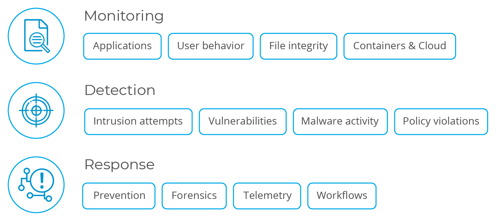
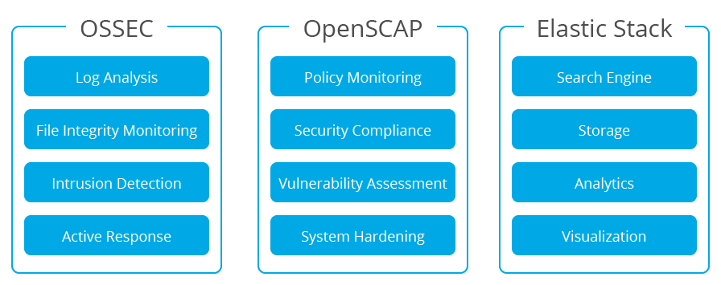
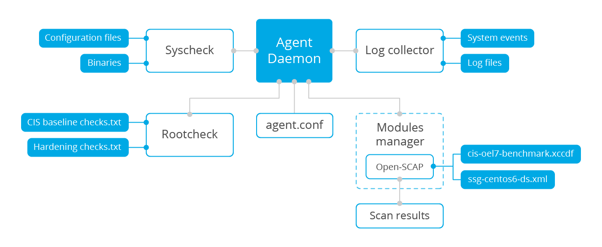
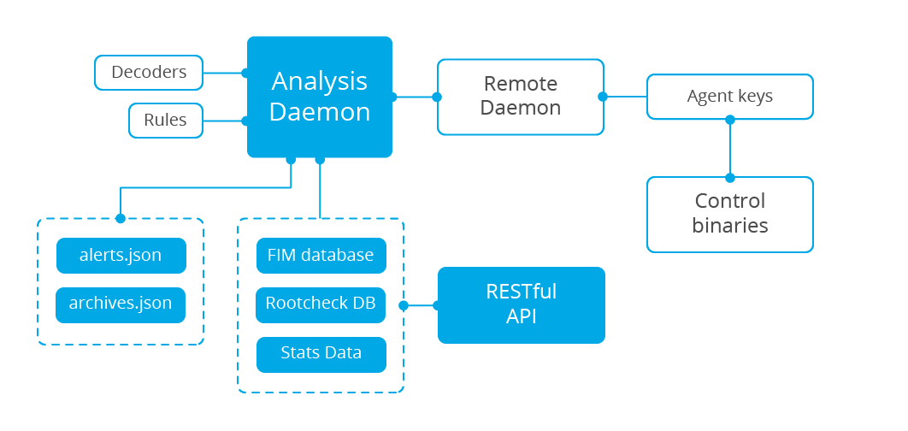
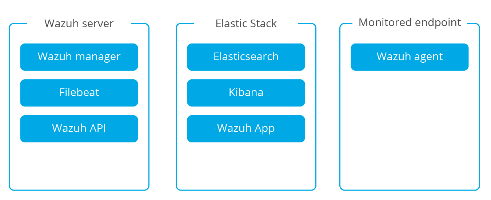
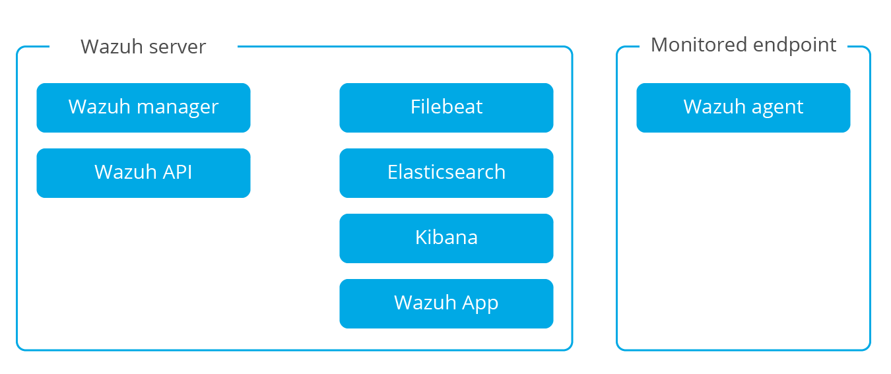
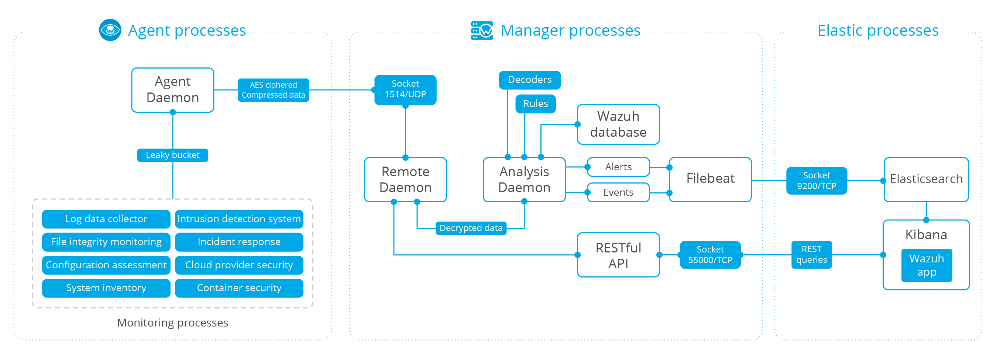
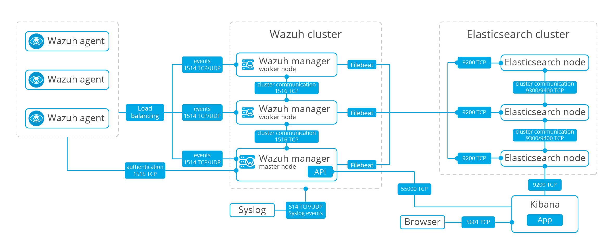
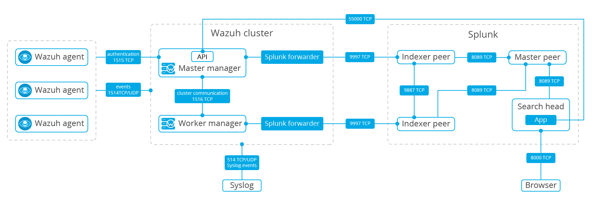
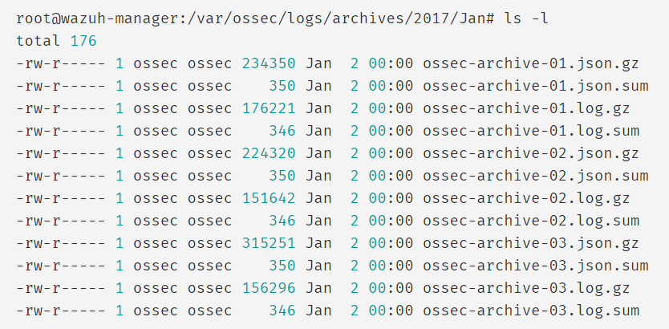

## Tổng quan về Wazuh

Wazuh là một hệ thống phát hiện xâm nhập dựa trên máy chủ (HIDS) mã nguồn mở. Nó được sinh ra như một nhánh của OSSEC HIDS, và sau đó được tích hợp với Elastic Stack và OpenSCAP, phát triển thành một giải pháp toàn diện hơn. Wazuh thực hiện phát hiện bảo mật, phân tích nhật ký, cảnh báo dựa trên thời gian và phản hồi tích cực. Nó cung cấp phát hiện xâm nhập cho hầu hết các hệ điều hành, bao gồm Linux, OpenBSD, FreeBSD, OS X, Solaris, và Windows. Wazuh có một kiến trúc đa nền tảng, tập trung cho phép nhiều hệ thống được giám sát và quản lý.

Các tính năng nổi bật của giải pháp này:

- Quản lý và phân tích nhật ký: Các Agent của Wazuh đọc nhật ký ứng dụng và hệ điều hành và chuyển tiếp chúng đến Server để phân tích và lưu trữ dựa trên tập luật.

- Giám sát toàn vẹn tệp: Wazuh giám sát hệ thống tệp, xác định các thay đổi về nội dung, quyền, quyền sở hữu và thuộc tính của các tệp.

- Phát hiện xâm nhập và bất thường: Agent quét hệ thống tìm kiếm phần mềm độc hại, rootkit hoặc dị thường đáng ngờ. Và có thể phát hiện các tệp ẩn, các quy trình bị che giấu hoặc các trình nghe mạng chưa đăng ký.

- Giám sát chính sách và tuân thủ: Wazuh giám sát các tệp cấu hình để đảm bảo chúng tuân thủ các chính sách bảo mật, tiêu chuẩn hoặc hướng dẫn cứng được cài đặt trước. Agent thực hiện quét định kỳ để phát hiện các ứng dụng được biết là dễ bị xâm nhập, chưa được bảo vệ hoặc được cấu hình không an toàn.

Dưới đây là một mô tả ngắn gọn về các công cụ này và những gì họ làm:

Wazuh được tích hợp OSSEC, OpenSCAP và Elastic Stack tạo thành một giải pháp thống nhất và toàn diện

[OSSEC HIDS](https://www.ossec.net/) là hệ thống phát hiện xâm nhập dựa trên máy chủ (HIDS) được sử dụng để phát hiện xâm nhập, hiển thị và giám sát. Nó dựa trên tác nhân đa nền tảng (multi-platform agent) truyền các dữ liệu hệ thống (ví dụ: log message, file hash và phát hiện bất thường) tới một máy quản lý trung tâm, nơi sẽ phân tích và xử lý, dựa trên các cảnh báo an ninh. Các Agent truyền dữ liệu sự kiện tới máy quản lý trung tâm thông qua kênh được bảo mật và xác thực. OSSEC HIDS cung cấp nhật ký hệ thống (syslog server) trung tâm và hệ thống giám sát không cần Agent, cung cấp việc giám sát tới các sự kiện và thay đổi trên các thiết bị không cài được Agent như firewall, switch, router, access point, thiết bị mạng....

[OpenSCAP](https://www.open-scap.org/) là trình thông dịch [OVAL](https://oval.mitre.org/) (Open Vulnerability Assessment Language) và [XCCDF](https://csrc.nist.gov/projects/security-content-automation-protocol/scap-specifications/xccdf) (Exténible Configuảtion checklist Description Format) được sử dụng để kiểm tra cấu hình hệ thống và phát hiện các ứng dụng dễ bị tấn công. Đây là 1 công cụ nổi tiếng được thiết kế để kiểm tra sự tuân thủ bảo mật và tăng cường hệ thống sử dụng các tiêu chuẩn an ninh dùng cho môi trường doanh nghiệp

[Elastic Stack](https://www.elastic.co/) là 1 bộ phần mềm (Filebeat, Logstash, Elaticsearch, Kibana) được sử dụng để thu thập, phân tích cú pháp, lập chỉ mục, lưu trữ, tìm kiếm và hiển thị dữ liệu nhật ký. Nó cung cấp 1 giao diện web cho người dùng, cung cấp các chế độ xem bảng điều khiển cấp cao về các sự kiện cho phép phân tích nâng cao và khai thác dữ liệu vào sâu trong kho dữ liệu của bạn.

### Các thành phần, chức năng của Wazuh

#### Các thành phần

Các thành phần chính của Wazuh là agent chạy trên mỗi máy chủ được giám sát và máy chủ phân tích dữ liệu nhận được từ các agent và các nguồn khác như syslog. Ngoài ra, máy chủ chuyển tiếp dữ liệu sự kiện đến cụm Elaticsearch nơi thông tin được lập chỉ mục và lưu trữ.

1. Wazuh agent

Wazuh agent chạy trên các hđh Windows, Linux, Solaris, BSD và Mac. Nó được sử dụng để thu thập các loại dữ liệu hệ thống và ứng dụng khác nhau, sau đó dữ liệu được chuyển tới Wazuh server thông qua 1 kênh được mã hóa và xác thực. Để thiết lập kênh bảo mật này, 1 quy trình đăng ký liên quan đến các khóa chia sẻ trước (pre-shared key) duy nhất được sử dụng.

Các agent có thể được sử dụng để giám sát các máy chủ vật lý, máy ảo và các đám mây (ví dụ Amazon AWS, Azure hoặc Google Clould). Wazuh cũng có các gói cài đặt agent có sẵng cho các hđh: Linux, HP-UX, AIX, Solaris, Windows và Darwin (Mac OS X)

Trên các hđh Unix-based, Wazuh agent chạy trên multiple process, các process này giao tiếp với nhau thông qua 1 local Unix domain socket. 1 trong các process này chịu trách mhiệm liên lạc và gửi dữ liệu đến Wazuh server. Trên các hệ thống Windows, chỉ có 1 agent process chạy trên multiple task sử dụng mutexes

Các agent task hoặc process khác nhau được dùng để giám sát hệ thống theo các cách khác nhau (ví dụ: giám sát sự toàn vẹn của file, đọc log, quét các thay đổi hệ thống ... )

Sơ đồ sau thể hiện các internal task và process diễn ra trên các agent level

Tất cả các agent process có mục đích và thiết lập khác nhau. Dưới đây là một mô tả ngắn gọn về chúng

- Rootcheck: tiến trình này thực hiện nhiều tác vụ liên quan đến việc phát hiện rootkit, malware và sự bất thường của hệ thống. Nó cũng chạy 1 số kiểm tra bảo mật cơ bản đối với các tệp cấu hình hệ thống

- Log Collector: agent này được sử dụng để đọc các thông điệp nhật ký ứng dụng và hđh, bao gồm các flat log file, nhật ký sự kiện tiêu chuẩn của Windows và thậm chí các kênh sự kiện của Windows. Nó cũng có thể được cấu hình để chạy định kỳ và bắt đầu ra cảu các lệnh cụ thể

- Syscheck: tiến trình này thực hiện giám sát toàn vẹn tệp (file integrity monitoring- FIM) và cũng có thể giám sát các khóa registry trên các hệ thống Windows. Nó có khả năng phát hiện các thay đổi trong nội dung, quyền sở hữu và các thuộc tính khác của tệp, cũng như lưu ý đến việc tạo và xóa tệp. Mặc dù nó thực hiện quét FIM định kỳ theo mặc định, nó cũng có thể được cấu hình để giao tiếp với nhân điều hành để phát hiện các thay đổi tệp trong thời gian thực và tạo báo cáo thay đổi chi tiết (diffs) của tệp văn bản

- OpenSCAP: mô-đun này sử dụng các hồ sơ bảo mật cơ sở OVAL và XCCDF. Bằng các quét định kỳ hệ thống, nó có thể tìm ra các ứng dụng hoặc cấu hình dễ bị tổn thương không tuân theo các tiêu chuẩn nổi tiếng, chẳng hạn như các tiêu chuẩn được xác định trong tiêu chuẩn [CIS](https://www.cisecurity.org/cis-benchmarks/) (Center of Internet Security)

- Agent Deamon: process nhận dữ liệu được tạo hoặc thu thập bởi tất cả các thành phần agent khác. Nó nén, mã hóa và phân phối dữ liệu tới Wazuh server thông qua 1 kênh xác thực. Process này chạy trong 1 môi trường bị cô lập (chroot), có nghĩa là nó có quyền truy cập hạn chế vào các hệ thống được giám sát. Điều này cải thiện bảo mật tổng thể cảu agent vì đây là process duy nhất kết nối với mạng

2. Wazuh server

Thành phần server chịu trách nhiệm phân tích dữ liệu nhận được từ các agent và kích hoạt cảnh báo khi một sự kiện phù hợp với quy tắc (ví dụ: phát hiện xâm nhập, thay đổi tệp, cấu hình không tuân thủ chính sách, rootkit, v.v.).

Server thường chạy trên một máy vật lý độc lập, máy ảo hoặc đám mây và chạy các thành phần agent với mục đích tự giám sát. Dưới đây là danh sách các thành phần server chính:

- Registration service: được sử dụng để đăng ký các agent mới bằng cách cung cấp và phân phối các khóa xác thực được chia sẻ trước là duy nhất cho mỗi agent. Quá trình này chạy như một dịch vụ mạng và hỗ trợ xác thực qua TLS / SSL  hoặc bằng mật khẩu cố định.

- Remote daemon service: Đây là dịch vụ nhận dữ liệu từ các agent. Nó sử dụng các khóa được chia sẻ trước để xác thực danh tính của mỗi agent và để mã hóa thông tin liên lạc giữa agent và người quản lý.

- Analysis daemon: Đây là process thực hiện phân tích dữ liệu. Nó sử dụng bộ giải mã để xác định loại thông tin đang được xử lý (ví dụ: sự kiện Windows, nhật ký sshd, nhật ký máy chủ web, v.v.) và sau đó trích xuất các yếu tố dữ liệu có liên quan từ thông điệp tường trình (ví dụ ip nguồn, id sự kiện, người dùng, v.v.). Tiếp theo, bằng cách sử dụng các quy tắc, nó có thể xác định các mẫu cụ thể trong các bản ghi nhật ký được giải mã có thể kích hoạt cảnh báo và thậm chí có thể gọi các biện pháp đối phó tự động (phản hồi tích cực) như chặc IP trên firewall.

- RESTful API: cung cấp giao diện để quản lý và giám sát cấu hình và trạng thái triển khai của các agent. Nó cũng được sử dụng bởi giao diện web Wazuh, một ứng dụng Kibana.

3. Elastic Stack

Elastic Stack là một bộ hợp nhất của các dự án nguồn mở phổ biến để quản lý nhật ký, bao gồm Elaticsearch, Logstash, Kibana, Filebeat và các dự án khác. Các dự án đặc biệt liên quan đến giải pháp Wazuh là:

- laticsearch: 1 công cụ tìm kiếm và phân tích toàn văn bản có khả năng mở rộng cao. Elaticsearch được phân phối, có nghĩa là dữ liệu (chỉ số) được chia thành các phân đoạn và mỗi phân đoạn có thể có 0 hoặc nhiều bản sao.

- Logstash: 1 công cụ để thu thập và phân tích các bản ghi sẽ được lưu vào một hệ thống lưu trữ (ví dụ: Elaticsearch). Các sự kiện được thu thập cũng có thể được làm phong phú và biến đổi bằng cách sử dụng các plugin đầu vào, bộ lọc và đầu ra.

- Kibana: giao diện web linh hoạt và trực quan để khai thác, phân tích và trực quan hóa dữ liệu. Nó chạy trên đầu nội dung được lập chỉ mục trên cụm Elaticsearch.

- Filebeat: 1 công cụ chuyển tiếp nhẹ được sử dụng để truyền tải các bản ghi trên một mạng, thường là Logstash hoặc Elaticsearch.

Wazuh tích hợp với Elastic Stack để cung cấp nguồn cấp dữ liệu nhật ký đã được giải mã để được Elaticsearch lập chỉ mục, cũng như bảng điều khiển web thời gian thực để phân tích dữ liệu nhật ký và cảnh báo. Ngoài ra, giao diện người dùng Wazuh (chạy trên nền Kibana) có thể được sử dụng để quản lý và giám sát cơ sở hạ tầng Wazuh của bạn.

Một chỉ mục Elaticsearch là một tập hợp các tài liệu có các đặc điểm hơi giống nhau (như các trường chung nhất định và các yêu cầu lưu giữ dữ liệu chung). Wazuh sử dụng tới ba chỉ số khác nhau, được tạo ra hàng ngày, để lưu trữ các loại sự kiện khác nhau:

- wazuh-alert: chỉ mục cho các cảnh báo được tạo bởi máy chủ Wazuh mỗi khi một sự kiện xảy ra theo quy tắc.

- wazuh-event: chỉ mục cho tất cả các sự kiện (dữ liệu lưu trữ) nhận được từ các agent cho dù họ có thực hiện quy tắc hay không.

- wazuh-monitoring: Chỉ mục cho dữ liệu liên quan đến trạng thái agent theo thời gian. Nó được sử dụng bởi giao diện web để thể hiện khi các agent riêng lẻ đang hoặc đã được "Active", "Disconnected", hoặc "Never connected".

Một chỉ mục bao gồm các tài liệu. Đối với các chỉ số ở trên, tài liệu là các cảnh báo riêng lẻ, các sự kiện được lưu trữ hoặc các sự kiện trạng thái.

Một chỉ mục Elaticsearch được chia thành một hoặc nhiều phân đoạn và mỗi phân đoạn có thể tùy chọn có một hoặc nhiều bản sao. Mỗi phân đoạn chính và bản sao là một chỉ số Lucene riêng. Do đó, một chỉ mục Elaticsearch được tạo thành từ nhiều chỉ mục Lucene. Khi tìm kiếm được chạy trên chỉ mục Elaticsearch, tìm kiếm được thực hiện trên tất cả các phân đoạn song song và kết quả được hợp nhất. Việc phân chia các chỉ mục Elaticsearch thành nhiều phân đoạn và bản sao được sử dụng trong các cụm Elaticsearch nhiều nút với mục đích nhân rộng các tìm kiếm và tính sẵn sàng cao. Các cụm Elaticsearch một nút thường chỉ có một phân đoạn cho mỗi chỉ mục và không có bản sao.

#### Chức năng

Wazuh cung cấp các khả năng sau:

- Phân tích bảo mật: Wazuh được sử dụng để thu thập, tổng hợp, lập chỉ mục và phân tích dữ liệu bảo mật, giúp các tổ chức phát hiện sự xâm nhập, đe dọa và dị thường hành vi. Khi các mối đe dọa trên mạng đang trở nên tinh vi hơn, việc theo dõi và phân tích bảo mật theo thời gian thực là cần thiết để phát hiện và khắc phục mối đe dọa nhanh chóng. Wazuh light-weight agent cung cấp các khả năng giám sát và phản hồi cần thiết, trong khi thành phần server cung cấp thông tin bảo mật và thực hiện phân tích dữ liệu.

- Phát hiện xâm nhập: Wazuh agent quét các hệ thống được giám sát để tìm kiếm phần mềm độc hại, rootkit và sự bất thường đáng ngờ. Chúng có thể phát hiện các tệp ẩn, các tiến trình bị che giấu hoặc các unregistered network listeners, cũng như sự không nhất quán trong các phản hồi cuộc gọi hệ thống. Ngoài các khả năng của agent, thành phần server sử dụng cách tiếp cận dựa trên chữ ký để phát hiện xâm nhập, sử dụng công cụ biểu thức chính quy của nó để phân tích dữ liệu nhật ký được thu thập và tìm kiếm các chỉ số thỏa hiệp.

- Phân tích dữ liệu nhật ký: Các Wazuh agent đọc nhật ký ứng dụng và hệ điều hành sau đó chuyển tiếp chúng đến quản lý trung tâm để phân tích và lưu trữ dựa trên quy tắc. Các quy tắc Wazuh giúp bạn biết về các lỗi ứng dụng hoặc hệ thống, cấu hình sai, các hoạt động độc hại đã cố gắng / hoặc thành công, vi phạm chính sách và một loạt các vấn đề bảo mật và hoạt động khác.

- Giám sát toàn vẹn tệp: Wazuh giám sát hệ thống tệp, xác định các thay đổi về nội dung, quyền, quyền sở hữu và thuộc tính của các tệp mà bạn cần để mắt tới. Ngoài ra, nó còn xác định người dùng và ứng dụng được sử dụng để tạo hoặc sửa đổi các tệp. Khả năng giám sát toàn vẹn tệp có thể được sử dụng kết hợp với trí threat intelligence để xác định các mối đe dọa hoặc máy chủ bị xâm nhập. Ngoài ra, một số tiêu chuẩn tuân thủ quy định, như PCI DSS, cũng yêu cầu nó.

- Phát hiện lỗ hổng: Wazuh agent lấy dữ liệu kiểm kê phần mềm và gửi thông tin này đến máy chủ, nơi tương quan với cơ sở dữ liệu CVE (Common Vulnerabilities and Exposure) được cập nhật liên tục, để xác định phần mềm dễ bị tổn thương đã biết.  Đánh giá lỗ hổng tự động giúp bạn tìm ra những điểm yếu trong tài sản quan trọng của mình và có biện pháp khắc phục trước khi kẻ tấn công khai thác chúng để phá hoại doanh nghiệp của bạn hoặc đánh cắp dữ liệu bí mật.

- Đánh giá cấu hình: Wazuh giám sát các cài đặt cấu hình hệ thống và ứng dụng để đảm bảo chúng tuân thủ các chính sách bảo mật, tiêu chuẩn. Agent thực hiện việc quét định kỳ để phát hiện các ứng dụng được biết là dễ tổn thương, chua được vá hoặc được cấu hình không an toàn. Ngoài ra việc kiểm tra cấu hình có thể được tùy chỉnh, điều chỉnh để chúng phù hợp với tổ chức, công ty của bạn. Cảnh báo bao gồm các khuyến nghị để cấu hình tốt hơn, tham chiếu và ánh xạ với tuân thủ quy định

- Ứng phó sự cố: Wazuh cung cấp các phản ứng tích cực sẵn có để thực hiện các biện pháp đối phó khác nhau để giải quyết các mối đe dọa hoạt động, chẳng hạn như chặn truy cập vào hệ thống khỏi nguồn đe dọa khi đáp ứng một số tiêu chí nhất định. Ngoài ra, Wazuh có thể được sử dụng để chạy các lệnh truy vấn hệ thống từ xa, xác định các chỉ số thỏa hiệp (indicators of compromise - IOCs) và giúp thực hiện các nhiệm vụ pháp y hoặc phản ứng sự cố trực tiếp khác.

- Tuân thủ quy định: Wazuh cung cấp 1 số kiểm soát bảo mật cần thiết để tuân thủ các tiêu chuẩn và quy định của ngành. Các tính năng này, kết hợp với khả năng mở rộng và hỗ trợ đa nền tảng của nó giúp các công ty, tổ chức đáp ứng các yêu cầu tuân thủ kỹ thuật. Wazuh được sử dụng rộng rãi bởi các công ty xử lý thanh toán và tổ chức tài chính để đáp ứng các yêu cầu PCI DSS (Payment Card Industry Data Security Standard - Tiêu chuẩn bảo mật dữ liệu công nghiệp thẻ thanh toán). Giao diện người dùng web của bó cung cấp các báo cáo và bảng điều khiển có thể trợ giúp với điều này và các quy định khác (ví dụ: GPG13 hoặc GDPR)

- Giám sát an ninh đám mây: Wazuh giúp giám sát cơ sở hạ tầng đám mây ở cấp API, sử dụng các mô-đun tích hợp có khả năng lấy dữ liệu bảo mật từ các nhà cung cấp đám mây nổi tiếng như Amazon AWS, Azure hoặc Google Clould. Ngoài ra, Wazuh cung cáp các quy tắc để đánh giá cấu hình của môi trường đám mây của bạn, dễ dàng phát hiện ra các điểm yếu. Ngoài ra, các multi-platform và light-weight Wazuh agent thường được sử dụng để giám sát môi trường đám mây ở cấp độ instance level

- Bảo mật container: Wazuh cung cấp khả năng hiển thị bảo mật vào các Docker server và container, theo dõi hành vi của chúng và phát hiện các mối đe dọa, lỗ hổng và sự bất thường. Wazuh agent có tích hợp riêng với công cụ Docker cho phép người dùng theo các images, volumes, cài đặt mạng và các container đang hoạt động. Wazuh liên tục thu thập và phân tích thông tin rumtime chi tiết. Ví dụ: cảnh báo cho các container chạy ở chế độ đặc quyền, các ứng dụng dễ bị tấn công, shell chạy trong container, thay đổi với các volumes cũng như images và các mối đe dọa có thể khác.

### Kiến trúc của Wazuh

Kiến trúc của Wazuh dựa trên các agent chạy trên các máy chủ được giám sát để chuyển tiếp dữ liệu nhật ký đến 1 máy chủ trung tâm. Ngoài ra các thiết bị agentless như firewall, switch, router, access point, ... cũng được hỗ trợ và có thể chủ động gửi dữ liệu nhật ký qua syslog hoặc kiểm tra định kỳ các thay đổi cấu hình của chúng để sau đó chuyển tiếp dữ liệu đến máy chủ trung tâm. Máy chủ trung tâm giải mã và phân tích thông tin đến và chuyển các kết quả tới Elaticsearch cluster để lập chỉ mục và lưu trữ. 1 Elaticsearch cluster là 1 tập hợp của 1 hoặc nhiều node (server) giao tiếp với nhau để thực hiện các hoạt động đọc và ghi trên các chỉ mục.

Mô hình kiến trúc của Wazuh được chia thành 2 dạng:

- Multi-node deployment

- Single-node deployment

#### Multi-node deployment

Khi Wazuh server và Elaticsearch cluster chạy trên các host khác nhau, Filebeat được sử dụng để chuyển tiếp 1 cách an toàn các cảnh báo hoặc các archived events đến Elaticsearch server(s) sử dụng mã hóa TLS. Các cluster với nhiều node được khuyến nghị khi có 1 số lượng lớn các hệ thống cần được giám sát, khi 1 khối lượng lớn dữ liệu đang được chờ đợi hoặc khi cần tính sẵn sàng cao.

Sơ đồ dưới đây minh họa cách các thành phần được phân phối khi Wazuh server và Elaticsearch cluster chyạ trên các host khác nhau. Lưu ý rằng multi-node clusters sẽ có nhiều Elastic Stack server mà Filebeat có khả năng chuyển tiếp dữ liệu:

#### Single-node deployment

Trong các tiển khai Wazuh nhỏ hơn (số lượng agent < 50), Wazuh và Elastic stack chạy với 1 single-node Elaticsearch cluster có thể được triển khai trên 1 máy chủ độc lập. Ở triển khai này, Logstash sẽ đọc các cảnh bóa, event từ Wazuh trực tiếp từ local file system và đẩy chúng tới local Elaticsearch instance

### Giao tiếp trong Wazuh và luồng dữ liệu

#### Agent-server communication

Wazuh agent sử dụng OESSEC message protocol để gửi các event thu thập được tới Wazuh server thông qua port 1514 (UDP hoặc TCP). Wazuh server giải mã và thực hiện rule-check với các event nhận được với công cụ phân tích. Các event ứng với các rule được bổ sung dữ liệu cảnh báo như rule-id và rule-name. Các event có thể được đẩy tới 1 hoặc cả 2 file sau, dựa vào việc có được event có tương ứng với rule hay không:

- File /var/ossec/logs/archives/archives.json chứa tất cả các event dù có tương ứng với rule hay không.

- File /var/ossec/logs/alerts/alerts.json chỉ chứa các event tương ứng với rule đã đặt ra.

OSSEC message protocol dùng 1 mã hóa 192-bit Blowfish với full 16-round implemetation hoặc mã hóa AES với 128 bit cho mỗi khối và khóa 256 bit.

#### Wazuh-Elastic communication

Trên mô hình triển khai diện rộng, Wazuh server sử dụng Filebeat để chuyển dữ liệu về các cảnh báo và event tới Logstash (5000/TCP) trên Elaticsearch server, sử dụng mã hóa TLS. Với kiến trúc single-host, Logstash đọc trực tiếp từ local file system mà không cần dùng Filebeat.

Filebeat định dạng dữ liệu đến và có thể bổ sung thêm thông tin GeoIP trước khi gửi nó đến Elaticsearch (cổng 9200/TCP). Sau khi dữ liệu được lập chỉ mục vào Elaticsearch, Kibana (cổng 5601/TCP) được sử dụng để khai thác và trực quan hóa thông tin.

Wazuh App chạy bên trong Kibana liên tục truy vấn tới RESTful API (port 55000/TCP trên Wazuh manager) để hiển thị thông tin liên quan đến cấu hình và thông tin trạng thái của server và agent, cũng như restart agent theo yêu cầu. Giao tiếp này được mã hóa với TLS và được xác thực với username và password.

#### Required ports

Để cài đặt Wazuh và Elastic Stack, một số cổng mạng phải có sẵn và được mở để các thành phần khác nhau có thể giao tiếp đúng giữa chúng.

- Wazuh

| Thành phần | Port | Giao thức | Mục đích |
| --- | --- | --- | --- |
| Wazuh manager | 1514 | TCP | Gửi các event thu thập được từ các agent (khi được cấu hình cho TCP) |
| Wazuh manager | 1514 | UDP | Gửi các event thu thập được từ các agent (khi được cấu hình cho UDP) - mặc định |
| Wazuh manager | 1515 | TCP | Agents registration service |
| Wazuh manager | 1516 | TCP | Wazuh cluster communications |
| Wazuh manager | 514 | TCP | Gửi các event thu thập được syslog (khi được cấu hình cho TCP) |
| Wazuh manager | 514 | UDP | Gửi các event thu thập được syslog (khi được cấu hình cho TCP) - mặc định |
| Wazuh API | 55000 | TCP | Incoming HTTP requests |

- Elastic Stack

| Thành phần | Port | Giao thức | Mục đích |
| --- | --- | --- | --- |
| Elasticsearch | 9200 | TCP | Elasticsearch RESTful API |
| Elasticsearch | 9300-9400 | TCP | Elasticsearch cluster communications |
| Kibana | 5601 | TCP | Kibana web interface |

- Splunk

| Thành phần | Port | Giao thức | Mục đích |
| --- | --- | --- | --- |
| Splunk | 8000 | TCP | Splunk web interface |
| Splunk | 9997 | TCP | Cổng đầu vào (đối với Splunk Forwarder) |
| Splunk | 8089 | TCP | Cổng quản lý (dành cho indexers) |
| Splunk | 9887 | TCP | Splunk cluster communications |

### Lưu trữ dữ liệu

Các event về alert và non-alert được lưu trữ cùng nhau trong file trên Wazuh server ngoài việc được gửi tới Elasticsearch. Các file này được viết với dạng JSON (.json) hoặc với định dạng văn bản thuần túy (.log). Các tệp này được nén hằng ngày và được đánh dấu bằng MD5 và SHA1 checksums. Cấu trúc thư mục và tên file như sau:

Việc Rotation và backup các file nén được khuyến khích, tùy theo khả năng lưu trữ của Wazuh Manger server. Sử dụng cron job để rà soát các file nén.

Ngoài ra, bạn có thể lựa chọn việc bỏ qua việc lưu trữ các file nén, và sử dụng Elasticsearch cho các tài liệu lưu trữ, đặc biệt nếu bạn chạy Elasticsearch snapshot backup hoặc multi-node Elasticsearch cluster với shard replica cho tính sẵn sàng cao. Bạn có thể sử dụng cron job để di chuyển các index đã được snapshot tới một server lưu trữ và đánh dấu chúng với MD5 và SHA1.