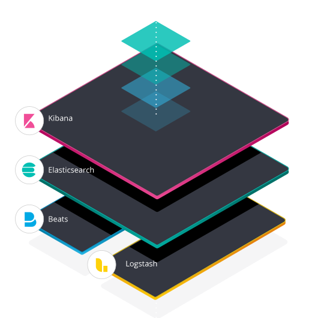
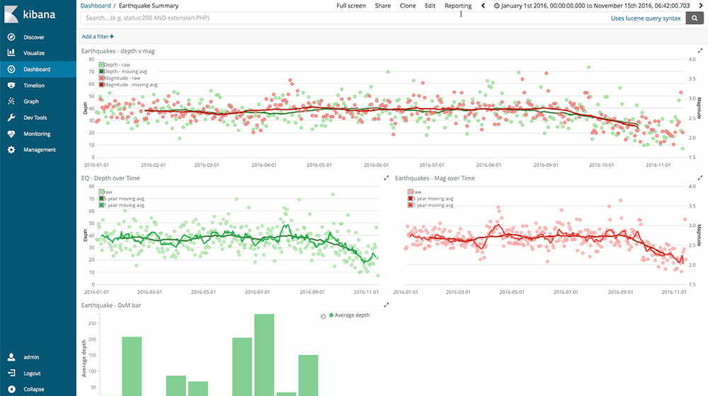
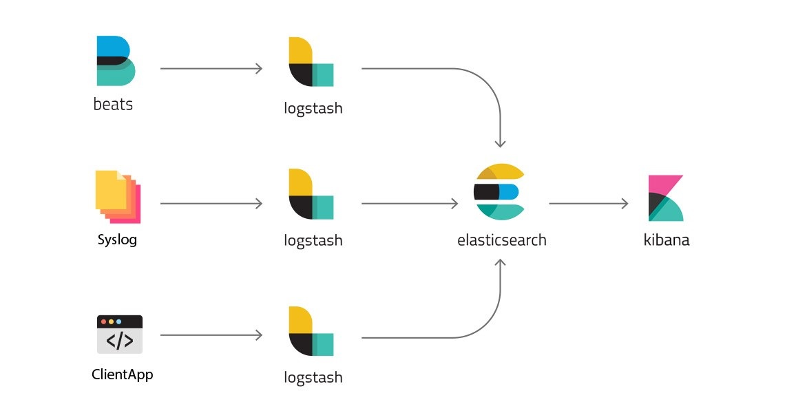

## Tìm hiểu về bộ công cụ ELK Stack

ELK là viết tắt của tập hợp 3 phần mềm cốt lõi đi kèm với nhau, phục vụ cho công việc giám sát hệ thống. Ba phần mềm này lần lượt là Elasticsearch, Logstash và Kibana. ELK được phát triển từ đầu những năm 2000 và cho đến nay đã hơn 250 triệu lượt tải xuống và sử dụng. Hiện tại phiên bản mới nhất của ELK là 7.4.2. Đây là bộ công cụ giám sát tập trung mã nguồn mở rất mạnh, có thể xử lý rất nhiều bài toán quản lý hệ thống mạng nên rất được các công ty, tổ chức tin dùng.

### Các thành phần chính trong ELK stack gồm 4 thành phần:

- Elasticsearch: Dùng để tìm kiếm và query log

- Logstash: Tiếp nhận log từ nhiều nguồn, sau đó xử lý log và ghi vào cơ sở dữ liệu.

- Kibana: Giao diện để quản lý, thống kê log. Đọc thông tin từ Elasticsearch.

- Beats: Một tập các công cụ chuyên dùng để thu thập dữ liệu cực mạnh.

Ảnh bên dưới là sơ đồ của elk stack

1. Elasticsearch

- Elasticsearch là một RESTful distributed search engine. Hiểu nôm na là nó cung cấp khả năng tìm kiếm phân tán qua API. Lưu trữ dữ liệu theo dạng NoSQL database (cơ sở dữ liệu không có cấu trúc).

- Elasticsearch cho phép bạn thực thi và kết hợp rất nhiều loại tìm kiếm: có cấu trúc, không cấu trúc, geo, metric theo cách bạn muốn.

- Elasticsearch hoạt động nhanh chóng, hiệu quả. Bạn có câu trả lời ngay tức thì với các dữ liệu thay đổi.

- Vận hành dễ dàng:

	- Khả năng co giãn, Độ sẵn sàng cao.

	- Dự đoán trước, tin cậy.

	- Đơn giản, trong suốt

- Elasticsearch sử dụng chuẩn RESTful APIs và JSON.

2. Logstash

- Logstash có chức năng phân tích cú pháp của các dòng dữ liệu. Việc phân tích làm cho dữ liệu đầu vào ở một dạng khó đọc, chưa có nhãn thành một dạng dữ liệu có cấu trúc, được gán nhãn.

- Khi cấu hình Logstash luôn có 3 phần: Input, Filter, Output.

- Bình thường khi làm việc với Logstash, sẽ phải làm việc với Filter nhiều nhất. Filter hiện tại sử dụng Grok để phân tích dữ liệu.

3. Kibana

Kibana được phát triển riêng cho ứng dụng ELK, thực hiển chuyển đổi các truy vấn của người dùng thành câu truy vấn mà Elasticsearch có thể thực hiện được. Kết quả hiển thị bằng nhiều cách: theo các dạng biểu đồ.

### Về nguyên lý hoạt động của ELK stack:

- Đầu tiên, thông tin cần giám sát sẽ được đưa đến máy chủ ELK thông qua nhiều con đường, ví dụ như server gửi UDP request chứa log tới URL của Logstash, hoặc Beats thu thập các thông tin từ các bộ công cụ chuyên dụng cài trên các server và gửi lên Logstash hoặc Elasticsearch.

- Logstash sẽ đọc những log này, thêm những thông tin như thời gian, IP, parse dữ liệu từ log (server nào, độ nghiêm trọng, nội dung log) ra, sau đó ghi xuống database là Elasticsearch.

- Khi muốn xem log, người dùng vào URL của Kibana. Kibana sẽ đọc thông tin log trong Elasticsearch, hiển thị lên giao diện cho người dùng query và xử lý. Kibana hiển thị thông tin từ log cho người dùng.

### Khi nào nên sử dụng  ELK Stack

Với các hệ thống hoặc ứng dụng nhỏ, ta không cần sử dụng ELK stack làm gì, cứ dùng thư viện ghi log đi kèm với ngôn ngữ, sau đó ghi log ra file rồi đọc bình thường.

Tuy nhiên, với những hệ thống lớn nhiều người dùng, có nhiều service phân tán (microservice), có nhiều server chạy cùng lúc… thì việc ghi log xuống file không còn hiệu quả nữa. Lúc này số lượng máy chủ trên hệ thống là lớn và nhiều do đó chúng ta không thể dùng cách thủ công là remote vào từng máy rồi đọc log của từng server được, lúc này ELK stack sẽ giải quyết vấn đề đó. ELK stack sẽ ghi log tập chung vào một chỗ khiến chúng ta có thể dễ dàng quản lý log trên toàn hệ thống.

Giả sử bạn có 20 con server chạy cùng lúc, bạn sẽ phải lục tung 20 con server này để đọc và tìm file log, cực quá phải không nào? Lúc này, người ta bắt đầu áp dụng centralized logging, tức ghi log tập trung vào 1 chỗ.

ELK là một lựa chọn cực kì phù hợp, được nhiều công ty lớn như Netflix, Linkedin, Medium lựa chọn vì những lý do đó!

### Ưu điểm của ELK Stack

Đọc log từ nhiều nguồn: Logstash có thể đọc được log từ rất nhiều nguồn, từ log file cho đến log database cho đến UDP hay REST request.

Dễ tích hợp: Dù bạn có dùng Nginx hay Apache, dùng MSSQL, MongoDB hay Redis, Logstash đều có thể đọc hiểu và xử lý log của bạn nên việc tích hợp rất dễ dàng.

Hoàn toàn free: ELK stack là phần mềm mã nguồn mở, chỉ cần tải về, setup và dùng, không tốn một đồng nào cả. Công ty tạo ra ELK Stack kiếm tiền bằng các dịch vụ cloud hoặc các sản phẩm premium phụ thêm.

Giao diện Kibana trực quan, sinh động.

Phương tiện cảnh báo đa dạng: tích hợp với email, sms, slack, các ứng dụng OTP (One Time Password) như Telegram, Whatsapp,...

Khả năng scale tốt: Logstash và Elasticsearch chạy trên nhiều node nên hệ thống ELK cực kì dễ scale. Khi có thêm service, thêm người dùng, muốn log nhiều hơn, bạn chỉ việc thêm node cho Logstash và Elasticsearch là xong.

Search và filter mạnh mẽ: Elasticsearch cho phép lưu trữ thông tin kiểu NoSQL, hỗ trợ luôn Full-Text Search nên việc query rất dễ dàng và mạnh mẽ.

Giải quyết được hầu hết các bài toán trong giám sát hệ thống mạng: giám sát hạ tầng, giám sát dịch vụ, giám sát an ninh, giám sát người dùng,... Đây là đặc điểm chính giúp cho ELK trong tương lai sẽ được các công ty và tổ chức sử dụng để triển khai hệ thống giám sát tập trung bên trong hệ thống mạng của họ.

Cộng đồng mạnh, tutorial nhiều: Nhiều công ty dùng nên dĩ nhiên là có nhiều tutorial để học và dùng ELK Stack rồi.