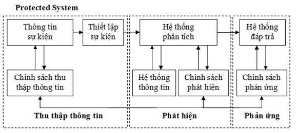
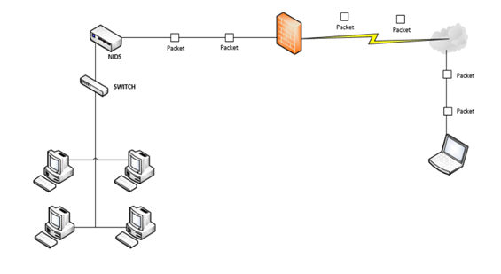
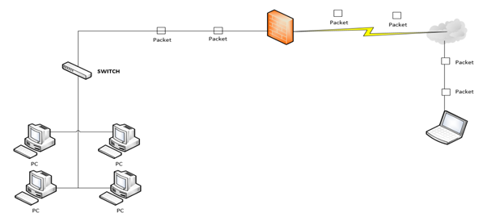

## Tìm hiểu về hệ thống phát hiện xâm nhập IDS (Intrusion Detection System)

### Tổng quan về hệ thống IDS

Hệ thống phát hiện xâm nhập IDS (Intrusion Detection System) bao gồm IDS cứng và IDS mềm là hệ thống giám sát có chức năng tự động theo dõi các sự kiện lưu thông trên hệ thống mạng máy tính, phân tích để phát hiện ra các vấn đề khả nghi liên quan đến an ninh, bảo mật và cảnh báo cho hệ thống và người quản trị.

Trong hệ thống khi có sự lưu thông bất thường, IDS cũng đảm nhận việc phản ứng lại với các lưu thông bất thường hay có hại đó, bằng cách thực hiện các hành động đã được thiết lập trước như khóa người dùng (user) hay địa chỉ IP nguồn đó không cho truy cập trong hệ thống mạng,… IDS cũng có thể phân biệt giữa những tấn công từ bên trong hay tấn công từ bên ngoài.

IDS có thể được triển khai theo một số cách tùy thuộc vào mục tiêu hay mục đích của hệ thống. Nó có thể bảo vệ các máy chủ nội bộ quan trọng, xác định các cuộc tấn công dựa trên Internet và giám sát các điểm truy cập mạng. IDS phát hiện tấn công dựa trên các dấu hiệu đặc biệt về các nguy cơ đã biết hay dựa trên so sánh lưu thông mạng hiện tại với baseline (thông số đo đạc chuẩn của hệ thống) để tìm ra các dấu hiệu khác thường. 

Sử dụng hệ thống IDS để nâng cao khả năng quản lý và bảo vệ mạng, lợi ích của nó đem lại là rất lớn. Mốt mặt nó giúp hệ thống an toàn trước những nguy cơ tấn công, mặt khác nó cho phép nhà quản trị nhận dạng và phát hiện được những nguy cơ tiềm ẩn dựa trên những phân tích và báo cáo được IDS cung cấp. Từ đó, hệ thống IDS có thể góp phần loại trừ được một cách đáng kể những lỗ hổng về bảo mật trong môi trường.

### Lịch sử phát triển của IDS

Khái niệm phát hiện xâm nhập xuất hiện qua một bài báo của James Anderson. Khi đó người ta cần IDS với mục đích là dò tìm và nghiên cứu các hành vi bất thường và thái độ của người sử dụng trong mạng, phát hiện ra các việc làm dụng đặc quyền để giám sát tài sản hệ thống mạng. Các nghiên cứu về hệ thống phát hiện xâm nhập được nghiên cứu chính thức từ năm 1983 đến năm 1988 trước khi được sử dụng tại mạng máy tính của không lực Hoa Kỳ. Cho đến tận năm 1996, các khái niệm IDS vẫn chưa được phổ biến, một số hệ thống IDS chỉ được xuất hiện trong các phòng thí nghiệm và viện nghiên cứu. Tuy nhiên trong thời gian này, một số công nghệ IDS bắt đầu phát triển dựa trên sự bùng nổ của công nghệ thông tin. Đến năm 1997 IDS mới được biết đến rộng rãi và thực sự đem lại lợi nhuận với sự đi đầu của công ty ISS, một năm sau đó, Cisco nhận ra tầm quan trọng của IDS và đã mua lại một công ty cung cấp giải pháp IDS tên là Wheel.

Hiện tại, các thống kê cho thấy IDS/IPS đang là một trong các công nghệ an ninh được sử dụng nhiều nhất và vẫn còn phát triển.

### Vai trò, chức năng của hệ thống IDS

Hệ thống IDS cho phép các công ty, tổ chức bảo vệ hệ thống của họ khỏi những đe dọa với việc gia tăng kết nối mạng và sự tin cậy của hệ thống thông tin. Các chức năng quan trọng nhất của IDS là: giám sát, cảnh báo, bảo vệ

#### Giám sát

Là vai trò chính của hệ thống IDS. Nó có nhiệm vụ xác định những cuộc tấn công và truy cập tái phép vào hệ thống mạng. Bên cạnh việc theo dõi mạng đễ phát hiện truy cập trái phép, phòng chống xâm nhập thì còn là việc giám sát lưu lượng mạng và các hoạt động khả nghi, giám sát cấc thiết bị và dịch vụ mạng, giám sát nguồn tài nguyên trên hệ thống.

Hệ thống giám sát thiết bị và dịch vụ có chức năng theo dõi trạng thái hoạt động của các thiết bị và dịch vụ trong hệ thống mạng, giám sát các tài nguyên trên các thiết bị như dung lượng trống cảu các ổ đĩa trên server, tình trạng sử dụng ram, cpu, kiểm tra trạng thái hoạt động của các cổng trên các switch trung tâm, ... Mọi hoạt động bất thường như có thiết bị ngưng làm việc, dịch vụ mạng nhưng hoạt động hay dung lượng ổ cứng trên các server còn quá ít sẽ được gửi cảnh báo tới người quản trị.

#### Cảnh báo

Cảnh báo là việc cung cấp các báo cáo về tình trạng mạng cho người quản trị hệ thống. Hệ thống báo động là 1 thành phần quan trọng trong hệ thống giám sát mạng. Nó giúp ngừi quản trị mạng nắm bắt được trạng thái hoạt động của hệ thống mạng

Hệ thống IDS có thể cảnh báo và ghi lại các bất thường cũng như thực hiện bắt giữ các lưu lượng khi phát hiện tấn công để cung cấp cho người quan trị các thông tin để phân tích và điều tra các sự bất thường

Hệ thống báo động kết hợp với hệ thống dò tìm xâm nhập, hệ thống giám sát thiết bị và dịch vụ truyền tín hiệu cảnh báo đến người quản trị khi có dấu hiệu xâm nhập hay sự cố bất thường khác. Những thông tin từ thiết bị phát hiện xâm nhập hay những dấu hiệu bất thường được chuyển tới hệ thống báo động để phát cảnh báo tới người quản trị

#### Bảo vệ

Dùng những thiết lập mặc định và sự cấu hình từ người quản trị mà có những hành động thiết thực chống lại kẻ xâm nhập và phá hoại. Kết hợp với các hệ thống giám sát, tường lửa, diệt virus ... tạo thành 1 hệ thống bảo mật hoàn chỉnh

Ngoài ra IDS còn có thể phân biệt các tấn công bên trong và bên ngoài. Phát hiện ra những dấu hiệu bất thường dựa trên những gì đã biết hoặc so sánh thông lượng mạng hiện tại với baseline. Ngăn chặn sự gia tăng của các cuộc tấn công, bổ sung vào những điểm yếu mà các hệ thống khác chưa làm được

Tổ hợp của những vai trò và chức năng này cung cấp cho người quản trị mạng khả năng tích hợp IDS vào mạng và tăng cường an ninh đến 1 mức độ mà trước nay không thể đạt đến bằng các biện pháp đơn lẻ như tường lửa

### Các thành phần, kiến trúc của IDS

IDS bao gồm các thành phần chính sau:

- thành phần thu thập gói tin

- thành phần phân tích gói tin

- thành phần phản ứng

Trong 3 thành phần này thì thành phần phân tích gói tin là quan trọng nhất và ở thành phần này bộ cảm biến đóng vai trò quyết định.

Bê dưới là ảnh kiến trúc của 1 hệ thống IDS

Bộ cảm biến có thể là các chương trình chạy trên các thiết bị mạng hoặc máy chuyên dụng trên các đường mạng. Bộ cảm biến có 1 vai trò quan trong vì có rất nhiều mục tiêu cần được giám sát trên hệ thống mạng.

Bộ cảm biến được tích hợp với thành phần sưu tập dữ liệu thành 1 bộ tạo sự kiện. Bộ tạo sự kiện (hđh, mạng, ứng dụng) cung cấp một số chính sách thích hợp cho các sự kiện, có thể là 1 bản ghi các sự kiện của hệ thống hoặc các gói mạng. Vai trò của bộ cảm biến là dùng để lọc thông tin và loại bỏ dữ liệu không tương thích từ các sự kiện liên quan với hệ thống bảo vệ, vì vậy có thể phát hiện được các hành động đáng nghi ngờ.

Bộ phân tích sử dụng cơ sở dữ liệu chính sách phát hiện cho mục này. Ngoài ra, còn có các thành phần: dấu hiệu tấn công, các hồ sơ hành vi thông thường, các tham số cần thiết (ví dụ: các mức cảnh báo).

Thêm vào đó, cơ sở dữ liệu giữ các tham số cấu hình, gồm có các chế độ truyền thông với module đáp trả. Bộ cảm biến cũng có cơ sở dữ liệu của riêng nó, gồm dữ liệu lưu về các xâm nhập phức tạp tiềm ẩn (tạo ra từ nhiều hành động khác nhau).

Khi hệ thống mạng dùng các Hub, ta có thể đặt các bộ cảm biến trên bất kì cổng nào của Hub vì mọi luồng lưu lượng truy cập được gửi ra tất cả các cổng trên Hub, và có thể phát hiện ra các luồng truy cập bất thường. Nhưng khi hệ thống cần sử dụng các bộ chuyển mạch (switch), các switch này chỉ gửi gói tin đến chính xác địa chỉ cần gửi trên từng cổng. Để giải quyết vấn đề này, một kỹ thuật thông dụng là sử dụng những bộ chuyển mạch có cổng mở rộng (expansion port) và ta kết nối IDS vào cổng này. Cổng này được gọi là Switched Port Analyzer (SPAN) port. SPAN port cần được cấu hình bởi các chuyên gia bảo mật để nhân bản mọi luồng dữ liệu của switch. 

Thành phần phân tích gói tin được kết nối trên mạng, không có địa chỉ IP, kiểm soát các luồng dữ liệu trên mạng và gửi cảnh báo khi phát hiện ra hành động xâm nhập. 

Thành phần phản ứng có chức năng gửi những báo cáo, cảnh báo tới người quản trị. Trong các hệ thống IDS hiện đại, lời cảnh báo có thể ở dưới nhiều dạng như: cửa sổ pop-up, alarm, email, SNMP, …

IDS không chỉ phát hiện các hành vi xâm nhập có khả năng ảnh hưởng nguy hiểm cho hệ thống, ghi nhận các hành vi đó, và gửi báo cáo cho người quản trị. IDS còn có khả năng thực hiện ngăn cản sự xâm nhập, sử dụng một số kỹ thuật để ngăn chặn sự tấn công từ bên ngoài hay chỉnh sửa lại môi trường bảo mật (ví dụ như cấu hình lại chính sách tường lửa), hoặc thay đổi mục tiêu của cuộc tấn công.

### Các loại IDS

#### Phân loại IDS theo kỹ thuật thực hiện

Dựa trên kỹ thuật thực hiện, IDS được chia thành 2 loại:

1. Signature-based IDS

Signature-based IDS phát hiện xâm nhập dựa trên dấu hiệu của hành vi xâm nhập, thông qua phân tích lưu lượng mạng và nhật ký hệ thống. Kỹ thuật này đòi hỏi phải duy trì một cơ sở dữ liệu về các dấu hiệu xâm nhập (signature database), và cơ sở dữ liệu này phải được cập nhật thường xuyên mỗi khi có một hình thức hoặc kỹ thuật xâm nhập mới.
 
2. Anomaly-based IDS

phát hiện xâm nhập bằng cách so sánh (mang tính thống kê) các hành vi hiện tại với hoạt động bình thường của hệ thống để phát hiện các bất thường (anomaly) có thể là dấu hiệu của xâm nhập. Ví dụ, trong điều kiện bình thường, lưu lượng trên một giao tiếp mạng của server là vào khỏang 25% băng thông cực đại của giao tiếp. Nếu tại một thời điểm nào đó, lưu lượng này đột ngột tăng lên đến 50% hoặc hơn nữa, thì có thể giả định rằng server đang bị tấn công DoS. Để hoạt động chính xác, các IDS loại này phải thực hiện một quá trình "học", tức là giám sát hoạt động của hệ thống trong điều kiện bình thường để ghi nhận các thông số hoạt động, đây là cơ sở để phát hiện các bất thường về sau.

#### Phân loại IDS theo phạm vi giám sát

Dựa trên phạm vi giám sát, IDS được chia thành 2 loại

1. Network – Based IDS

Hệ thống IDS dựa trên mạng sử dụng bộ dò và bộ cảm biến cài đặt trên toàn mạng. Những bộ dò này theo dõi trên mạng nhằm tìm kiếm những lưu lượng trùng với những mô tả sơ lược được định nghĩa hay là những dấu hiệu. Những bộ cảm biến thu nhận và phân tích lưu lượng trong thời gian thực. Khi ghi nhận được mẫu lưu lượng hay dấu hiệu, bộ cảm biến gửi tín hiệu cảnh báo đến quản trị và có thể được cấu hình nhằm tìm ra biện pháp ngăn chặn những xâm nhập xa hơn. NIDS là tập nhiều sensor được đặt ở toàn mạng bên ngoài để theo dõi những gói tin trong mạng so sánh với những mẫu đã được định nghĩa để phát hiện đó có phải là tấn công hay không.

Dùng để giám sát lưu lượng trong hệ thống mạng hay một thiết bị nào đó và phân tích hoạt động giao thức mạng hay hoạt động của ứng dụng để xác định các hành động khả nghi. Thường triển khai ở biên của hệ thống mạng, nằm gần tường lửa hay router, server VPN và mạng không dây.

Được cài đặt giữa kết nối hệ thống mạng bên trong và bên ngoài để giám sát toàn bộ lưu lượng vào, đón bắt lưu lượng phân tích nội dung gói tin và đưa ra các cảnh báo. Có thể là thiết bị phần cứng riêng biệt được thiết lập sẵn hay phần mềm cài đặt trên máy tính. Chủ yếu để đo lưu lượng mạng được sử dụng.

Việc đặt một NIDS đằng sau thiết bị lọc, chẳng hạn như tường lửa, có thể giúp loại trừ một số lưu lượng truy cập giả mạo vì thế sẽ giảm lưu lượng truy cập NIDS cần kiểm tra. Bởi vì NIDS cần phải kiểm tra một số lượng lưu lượng lớn truy cập trên mạng cụ thể, chúng thường chỉ có thể làm một kiểm tra tương đối qua loa để xác định tình hình trên mạng là bình thường hay không. Vì vậy, một NIDS có thể bỏ lỡ mốt số loại tấn công, đặc biệt là những người sử dụng mánh khóe thủ công đặc biệt để vượt qua kiểm tra. Các tấn công thủ công gói tin liên quan đến các gói tin được thiết kế đặc biệt của lưu lượng truy cập để chứa đựng các cuộc tấn công hoặc mã độc hại, nhưng được thiết kế để tránh sự phát hiện của IDS, tường lửa, và các thiết bị tương tự khác.

Hình bên dưới là sơ đồ của 1 hệ thống mạng với NIDS

Theo chức năng sử dụng, hệ thống NIDS còn được phân chia thành hai hệ thống nhỏ là Protocol-based Intrusion Detection System (PIDS) và Application Protocol-based Intrusion Detection System (APIDS).

Hệ thống PIDS và APIDS được sử dụng để giám sát các giao vận và giao thức không hợp lệ hoặc không mong muốn trên lường dữ liệu hoặc hạn chế các ngôn ngữ giao tiếp. Hệ thống PIDS chứa một hệ thống (System) hoặc một thành phần Agent thường được đặt ngay trước một máy chủ, giám sát và phân tích các giao thức trao đổi giữa các thiết bị được kết nối mạng. Hệ thống APIDS bao gồm một hệ thống (System) hoặc thành phần Agent thường được nằm giữa một nhóm các máy chủ, giám sát và phân tích các trao đổi ở lớp ứng dụng của một giao thức định sẵn. 

- Ưu điểm:

Quản lý được cả một network segment (gồm nhiều host).

"Trong suốt" đối với cả người dùng lẫn kẻ tấn công.

Cài đặt và bảo trì đơn giản, không ảnh hưởng tới mạng.

Tránh DoS ảnh hưởng tới một máy chủ nào đó.

Có khả năng xác định lỗi ở tầng Network (trong mô hình OSI).

Độc lập với hệ điều hành. 

Chi phí thấp 

Phát hiện được các tấn công mà HIDS bỏ qua. 

Khó xóa bỏ dấu vết vì NIDS có tệp ghi lại nhật ký của hệ thống mà HIDS không có được, các thông tin này không chỉ chứa cách thức tấn công mà còn chứa các thông tin cho phép xác minh buộc tội tấn công. 

Tốc độ phát hiện nhanh đối phó kịp thời. 

- Nhược điểm:

Có thể xảy ra trường hợp báo động giả (false positive), tức không có xâm nhập mà NIDS báo là có xâm nhập trái phép. 

Không thể phân tích các luồng dữ liệu đã được mã hóa (ví dụ: SSL, IPsec, SSH...) 

NIDS đòi hỏi phải được cập nhật các dấu hiệu mới nhất để thực sự an toàn. 

Có độ trễ giữa thời điểm bị tấn công với thời điểm phát báo động. Khi báo động được phát ra, hệ thống có thể đã bị tổn hại. 

Không cho biết việc tấn công có thành công hay không. 

Hạn chế giới hạn băng thông. Những bộ dò mạng phải nhận tất cả các lưu lượng mạng, sắp xếp lại những lưu lượng đó cũng như phân tích chúng. Khi tốc độ mạng tăng lên thì khả năng của đầu dò cũng vậy. Một giải pháp là đảm bảo cho mạng được thiết kế chính xác để cho phép sự sắp đặt của nhiều đầu dò. Khi mà mạng phát triển, thì càng nhiều đầu dò được lắp đặt thêm vào để bảo đảm truyền thông và bảo mật một cách tốt nhất.

2. Host- Based IDS

1 Host-Based IDS chỉ làm nhiệm vụ giám sát và ghi lại nhật ký cho một máy chủ (host-system). Đây là dạng IDS với giới hạn chỉ giám sát và ghi lại toàn bộ những khả năng của host-system (bao gồm cả hệ điều hành và các ứng dụng cũng như toàn bộ service của máy chủ đó). Host-Based IDS có khả năng phát hiện các vấn đề nếu các thông tin về máy chủ đó được giám sát và ghi lại. Là thiết bị bảo mật cho phát hiện các tấn công trực tiếp tới một máy chủ. 

Được cài đặt cục bộ trên một máy tính làm cho nó trở nên linh hoạt hơn nhiều so với NIDS. Kiểm soát lưu lượng vào ra trên một máy tính, có thể được triển khai trên nhiều máy tính trong hệ thống mạng. HIDS có thể được cài đặt trên nhiều dạng máy tính khác nhau cụ thể như các máy chủ, máy trạm, máy tính xách tay. 

HIDS cho phép thực hiện một cách linh hoạt trong các đoạn mạng mà NIDS không thể thực hiện được. Lưu lượng đã gửi tới máy tính HIDS được phân tích và chuyển qua nếu chúng không chứa mã nguy hiểm. HIDS được thiết kế hoạt động chủ yếu trên hệ điều hành Windows, mặc dù vậy vẫn có các sản phẩm hoạt động trong nền ứng dụng Unix và nhiều hệ điều hành khác. Một số dịch vụ cho phép admin theo dõi và giám sát như Syslog, File Fingerprinting, System Integrity Check và Systrace. 

Hệ thống HIDS bao gồm thành phần (Agent) trên các máy trạm, nó xác định các truy cập trái phép vào hệ thống bằng cách phân tích các trao đổi của hệ thống, các bản ghi của các ứng dụng, sự sửa đổi các tệp tin trên hệ thống, các hoạt động và trạng thái khác của hệ thống để từ đó phát hiện ra các dấu hiệu truy cập trái phép vào hệ thống. Khi phát hiện ra các truy nhập trái phép, Agent lập tức sinh ra một sự kiện và gửi báo cáo về Engine, Engine tiến hành lưu trữ các báo cáo của Agent vào cơ sở dữ liệu và tiến hành phân tích thông tin để đưa ra các cảnh báo cho người quản trị hoặc hệ thống,

Hệ thống HIDS được sử dụng để phân tích các hoạt động ở trên hoặc hướng vào các giao diện mạng của một host cụ thể. Chúng có nhiều lợi thế tương tự như hệ thống NIDS có nhưng phạm vị hoạt động hẹp hơn. Như với phần mềm tường lửa các công cụ này có thể dao động từ phiên bản sử dụng đơn giản tới các phiên bản thương mại phức tạp hơn, cho phép giám sát và quản lý tập trung. HIDS thường được triển khai trên máy trạm hoặc máy chủ quan trọng, chỉ bảo vệ từng máy.

Hình bên dưới là sơ đồ 1 hệ thống mạng với HIDS

- Ưu điểm:

Xác định được người dùng có liên quan tới các sự kiện. 

Có khả năng phát hiện các tấn công diễn ra trên máy còn NIDS thì không có khả năng này. 

Có khả năng phân tích các dữ liệu mã hóa.

Cung cấp các thông tin về máy chủ khi xảy ra tấn công trên máy chủ này.

- Nhược điểm:

Khi máy đã bị tấn công thì cả thông tin trên máy HIDS là không đáng tin cậy. 

Khi hệ điều hành bị “hạ” do bị tấn công thì đồng nghĩa với việc HIDS cũng “hạ”. 

HIDS phải được thiết lập trên từng máy cần giám sát. 

HIDS không có khả năng phát hiện các cuộc dò quét mạng (ví dụ: Nmap, Netcat…). 

HIDS cần tài nguyên trên host để hoạt động. 

HIDS không hiệu quả khi bị tấn công DoS